# Client architecture

The client area is the interactive session authority. Reducers and value-type drivers decide state transitions and emit effects; the runtime owns external resources and feeds results back as events. Terminal and protocol routes remain keyed by frame identity, persistence uses explicit deletion, and browser presentation does not become an independent lifecycle authority.

The complete legacy sources remain below as migration history. The governing contract above is the maintained design surface.

## Legacy Source: component-20260624-client-interfaces

````markdown
---
id: component-20260624-client-interfaces
kind: component
title: Interfaces, Data Files, and File Structure
status: active
created: '2026-06-24'
updated: '2026-07-04'
tags:
- technical
- client
- legacy-import
owners: []
relations:
- {type: referencedBy, target: component-20260624-client-ipc}
- {type: referencedBy, target: component-20260624-client-overview}
- {type: referencedBy, target: component-20260624-client-state-monitoring}
- {type: referencedBy, target: note-20260624-technical-overview}
source_paths:
- src/platform/termvt/
- src/client/config/config.go
- ARCHITECTURE.md
- src/platform/
- src/client/
- src/cmd/
- src/cmd/server/
- src/cmd/uihost/
provides:
- interfaces-data-files-and-file-structure
summary: All state, runtime, and driver layers are defined as interfaces for testability.
  The state layer consists of pure value types and pure functions, while the runtime
  layer can be swapped with fakes during testing via
---

<!-- migrated_from: docs/technical/client/interfaces.md -->

# Interfaces, Data Files, and File Structure

## Interfaces

All state, runtime, and driver layers are defined as interfaces for testability. The state layer consists of pure value types and pure functions, while the runtime layer can be swapped with fakes during testing via backend interfaces.

```go
// state/state.go — All domain state (plain data, no methods)
type State struct {
    Sessions       map[SessionID]Session
    PendingCreates map[JobID]PendingCreate
    ActiveSession  SessionID
    Subscribers    map[ConnID]Subscriber
    Jobs           map[JobID]JobMeta
    NextJobID      JobID
    NextConnID     ConnID
    Now            time.Time
    Aliases        map[string]string
    DefaultCommand string
}

// Session owns a stack of SessionFrames. The active frame is always
// Frames[len-1]; the root frame is Frames[0]. Frame death truncates
// the stack from that index onward.
type Session struct {
    ID        SessionID
    Project   string
    CreatedAt time.Time
    Frames    []SessionFrame
}

// SessionFrame is one execution context within a session. Each frame
// owns one pty session and carries its own DriverState, so push-driver
// can layer a fresh driver context on top and frame death can truncate
// just that slice of the stack.
type SessionFrame struct {
    ID            FrameID
    Project       string
    Command       string
    LaunchOptions LaunchOptions
    CreatedAt     time.Time
    Driver        DriverState   // sum type: concrete state per driver impl
}

// LaunchOptions is the driver-agnostic, normalized set of options that
// shape a frame's launch. Drivers receive the user's request via
// PrepareLaunch, normalize it, and return the canonical form, which
// round-trips through sessions.json and is re-applied on cold start.
type LaunchOptions struct {
    Worktree WorktreeOption
}

type WorktreeOption struct {
    Enabled bool
}
```

```go
// state/driver_iface.go — Driver interface (value-type plugin)
type Driver interface {
    Name() string
    DisplayName() string
    NewState(now time.Time) DriverState
    Step(prev DriverState, ev DriverEvent) (DriverState, []Effect, View)
    Status(s DriverState) Status
    View(s DriverState) View
    Persist(s DriverState) map[string]string
    Restore(bag map[string]string, now time.Time) DriverState

    // PrepareLaunch resolves the launch plan (command, start dir,
    // normalized options) for one frame. Invoked synchronously inside
    // state.Reduce for new frames and during cold-start restoration
    // for existing frames. Must be a pure function.
    PrepareLaunch(s DriverState, mode LaunchMode, project, baseCommand string,
                  options LaunchOptions) (LaunchPlan, error)
}

// CreateSessionPlanner is an optional extension for drivers that need
// async setup work (e.g. creating a managed worktree) between the
// create-session request and the frame spawn. PrepareCreate returns a
// CreatePlan with an optional SetupJob; once the job completes the
// reducer calls CompleteCreate to get the final CreateLaunch.
type CreateSessionPlanner interface {
    PrepareCreate(s DriverState, sessionID SessionID, project, command string,
                  options LaunchOptions) (DriverState, CreatePlan, error)
    CompleteCreate(s DriverState, command string, options LaunchOptions,
                   result any, err error) (DriverState, CreateLaunch, error)
}

// DriverState — closed sum type marker for per-frame state
type DriverState interface {
    driverStateMarker()
}

// DriverEvent — input to Driver.Step (closed sum type)
// DEvTick, DEvHook, DEvJobResult, DEvFileChanged, DEvFrameOsc, DEvFramePrompt, DEvSubsystem
```

Hook-driven agents (Claude, Gemini) receive `DEvHook`. Stream-backed agents (Codex) receive `DEvSubsystem` carrying structured thread / turn / tool / approval events from `codex app-server`.

Driver is a **value-type plugin**: no goroutines, no I/O, no mutexes. Per-frame state is embedded on each `SessionFrame.Driver` as a `DriverState` value, and round-trips as arguments and return values of `Driver.Step`. Side effects are returned as `[]Effect` and executed by the runtime's Effect interpreter.

**Launch plan is resolved in the reducer, not the runtime.** `reduceCreateSession` (or `handlePendingCreate` for planner-gated flows) calls `Driver.PrepareLaunch` synchronously, writes the normalized `LaunchOptions` onto the frame, and bakes `launch.Command` / `launch.StartDir` / `launch.Options` into `EffSpawnFrame`. The runtime interprets the effect verbatim and never calls driver methods, keeping driver-specific logic entirely inside the pure functional core. (`LaunchPlan` and `WrappedLaunch` also carry `Argv []string` for `agentlaunch.Spawn`; the frame spawn path uses `Command`.)

```go
// state/view/status.go — canonical Status definition (stdlib-only; no state import)
type Status int
const (
    StatusRunning Status = iota
    StatusWaiting
    StatusIdle
    StatusStopped
    StatusPending
)

// state/status.go — re-exports via type aliases (transparent to existing callers)
type Status = v.Status
type StatusInfo = v.StatusInfo
// constants re-exported as StatusRunning = v.StatusRunning, etc.
```

```go
// state/reduce.go — Pure state transition function
func Reduce(s State, ev Event) (State, []Effect)
```

`Reduce` is the sole entry point for all state transitions. Event / Effect are closed sum types (`isEvent()` / `isEffect()` markers).

```go
// runtime/runtime.go — Imperative shell
type Runtime struct {
    cfg     Config
    state   state.State        // solely owned by the event loop goroutine
    eventCh chan state.Event    // Event submission from external goroutines
    workers *worker.Pool
    conns   map[state.ConnID]*ipcConn
    // ...
}

func (r *Runtime) Run(ctx context.Context) error  // event loop
func (r *Runtime) Enqueue(ev state.Event)          // goroutine-safe
```

```go
// runtime/backends.go — Backend interfaces swappable for testing
//
// Frame operations are split into narrow role interfaces so callers can
// depend on the minimum surface they need. The production backend
// (PtyBackend, built on platform/termvt) implements all of them; test
// fakes can stub a subset.

type FrameLifecycle interface {
    SpawnFrame(frameID, name, command, startDir string,
               env map[string]string) error
    KillFrame(frameID string) error
    RespawnFrame(target, command string) error
    FrameExitStatus(target string) (dead bool, code int, err error)
}

type FrameIO interface {
    SendKeys(frameID, text string) error              // text + Enter
    SendKey(frameID, key string) error                // named key, no Enter
    SendEnter(target string) error
    LoadBuffer(name, text string) error               // bracketed-paste path
    PasteBuffer(name, target string) error
}

type FrameInspect interface {
    ResolveID(target string) (string, error)
    FrameSize(target string) (width, height int, err error)
    CaptureFrame(frameID string, nLines int) (string, error)
}

// FrameBackend bundles the full set of frame operations the runtime
// needs (lifecycle + io + inspect + session env). Production
// wiring uses PtyBackend; new code should depend on the narrower role
// interfaces above where possible.
type FrameBackend interface {
    FrameLifecycle
    FrameIO
    FrameInspect
    SessionEnv
}

// PersistBackend abstracts sessions.json persistence so tests don't
// touch the filesystem. Save is upsert-only; removal is explicit via
// Delete(id), so a transiently empty in-memory state cannot wipe the
// on-disk record.
type PersistBackend interface {
    Save(sessions []SessionSnapshot) error
    Delete(id string) error
    Load() ([]SessionSnapshot, error)
}

// EventLogBackend writes per-frame agent event log lines; the
// implementation lazy-opens the file on first append and keeps it open
// until Close(frameID).
type EventLogBackend interface {
    Append(frameID state.FrameID, line string) error
    Close(frameID state.FrameID)
    CloseAll()
}

// FSWatcher is the fsnotify wrapper. It watches per-frame files and
// emits FSEvent values on Events() when they change.
type FSWatcher interface {
    Watch(frameID state.FrameID, path string) error
    Unwatch(frameID state.FrameID) error
    Events() <-chan FSEvent
    Close() error
}
```

```go
// runtime/worker/pool.go — typed worker pool
// runtime/worker/registry.go — JobKind-based runner registry

func NewPool(parent context.Context, size int) *Pool
func RegisterRunner[In state.JobInput, Out any](
    kind string,
    runner func(context.Context, In) (Out, error),
)
func Dispatch(pool *Pool, jobID state.JobID, input state.JobInput)

type Pool struct { /* fixed-size goroutine pool, scoped to pool ctx */ }
func Submit[In state.JobInput, Out any](
    p *Pool, jobID state.JobID, input In,
    runner func(context.Context, In) (Out, error),
)
func (p *Pool) Results() <-chan state.Event   // EvJobResult
func (p *Pool) Stop()                         // bounded 500ms; cancels pool ctx
```

The `context.Context` handed to each runner is the pool's shutdown context. `Stop()` cancels it and waits up to 500 ms; runners must start any subprocess via `exec.CommandContext` (or otherwise honour the ctx) so cancellation propagates as SIGKILL. Jobs still queued when `Stop()` is called are discarded.

```go
// proto/envelope.go — typed IPC wire format
type Envelope struct {
    Type   string          `json:"type"`     // "cmd" | "resp" | "evt"
    ReqID  string          `json:"req_id,omitempty"`
    Cmd    string          `json:"cmd,omitempty"`
    Name   string          `json:"name,omitempty"`
    Status string          `json:"status,omitempty"`
    Data   json.RawMessage `json:"data,omitempty"`
    Error  *ErrorBody      `json:"error,omitempty"`
}

// Command — closed sum type.
// subscribe / unsubscribe / event: session control and domain operations.
// surface.read_text / surface.send_text / surface.send_key: frame surface control.
// driver.list: enumerate registered drivers.
// All session domain operations are dispatched via CmdEvent with Event field
// discriminator + RegisterEvent[T] typed handler lookup.
type Command interface { isCommand(); CommandName() string }

// CmdEvent is the unified envelope for session domain events and driver hooks.
// Operator-facing tools (create-session, etc.) and driver hooks both use this.
type CmdEvent struct {
    Event     string          `json:"event"`
    Timestamp time.Time       `json:"timestamp"`
    SenderID  string          `json:"sender_id"`
    Payload   json.RawMessage `json:"payload,omitempty"`
}
```

Hook-driven agents pass their payloads through typed IPC as `proto.CmdEvent{Event, Timestamp, SenderID, Payload}`. Each hook bridge subcommand (e.g., `server event <eventType>`) reads the frame id from its frame's pty environment, packs its hook payload into `CmdEvent` with `SenderID = frameID`, and sends it. The runtime's IPC reader converts it into an `EvDriverEvent` and feeds it into the event loop. `reduceDriverHook` locates the owning frame across all sessions and calls `Driver.Step(frame.Driver, DEvHook{...})`. Hooks whose target frame has already been truncated off the stack are silently dropped.

Structured backends such as Codex App Server use `proto.CmdSubsystemEvent{Source, Kind, Payload}` instead. The runtime converts this to `EvSubsystem`, updates the frame's `TargetID` when present, and calls `Driver.Step(frame.Driver, DEvSubsystem{...})`.

On cold start, the bootstrap walks each session's frames in root-to-tail order and calls `Driver.PrepareLaunch(frame.Driver, LaunchModeColdStart, project, command, frame.LaunchOptions)` to reconstruct the launch plan, including any driver-specific resume logic (e.g. the Claude driver assembles `claude --resume <id>` here using the session id it persisted in `DriverState`). The generic driver returns the base command as-is. The resolved launch plan drives the backend's `SpawnWindow` directly — no separate driver method is involved.

## Data Files

| Path | Format | Contents | Lifecycle |
|------|--------|----------|-----------|
| `~/.agent-grid/config.toml` | TOML | User settings (see below) | Created by user. Falls back to default values if absent |
| `~/.agent-grid/sessions.json` | JSON | Session metadata and the frame stack. Each session holds a list of frames; each frame carries its own command, normalized `launch_options`, `subsystem_id`, `target_id`, and driver-interpreted `driver_state` bag. Active frame is not persisted — it is always the tail of the frame list | Written on `EffPersistSnapshot` (on Tick / hook / subsystem event / session lifecycle changes). Read only at daemon startup via `runtime.Bootstrap`. `driver_state` entries are opaque key/value pairs interpreted by the driver; runtime knows none of the key names |
| `~/.agent-grid/events/{frameID}.log` | Text | Per-frame agent hook event log | Appended via `EffEventLogAppend`. The runtime's EventLogBackend manages file handles with lazy-open |
| `~/.agent-grid/server.log` | slog | Application log | Created/appended at daemon startup |
| `~/.agent-grid/server.sock` | Unix socket | Host IPC endpoint (SO_PEERCRED auth) — co-resident HTTP/WS gateway, `server event/host-exec/mcp-exec` subcommands | Created at daemon startup. Deleted on exit |
| `~/.agent-grid/run/<project-hash>/server.sock` | Unix socket | Container IPC endpoint (bearer-token auth) — sandboxed agents only; implements `hook-event` and `subsystem-event` | Started on first container spawn for a project. Bind-mounted into the container as `/opt/agent-grid/run/server.sock` |
| `~/.agent-grid/run/credproxy.sock` | Unix socket | Credential proxy endpoint (single instance per daemon; bearer token per project) | Listens whenever sandbox mode is `devcontainer`. Bind-mounted per project into the container as `/opt/agent-grid/run/credproxy.sock` |
| `~/.agent-grid/warm/<frameID>.json` | JSON | Per-frame container bearer token (atomic, `0o600`) | Written when a sandboxed frame is launched; replayed by `RecoverSandboxFrames` on warm restart. Wiped at cold start |

Base path can be changed via `Config.DataDir` (set to TempDir during tests).

User-facing `settings.toml` fields and defaults live in the source code (`client/config/config.go`).

## File Structure

Source tree is split into three top-level trees under `src/` — see ARCHITECTURE.md "Layer Structure".
`src/platform/` holds shared infrastructure, `src/client/` holds client-specific code, `src/cmd/` holds binary entry points.

```
src/
├── cmd/server/          Merged backend binary — pty session daemon + HTTP/WS
│   │                    gateway in one process. Exposes the daemon over the
│   │                    Unix socket and the gateway over -addr.
│   ├── main.go             Process entry point (flag classification, logger
│   │                       bootstrap, panic recovery, subcommand dispatch)
│   ├── coordinator.go      Boots Runtime + IPC server + co-resident gateway
│   │                       under a shared ctx
│   ├── daemon_flags.go     Daemon flag set (-addr / -data-dir / -token / -tls-*
│   │                       / -insecure / -no-auth)
│   ├── daemon_lock.go      Per-data-dir flock so a second backend cannot bind
│   │                       the same socket
│   ├── gateway.go          DaemonClient supervisor + http.Server wiring for the
│   │                       co-resident HTTP/WS gateway
│   ├── subcommand.go       One-shot subcommand classification (event /
│   │                       host-exec / mcp-exec / help)
│   ├── hostexec.go         `server host-exec` shim (in-container glue)
│   └── mcpexec.go          `server mcp-exec` shim (in-container glue)
├── cmd/uihost/             Web frontend host binary — serves embedded src/uihost/dist
│                        and reverse-proxies /api + /ws to the server gateway
├── cmd/bridge/  Bridge binary (thin container-side client; uses client/proto)
├── cmd/claude-app-server/  Codex app-server stdio shim for Claude
├── client/event/
│   └── event.go         Event sender (writes proto.CmdEvent over the host socket)
├── client/state/        Pure domain layer (no I/O, no goroutine)
│   ├── state.go         State, Session, SessionFrame, Subscriber, JobMeta,
│   │                    LaunchOptions — plain value types
│   ├── event.go         Event closed sum type (EvEvent, EvDriverEvent, EvSubsystem,
│   │                    EvTick, EvJobResult, EvFrameVanished, EvFrameSpawned,
│   │                    EvSpawnFailed, EvFrameCommandExited,
│   │                    EvFrameOsc, EvFramePrompt, ...)
│   ├── event_dispatch.go  RegisterEvent[T] registry + dispatch lookup
│   ├── effect.go        Effect closed sum type (EffSpawnFrame,
│   │                    EffKillFrame, EffRegisterFrame, EffUnregisterFrame,
│   │                    EffSetSessionEnv, EffUnsetSessionEnv,
│   │                    EffPersistSnapshot, EffEventLogAppend, EffToolLogAppend,
│   │                    EffReconcileWindows, EffStartJob, EffRecordNotification,
│   │                    EffSendFrameKeys,
│   │                    EffSurfaceSubscribeStart/Stop/Resize/WriteRaw,
│   │                    EffBroadcastSurfaceOutput, ...)
│   ├── reduce.go        Reduce(State, Event) → (State, []Effect) — pure transition
│   ├── reduce_event.go  EvEvent → registered handler dispatch;
│   │                    EvDriverEvent / EvSubsystem → Driver.Step routing
│   ├── reduce_session.go  session / frame lifecycle reducers (create-session,
│   │                      push-driver, stop-session, …)
│   ├── reduce_session_nav.go  preview / switch / activate-frame reducers
│   ├── reduce_frame.go        frame-stack lifecycle helpers and reducers
│   ├── reduce_frame_evict.go  spawn-failure and frame-death eviction paths
│   ├── reduce_tick.go         EvTick → step active frame of each session →
│   │                          Driver.Step(DEvTick)
│   ├── reduce_osc.go    EvFrameOsc / EvFramePrompt → EffEventLogAppend + driver routing
│   │                    (OSC 0/2 → DEvFrameOsc; OSC 133 → DEvFramePrompt;
│   │                     OSC 9/99/777 → EffRecordNotification)
│   ├── reduce_surface.go  surface.read_text / send_text / send_key / driver.list /
│   │                     surface streaming reducers
│   ├── reduce_job.go    EvJobResult → Driver.Step(DEvJobResult)
│   ├── reduce_conn.go   IPC connection lifecycle
│   ├── reduce_lifecycle.go  shutdown / detach
│   ├── reduce_helpers.go    shared reducer helpers including frame-stack helpers
│   │                        (activeFrame, rootFrame, findFrame, truncateFrames)
│   ├── reduce_peer.go   peer-mesh reducers (PeerList, PeerSend, …)
│   ├── peer.go          Peer state types (PeerSummary, InboxEntry, …)
│   ├── driver_iface.go  Driver interface (Step, Status, View, Persist, Restore,
│   │                    PrepareLaunch). DriverState / DriverEvent / DriverStateBase
│   │                    marker. LaunchMode / LaunchOptions / LaunchPlan /
│   │                    CreateLaunch / CreatePlan
│   ├── status.go        Re-exports state/view.Status, StatusInfo as type aliases
│   ├── view.go          Re-exports state/view.View, Card, Tag, LogTab, InfoLine
│   │                    as type aliases
│   ├── tab_renderer.go  Pure renderer for LogTabs from frame state
│   ├── notify.go        Notification rule data structures
│   ├── clone.go         Copy-on-write helpers for State
│   └── view/            Wire-safe view types (stdlib-only; no state import; safe
│       │                for proto and bridge)
│       ├── status.go    Status enum + StatusInfo — canonical definition
│       │                (Running/Waiting/Idle/Stopped/Pending)
│       └── view.go      View / Card / Tag / LogTab / TabKind / InfoLine
├── client/driver/       Driver implementations — value-type plugins (no goroutines, no I/O)
│   ├── claude.go        claudeDriver — event-driven status + transcript job emit
│   ├── claude_event.go  DEvHook dispatch (state-change, session-start, ...)
│   ├── claude_tick.go   DEvTick: active gate + transcript parse job emit
│   ├── claude_view.go   View() — Card, LogTabs, InfoExtras, StatusLine
│   ├── claude_persist.go     Persist / Restore — opaque bag round-trip
│   ├── claude_fork.go        Push-driver / fork bookkeeping for the Claude driver
│   ├── claude_runners.go     Built-in runners (TranscriptParse, branch detection)
│   ├── claude_statusline.go  Status-line rendering helpers
│   ├── claude_tool_log.go    Tool-log append helpers
│   ├── claude_worktree.go    Managed-worktree CreateSessionPlanner glue
│   ├── codex*.go             codexDriver — Codex app-server subsystem consumer
│   │                         (event, persist, runners, tool_log, view, worktree)
│   ├── gemini*.go            geminiDriver — Gemini hook + tick consumer
│   ├── generic.go            genericDriver — Idle/Waiting transitions driven by
│   │                         tick + OSC events
│   ├── generic_view.go       View()
│   ├── shell.go              shellDriver — OSC 133 prompt-phase consumer
│   ├── vt/              VT emulator wrapper — driver/vt.Terminal feeds bytes to
│   │                    charmbracelet/x/vt and exposes OnOscNotification /
│   │                    OnWindowTitle / OnPromptEvent callbacks
│   ├── jobs.go          Job input/output types (TranscriptParseInput,
│   │                    BranchDetectInput, ...)
│   ├── runners.go       Shared built-in runners (HaikuSummary, GitBranch, ...)
│   ├── summary*.go      Cross-driver summary prompt + job
│   ├── tags.go          CommandTag helper
│   └── register.go      init() registers with state.Register
├── client/runtime/      Imperative shell — event loop + Effect interpreter
│   ├── runtime.go       Runtime.Run() — single event loop (select)
│   ├── interpret.go     execute(Effect) — interpreter for all side effects
│   ├── interpret_spawn.go    EffSpawnFrame interpreter (sandbox dispatch,
│   │                         launcher wiring, env propagation)
│   ├── ipc.go           Host IPC server (accept + SO_PEERCRED uid check,
│   │                    readLoop, writeLoop)
│   ├── ipc_container.go Container IPC endpoint (per-project Unix socket;
│   │                    `hook-event` / `subsystem-event`)
│   ├── framereg/        Per-frame bearer token + bind-mount registry
│   │   └── registry.go  Single-writer / multi-reader (event loop writes;
│   │                    container endpoint handlers read concurrently)
│   ├── warm_state.go    Persists / replays container tokens across daemon
│   │                    warm-restart (`<dataDir>/warm/`)
│   ├── rundir.go        Per-project run directory (host-side dir bind-mounted as
│   │                    `/opt/agent-grid/run`)
│   ├── launcher.go      AgentLauncher interface + DirectLauncher + WrappedLaunch +
│   │                    container-token wrap
│   ├── notifier.go      Notification dispatch wiring (driven by EffRecordNotification)
│   ├── resident.go      Long-lived per-project resources (sandbox managers, etc.)
│   ├── terminal_relay.go     Per-subscriber frame→client byte relay for the
│   │                         HTTP/WS gateway (EffSurfaceSubscribeStart)
│   ├── backends.go      FrameLifecycle / FrameIO / FrameInspect / SessionEnv /
│   │                    FrameBackend +
│   │                    PersistBackend / EventLogBackend / ToolLogBackend /
│   │                    FSWatcher interfaces and noop fakes
│   ├── pty_backend.go   PtyBackend — production FrameBackend implementation over
│   │                    platform/termvt (termvt.Manager keyed by string(FrameID),
│   │                    per-session scrollback cap)
│   ├── frametap.go      FrameTap interface — raw byte stream abstraction
│   ├── pty_tap.go       PtyFrameTap — subscribes directly to termvt.Manager and
│   │                    forwards Output events as the raw byte stream
│   ├── tap_manager.go   per-frame tap lifecycle; runs a goroutine that feeds tap
│   │                    bytes into a driver/vt.Terminal and emits EvFrameOsc
│   │                    (OSC 0/2/9/99/777) and EvFramePrompt (OSC 133) into eventCh
│   ├── stream_backend.go     UDS path resolution for the per-session app-server
│   ├── subsystem.go          Subsystem dispatcher entry point
│   ├── subsystem/            Subsystem backend implementations
│   │   ├── subsystem.go      Subsystem interface + factory registry
│   │   ├── worktree.go       Managed-worktree subsystem (frame BindFrame hook)
│   │   ├── cli/              CLI-backed subsystems (hook-driven agents)
│   │   └── stream/           Stream-backed subsystems (Codex app-server)
│   ├── peercred_linux.go     SO_PEERCRED uid verification (Linux)
│   ├── peercred_other.go     no-op stub (non-Linux)
│   ├── persist.go            PersistBackend concrete implementation (sessions.json)
│   ├── eventlog.go           EventLogBackend concrete implementation
│   ├── tool_log.go           ToolLogBackend concrete implementation
│   ├── fsnotify.go           FSWatcher concrete implementation
│   ├── convert.go            state.View → proto.SessionInfo conversion
│   ├── proto_bridge.go       proto.Command → state.Event conversion
│   ├── proto_bridge_surface.go  surface.* command bridging
│   ├── bootstrap.go          Initial State construction for warm/cold restart;
│   │                         RecoverSandboxFrames
│   ├── bootstrap_coldstart.go    Cold-start frame reconstruction
│   ├── cleanup.go            Per-frame cleanup callbacks (sandbox release,
│   │                         container token revoke)
│   ├── filerelay.go          File relay (per-frame file watcher → event log)
│   ├── testing.go            Test helper (fake backend)
│   └── worker/               Worker pool
│       ├── pool.go           Pool + Submit[In,Out] (typed job submission)
│       └── registry.go       RegisterRunner[In,Out] + Dispatch
│                             (JobKind-based runner registry)
├── client/proto/        Typed IPC wire layer — imports state/view only
│                        (safe for bridge)
│   ├── envelope.go      Envelope wire format ({type, req_id, cmd|name, data})
│   ├── command.go       Command closed sum type (CmdSubscribe, CmdUnsubscribe,
│   │                    CmdEvent, CmdHookEvent (container-only), CmdSurface*,
│   │                    CmdDriverList, CmdPeer*)
│   ├── surface_command.go    Surface command variants (read_text / send_text /
│   │                         send_key / subscribe / unsubscribe / resize /
│   │                         write_raw)
│   ├── surface_event.go      EvtSurfaceOutput / EvtPromptEvent wire types
│   ├── response.go      Response closed sum type (RespOK, RespSurfaceText,
│   │                    RespDriverList, RespPeerList, RespPeerDrainInbox).
│   │                    Session-related types live in proto/sessions
│   ├── event.go         ServerEvent closed sum type
│   ├── codec.go         NDJSON encode/decode
│   ├── client.go        proto.Client (Dial / DialConn / Send / Events); used by
│   │                    the operator CLI, bridge, HTTP/WS gateway
│   ├── client_helpers.go     Peer helpers (PeerSend/List/SetSummary/DrainInbox),
│   │                         SendEvent, SendHookEvent
│   ├── reqid.go         Request ID generation
│   ├── errors.go        ErrCode enum
│   └── protofake/       In-memory proto.Client fake for tests
├── client/proto/sessions/    Session management layer — imports proto + state
│                             (NOT used by bridge)
│   ├── client.go        sessions.Client wraps *proto.Client; session helpers
│   │                    (CreateSession, StopSession, ListSessions, PushDriver,
│   │                    ActivateFrame, ...)
│   └── helpers.go       sendJSONEvent / sendJSONEventTimeout helpers;
│                        timeout constants
├── clients/ui/ (repo root)  Browser frontend (xterm.js)
│   ├── index.html       Single-page shell
│   ├── package.json     Frontend deps (vite, xterm, vitest)
│   ├── vite.config.ts   Build config (output → dist/)
│   ├── src/             TypeScript sources
│   │   ├── main.tsx          Entry point
│   │   ├── App.tsx           Top-level component
│   │   ├── socket/           WebSocket client (gateway protocol)
│   │   ├── wire/             Wire-format encoders / decoders mirroring proto/
│   │   ├── store/            Client-side state (active session, subscriptions)
│   │   ├── components/       Pane / session-list / palette UI
│   │   ├── hooks/            Reusable React hooks
│   │   ├── lib/              Pure helpers
│   │   ├── css/              Stylesheets
│   │   └── auth.ts           Bearer-token handshake
│   ├── dist/            Built bundle (vite build output)
│   ├── embed.go         //go:embed dist/* — exposes the built bundle to cmd/uihost
│   ├── headers.go       Static-asset header helpers
│   └── host.go          HTTP host that serves the embedded bundle
├── client/procio/
│   └── procio.go        Buffered stdin/stdout helpers for subcommand wiring
├── client/tools/
│   ├── tools.go         Tool + Param + ToolContext + Registry + DefaultRegistry
│   └── builtin.go       Built-in tool registrations
├── client/lib/          Client-only helpers (not used by bridge)
│   ├── claude/          Claude CLI + transcript glue
│   ├── codex/           Codex CLI glue
│   ├── editor/          $EDITOR launcher
│   └── peers/           Peer-mesh client helpers
├── client/config/
│   ├── config.go        TOML configuration loading (`AG_DATA_DIR` env override).
│   │                    Source of truth for user-facing settings.toml fields
│   ├── notify.go        Notification rule matching
│   ├── project.go       Project enumeration from `project_roots` / `project_paths`
│   └── workspace_resolver.go  Reads each project's `.agent-grid/settings.toml`
│                              for workspace grouping
├── platform/agentlaunch/
│   ├── spawn.go         Spawn — argv-direct process launch (no host shell),
│   │                    SpawnResult{Stdout,Stdin,Wait,PID}
│   ├── splitargs.go     SplitArgs — POSIX shell-word tokenizer
│   │                    (single/double quotes, backslash-escape)
│   ├── types.go         LaunchPlan{Command,Argv,…} /
│   │                    WrappedLaunch{Command,Argv,…} — dual representation
│   ├── devcontainer.go  DevcontainerLauncher — Wrap produces docker exec argv
│   │                    (TTY conditional on consumer)
│   ├── direct.go        DirectDispatcher — pass-through (no-op wrapping)
│   └── mounts.go        WrappedLaunch.HostPath — container→host path translation
│                        via Mounts
├── platform/sandbox/    Project-level sandbox backends (generic Manager[I any])
│   ├── manager.go       Instance[I] / Manager[I] / StartOptions interface
│   │                    definitions
│   └── devcontainer/    Devcontainer backend (per-project container lifecycle
│                        via docker)
├── platform/hostexec/   Host-exec broker (`container.Provider` impl): per-project
│                        Unix socket server that runs allowlisted host binaries on
│                        behalf of container processes via SCM_RIGHTS stdio
│                        forwarding; deny/allow glob policy with env-assignment
│                        prefix stripping. Credential providers (awssso /
│                        gcloudcli / sshagent) live in the external `credproxy`
│                        library under `providers/<name>/`
├── platform/termvt/     Pty + VT manager that PtyBackend builds on. Owns the
│                        Manager → Session map and emits structured Output events.
├── platform/lib/        Provider-specific helpers usable by both client and
│                        orchestrator layers (claude, codex, gemini, git, github,
│                        plastic, vcs, …)
├── platform/pathmap/    Container↔host path translation for IPC payloads
│                        (uses WrappedLaunch.Mounts)
└── platform/logger/
    └── logger.go        slog initialization
```

````

## Legacy Source: component-20260624-client-ipc

````markdown
---
id: component-20260624-client-ipc
kind: component
title: Inter-Process Communication (IPC) and Tool System
status: active
created: '2026-06-24'
updated: '2026-07-04'
tags:
- technical
- client
- legacy-import
owners: []
relations:
- {type: references, target: component-20260624-client-interfaces}
- {type: references, target: component-20260624-client-state-monitoring}
- {type: references, target: component-20260624-platform-sandbox}
- {type: referencedBy, target: component-20260624-client-overview}
- {type: referencedBy, target: component-20260624-client-state-monitoring}
- {type: referencedBy, target: note-20260624-technical-overview}
source_paths:
- src/platform/termvt/
- ARCHITECTURE.md
- src/client/proto/
- src/client/proto/sessions/
provides:
- inter-process-communication-ipc-and-tool-system
summary: 'JSON messaging over Unix domain sockets. Two physical endpoints serve different
  client classes:'
---

<!-- migrated_from: docs/technical/client/ipc.md -->

# Inter-Process Communication (IPC) and Tool System

## Inter-Process Communication (IPC)

JSON messaging over Unix domain sockets. Two physical endpoints serve different client classes:

| Endpoint | Path | Auth | Clients |
|---|---|---|---|
| **Host** | `<dataDir>/server.sock` | SO_PEERCRED UID check | co-resident HTTP/WS gateway, `server event` hook bridges, the `scripts/setup-{claude,codex,gemini}.sh` setup scripts (indirectly via the running backend) |
| **Container** | `<dataDir>/run/<project-hash>/server.sock` | Bearer token (`AG_SOCKET_TOKEN`) | Sandboxed agent processes inside devcontainers |

The host endpoint exposes the full command surface. The container endpoint accepts `hook-event` and `subsystem-event`; all other commands are structurally absent (no handler registered, not a filter). See [Sandbox Backends](../component/component-20260624-platform-sandbox.md#container-ipc-endpoint) for security properties.

### Topology

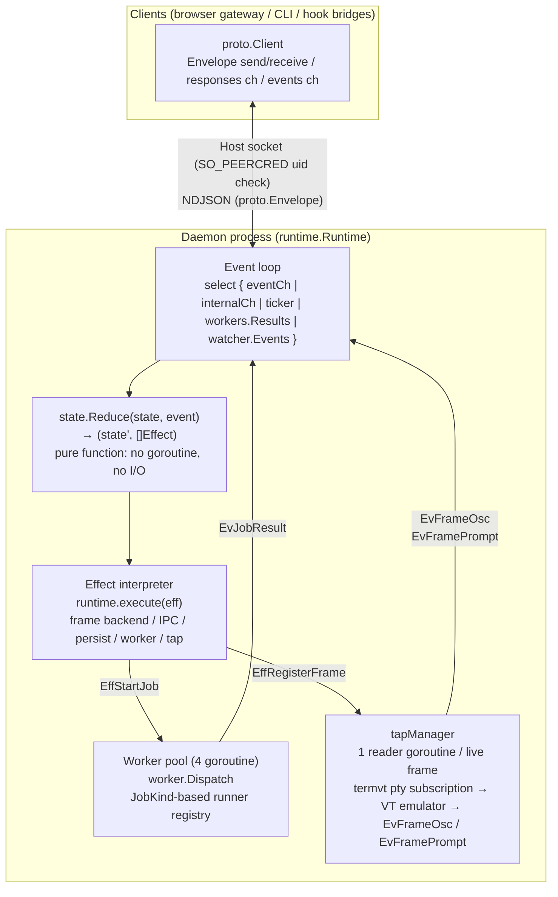

`runtime.Runtime` is the sole state owner. `state.State` is a pure value type that only round-trips as an argument and return value of `Reduce`. The effect interpreter performs frame-backend operations, IPC sends, persistence, and worker pool submits, feeding results back to the event loop as `Event`s.

**Runtime composition**:
- `state`: `state.State` — all domain state (Sessions map, Active, Subscribers, Jobs). Solely owned by the event loop goroutine
- `eventCh`: channel where external goroutines (IPC reader, worker pool, fsnotify watcher, tap readers) submit Events
- `workers`: `worker.Pool` — fixed-size (4) goroutine pool. `worker.Dispatch` dispatches via registered runner lookup using `JobInput.JobKind()`
- `taps`: `*tapManager` — per-frame FrameTap reader goroutines. Started on `EffRegisterFrame`, stopped on `EffUnregisterFrame`. `PtyFrameTap` subscribes directly to the per-frame pty managed by `platform/termvt`; the raw byte stream feeds a per-frame VT emulator (`driver/vt.Terminal`), which fires synchronous callbacks for OSC notifications, window titles, and OSC 133 prompt phases. Callbacks enqueue `EvFrameOsc` / `EvFramePrompt` into `eventCh`
- `conns`: `map[ConnID]*ipcConn` — connection management. Solely owned by the event loop goroutine
- `cfg.Backend` / `cfg.Persist` / `cfg.EventLog` / `cfg.Watcher`: backend interfaces (replaceable with fakes during testing). Production wires `PtyBackend` (over `platform/termvt`) into `cfg.Backend`

### Communication Patterns

| Pattern | Direction | Characteristics | Example |
|---------|-----------|-----------------|---------|
| **Request-Response** | Client → Daemon → Client | Synchronous. Client blocks waiting on response ch | `create-session`, `list-sessions`, `surface.read_text` |
| **Event Broadcast** | Daemon → all subscribed clients | Asynchronous. Delivered to all subscribed clients | `sessions-changed`, `agent-notification`, `peer-message` |

`SessionInfo` is a unified type that carries static metadata and dynamic state in a single message: the runtime's `broadcastSessionsChanged` retrieves status / title etc. from each Session's `Driver.View(sess.Driver)` and packs them into `proto.SessionInfo`. `reduceTick` emits `EffBroadcastSessionsChanged` on every tick, delivering to all subscribers.

Responses are sent uniformly via the `sendResponse` method. Broadcasts are delivered only to clients that have sent the `subscribe` command.

### Message Format

All messages are represented as `proto.Envelope` structs, serialized as newline-delimited JSON (NDJSON). The `Type` field discriminates the message type.

| Field | Purpose |
|-------|---------|
| `type` | `"cmd"` / `"resp"` / `"evt"` |
| `req_id` | Correlates request-response pairs |
| `cmd` | Command name (when type=cmd) |
| `name` | Event name (when type=evt) |
| `status` | `"ok"` / `"error"` (when type=resp) |
| `data` | Typed payload (`json.RawMessage`) |
| `error` | Error details (when status=error) |

Command / Response / ServerEvent are closed sum types. See [interfaces.md](../component/component-20260624-client-interfaces.md#interfaces) for detailed Go type definitions.

### Commands (Client → Server)

| Wire Command | Parameters | Function |
|---------|------------|----------|
| `subscribe` | filters (optional) | Start receiving broadcasts |
| `unsubscribe` | - | Stop receiving broadcasts |
| `event` | event, timestamp, sender_id, payload | Unified event envelope — domain operations and driver hooks (see below). **Host endpoint only.** |
| `hook-event` | token, hook, timestamp, payload | Driver hook notification from a sandboxed agent. **Container endpoint only.** Token resolves to the owning frame server-side. |
| `subsystem-event` | token, source, kind, timestamp, payload | Structured subsystem event from a sandboxed backend. **Container endpoint only.** Token resolves to the owning frame server-side. |
| `surface.read_text` | session_id, lines | Read the trailing N lines of the active frame's VT snapshot |
| `surface.send_text` | session_id, text | Send text followed by Enter to the session's active frame |
| `surface.send_key` | session_id, key | Send a named key (e.g. `Escape`, `q`) without Enter |
| `driver.list` | - | List available driver names and display names |

#### Event Types (via `CmdEvent.Event`)

Domain operations and hook-driven agent events are dispatched via `CmdEvent`. Session-domain operations are registered via `RegisterEvent[T]` and dispatched to typed handlers. Hook-driven events (those with `SenderID` set) are routed as `EvDriverEvent` to the owning frame's driver. Structured backends such as Codex App Server use `CmdSubsystemEvent` and route through `EvSubsystem`.

| Event Type | Payload | Function |
|------------|---------|----------|
| `create-session` | project, command, options | Create a new session (root frame). `options` normalizes driver-agnostic launch flags such as `worktree.enabled` |
| `push-driver` | session_id, project, command, options | Append a new driver frame on top of an existing session's active frame |
| `stop-session` | session_id | Stop a session (terminates every frame in its stack) |
| `list-sessions` | - | Retrieve session list |
| `shutdown` | - | Shut down the daemon |
| *(driver hooks)* | driver-specific | Hook events from hook-driven agents such as Claude and Gemini. `SenderID` is the frame id; the reducer locates the owning frame across all sessions and routes the hook to that frame's driver |
| *(subsystem events)* | source, kind, payload | Structured execution events emitted by a subsystem. Codex App Server uses this path for thread lifecycle, tool execution, approvals, plan, diff, and assistant message updates |

### Client Message Routing

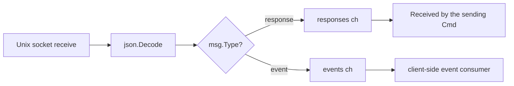

### Concurrency Model — Single Event Loop + Worker Pool

The daemon is composed of a **single event loop + fixed-size worker pool**. All domain state (`state.State`) is solely owned by the event loop goroutine, and state transitions are expressed as the pure function `state.Reduce(state, event) → (state', []Effect)`. No `sync.Mutex` exists in the domain layer (except inside the worker pool).

#### Event Loop and State Ownership

```
runtime.Runtime.Run() — single goroutine
├── select {
│   ├── eventCh     — Events from IPC reader / event bridge
│   ├── internalCh  — conn open/close (runtime internal events)
│   ├── ticker.C    — EvTick at 1-second intervals
│   ├── workers.Results() — EvJobResult from worker pool
│   └── watcher.Events()  — EvFileChanged from fsnotify
│   }
├── dispatch(ev):
│   ├── state.Reduce(r.state, ev) → (next, effects)
│   ├── r.state = next
│   └── for _, eff := range effects { r.execute(eff) }
└── state: state.State (Sessions, Active, Subscribers, Jobs, ...)
    → solely owned by event loop goroutine. No mutex needed
```

#### Effect Interpreter Dispatch

`runtime.execute(eff)` maps each Effect type to backend I/O. Since Effect is a closed sum type, all side effects can be enumerated via `grep`:

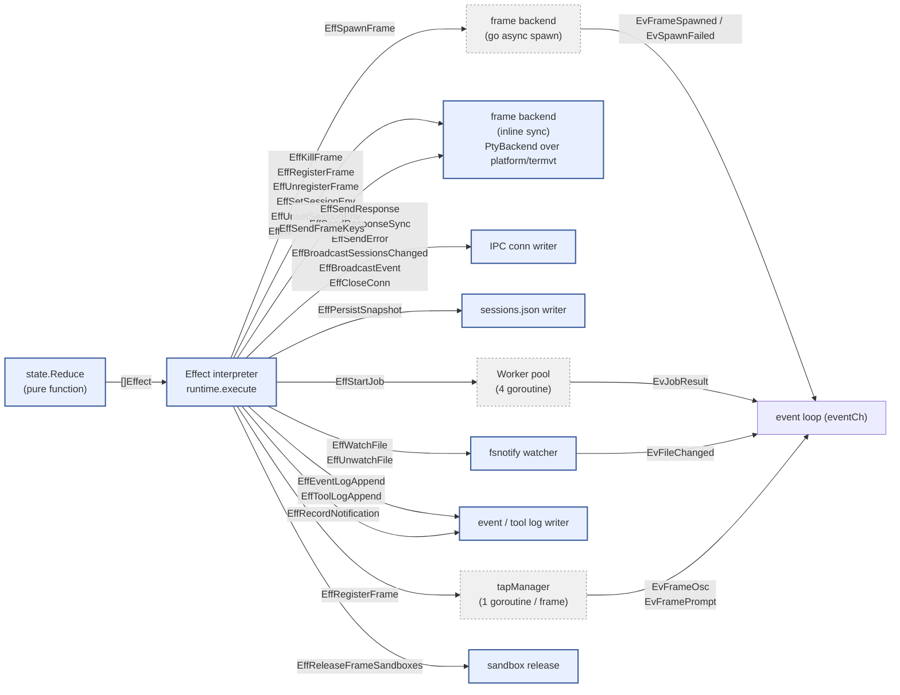

Legend:
- **Solid border** = executed synchronously on the event loop goroutine
- **Dashed border** = executed asynchronously in a separate goroutine. Results are fed back to the event loop as Events

**`EffSendResponse` vs `EffSendResponseSync`**: the former enqueues the wire frame on the connection's writer-goroutine outbox and returns immediately. The latter writes directly to the socket from the event loop goroutine, guaranteeing the response reaches the kernel buffer before the next effect in the same Reduce cycle runs. The sync form is used when a subsequent effect in the same cycle will tear down the connection or shut down the daemon — e.g. the `shutdown` reply must land before the connection-closing effect drops the socket.

#### Worker Pool (Off-Loop Execution of Slow I/O)

Heavy I/O (transcript parse, haiku summary, git branch detect) is executed outside the event loop in a fixed-size worker pool (`worker.Pool`, 4 goroutines). Runners are registered via `RegisterRunner[In,Out]` by the driver at init time, and `Dispatch` looks them up by `JobInput.JobKind()`:

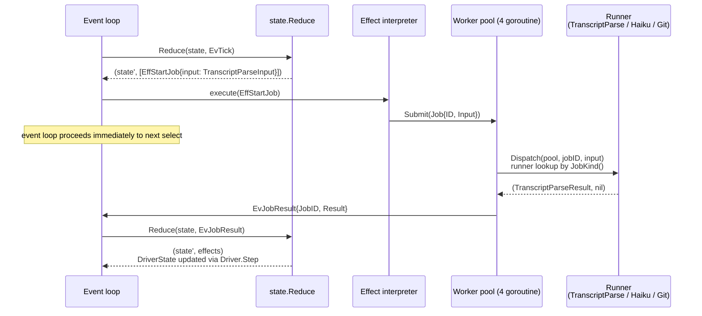

Key points:
- **The event loop never blocks**: EffStartJob only submits to the worker pool. Results return asynchronously as EvJobResult
- **Fixed goroutine count**: event loop (1) + IPC accept (1) + worker pool (4) + IPC reader/writer (per client). Independent of session count
- **Type-based runner registration**: `worker.RegisterRunner("transcript_parse", runner)` — adding a new job type requires only one RegisterRunner call + a runner function + a JobKind() method

#### Tick Processing Sequence

On each tick, `state.Reduce` calls Driver.Step for all sessions and returns the necessary Effects (transcript parse / branch detect job, broadcast, persist):

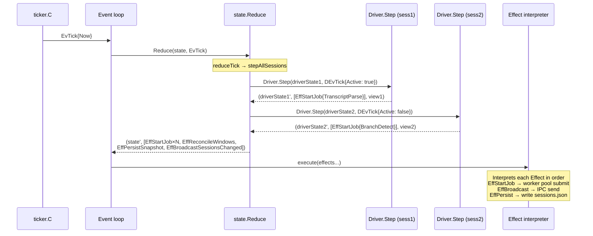

#### Hook and Subsystem Event Routing

**Host frames**: `CmdEvent` (with `SenderID` set to the frame's env var) → IPC reader → event loop → `reduceDriverHook` → `Driver.Step(DEvHook)`.

**Sandboxed frames**: `CmdHookEvent` (with bearer token) → container endpoint accept loop → token Lookup → `EvDriverEvent{SenderID: resolvedFrameID}` → event loop → `reduceDriverHook` → `Driver.Step(DEvHook)`. The client-supplied frame ID is not used; the token resolves it server-side.

**Structured backends**: `CmdSubsystemEvent` (host or container bearer-token path) → IPC reader / container endpoint → `EvSubsystem{FrameID: resolvedFrameID}` → event loop → `reduceSubsystem` → `Driver.Step(DEvSubsystem)`.

Hook-driven agents converge at `EvDriverEvent`; structured backends converge at `EvSubsystem`. See [state-monitoring.md](../component/component-20260624-client-state-monitoring.md) for the driver-side handling details.

#### Resident Goroutines

| Goroutine | Count | Role |
|-----------|-------|------|
| `Runtime.Run` (event loop) | 1 | State ownership + Reduce + Effect interpretation |
| `acceptLoop` (host) | 1 | Accepts new connections on `server.sock`; performs SO_PEERCRED uid check before admitting |
| container endpoint accept | 1 per active project | Accepts connections on per-project `<run-hash>/server.sock`; bearer token is validated per-message |
| `ipcConn.readLoop` | M (1 / client) | IPC reader. Converts Commands to Events and submits to eventCh |
| `ipcConn.writeLoop` | M (1 / client) | IPC writer. Drains outbox and writes to socket |
| `worker.Pool.run` | 4 (fixed) | Worker pool goroutines |
| `tapManager.readTap` | N (1 / live frame) | FrameTap reader. Feeds the raw byte stream from the per-frame pty via `platform/termvt` subscription into a per-frame VT emulator, which fires callbacks that emit `EvFrameOsc` (window titles + OSC 9/99/777 notifications) and `EvFramePrompt` (OSC 133 phases) into eventCh |

IPC reader/writer scales with client count; tap readers scale with live frame count. Both are continuous sources that only emit events — they never read or write `state.State`.

#### Hook Event Routing Sequence

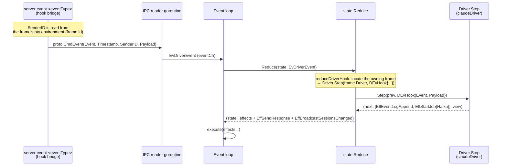

#### Subsystem Event Routing Sequence

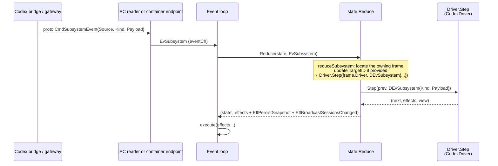

### IPC Type Design Invariants

`Cmd*`, `Resp*`, and `Evt*` types in `src/proto/` follow these invariants:

- **Optional fields use `omitempty`; zero value means absent.** A zero value with distinct semantics belongs in a separate type.
- **Names are client-agnostic.** No client-specific terms (browser / CLI / hook / orchestrator) in field or type names; every client consumes the same types.
- **Every concrete type carries its marker methods** (`isCommand()` / `CommandName()`, `isEvent()` / `EventName()`, `isResponse()`).
- **`state.View` is written by the driver only.** Browser and any future native clients read state; neither branches on driver name (see Driver isolation in `ARCHITECTURE.md`).

Commands in the `surface.*` and `driver.*` namespaces use dotted names within the same `proto.Envelope` format — no protocol change is required to add new namespaces.

## Tool System

High-level user operations are abstracted as `Tool`s. Each Tool wraps a typed IPC command sequence and is surfaced uniformly to every client: the browser via the gateway's REST API (`POST /api/sessions`, etc.) and host-side helpers via the same IPC.

```go
// tools/tools.go
type Tool struct {
    Name        string
    Description string
    Params      []Param
    Run         func(ctx *ToolContext, args map[string]string) (*ToolInvocation, error)
}

type Param struct {
    Name    string
    Options func(ctx *ToolContext) []string  // generates choices at runtime
}

type ToolContext struct {
    Client *sessions.Client // typed IPC connection to daemon (sessions.Wrap(*proto.Client))
    Config ToolConfig       // tool config (commands, projects)
    Args   map[string]string
}
```

### Tool to IPC Command Mapping

A Tool's `Run` sends typed IPC commands via `ToolContext.Client` (`sessions.Client`, which wraps `proto.Client`). Each Tool corresponds to one IPC command. By returning a `ToolInvocation`, tools can chain follow-up tools within the same invocation (e.g., `create-project` → `new-session`).

| Tool | IPC Command | Parameters |
|------|-------------|------------|
| `new-session` | `create-session` | project, command |
| `stop-session` | `stop-session` | session_id |

Tools target high-level operations with side effects (create, stop, etc.). Side-effect-free lookups such as session listing or surface reads bypass the Tool layer and are sent directly as IPC commands by the calling client.

### Parameter Completion

Tool parameter values are resolved by each `Param`'s `Options` callback. The completion flow is: tool selection → dynamically generate choices via `Options` → incremental filtering by user input → execute `Tool.Run` once every parameter is bound. Effects of the invocation reach every subscribed client via the `sessions-changed` broadcast.

````

## Legacy Source: component-20260624-client-overview

````markdown
---
id: component-20260624-client-overview
kind: component
title: client/ — agent-grid client (Session Lifecycle Manager)
status: active
created: '2026-06-24'
updated: '2026-07-04'
tags:
- technical
- client
- legacy-import
owners: []
relations:
- {type: references, target: adr-20260624-0081-codex-frame-init-serialize}
- {type: references, target: component-20260624-client-interfaces}
- {type: references, target: component-20260624-client-ipc}
- {type: references, target: component-20260624-client-process-model}
- {type: references, target: component-20260624-client-state-monitoring}
- {type: references, target: component-20260624-orchestrator-overview}
- {type: referencedBy, target: note-20260624-agent-overview}
- {type: referencedBy, target: note-20260624-docs-overview}
- {type: referencedBy, target: note-20260624-technical-code-enforcement}
- {type: referencedBy, target: note-20260624-technical-overview}
- {type: referencedBy, target: component-20260705-client-web-browser-harness}
source_paths:
- clients/ui/
- src/cmd/server/
- src/server/api/
- ARCHITECTURE.md
- src/client/state/
- src/client/runtime/
- src/client/state/view/
- src/client/driver/
provides:
- client-agent-grid-client-session-lifecycle-manager
summary: 'client/ is all of the client: the in-process session daemon (state machine
  + runtime + drivers + IPC) and the browser frontend assets under clients/ui/ (repo root). Both
  are shipped inside the server binary (cmd/server). It depends'
---

<!-- migrated_from: docs/technical/client/README.md -->

# client/ — agent-grid client (Session Lifecycle Manager)

`client/` is all of the client: the in-process session daemon (state machine + runtime + drivers + IPC) and the browser frontend assets under `clients/ui/` (repo root). Both are shipped inside the `server` binary (`cmd/server`). It depends on `platform/` but **must not** import `orchestrator/` (enforced by the `depguard` rule `client-no-orchestrator`).

The agent-grid client is a *session lifecycle manager*, not an agent orchestrator. It gives you visibility and fast access to agents running across many projects; it does not decide what those agents do. The daemon owns sessions and exposes typed IPC over a Unix socket; the co-resident HTTP/WS gateway under `server/api/` translates browser REST + WebSocket traffic into IPC, so the browser is the operator's primary surface.

## Functional Core / Imperative Shell

This is the **canonical statement** of how `client/` realizes the cross-layer core principles ([ARCHITECTURE.md → Design Principles](../../../ARCHITECTURE.md#design-principles)). It is the strict Functional Core / Imperative Shell form — pure reducer plus zero mutexes — shared by **both decision-loop layers**: the orchestrator's `scheduler` realizes the same form (`scheduler.Reduce` over an immutable, mutex-free `State`; see the [orchestrator deep dive](../component/component-20260624-orchestrator-overview.md#design-principles-orchestrator-realization)). The pattern below is the reference implementation; `platform/`, being an I/O-wrapping library rather than a decision loop, uses dependency-injection seams instead.

- **Functional Core (`client/state/`)** — all state transitions are a pure function `state.Reduce(state, event) → (state', []Effect)`. No goroutines, mutexes, or actors (the no-mutex rule is enforced by `forbidigo`). Drivers run synchronously inside `Reduce`; the only permitted synchronous I/O is bounded read-only filesystem stat (e.g. checking whether a resume file exists). Everything else is emitted as an `Effect`.
- **Imperative Shell (`client/runtime/`)** — a single event loop owns state mutation and interprets `Effect` values into real I/O (PTY spawn / IPC writes / sandbox launch / worker pool). Long-lived I/O readers only *emit* events; they never read or write state. The worker pool (discrete jobs) and stream readers (continuous sources) are both instances of this principle.

This split is why the core is testable without mocks: `Reduce` and `Driver.Step` are verified purely by their return values.

## Packages

| Package | Responsibility |
|---|---|
| `client/state/` | Pure domain layer — `State`, `Event`, `Effect`, `Reduce`. No I/O, no goroutines. Imports only stdlib + stdlib-only internal packages (`features`). |
| `client/state/view/` | Wire-safe view types — `Status`, `View`, `Card`, `Tag`. Stdlib-only; no `state` import. |
| `client/driver/` | Driver implementations — value-type plugins + per-frame `DriverState`. No I/O. |
| `client/runtime/` | Imperative shell — single event loop, Effect interpreter, backend abstraction. |
| `client/runtime/worker/` | Worker pool — slow I/O jobs (summarize, transcript parse, git, github fetch). |
| `client/runtime/subsystem/` | `Subsystem`/`Factory` interfaces + the `cli` and `stream` implementations. The only place in `runtime/` allowed to import `driver/<tool>`. |
| `client/proto/` | Typed IPC wire layer — Command / Response / ServerEvent sum types + codec. Imports `state/view` only. |
| `client/proto/sessions/` | Session-management helpers wrapping `proto.Client`. Imports `state`. |
| `client/tools/` | Operator tool abstraction (palette-style tool invocation surfaced through IPC). |
| `clients/ui/` (repo root) | Browser frontend assets (React + xterm.js), served by `cmd/uihost` via `src/uihost`. |
| `client/config/` | TOML loading, DataDir injection, SandboxResolver. |
| `client/cli/` | Subcommand registry — tool-specific subcommands registered via `init()`. |
| `client/lib/peers/` | Peers MCP server (IPC specific to the client). |
| `client/lib/{claude,codex}/transcript/` | Transcript renderers (depend on `state` for frontend integration). |

## Terminology

| Term | Meaning |
|---|---|
| **Session** | A unit of work for an agent. `state.Session` owns a stack of execution **frames** (`[]SessionFrame`). The active frame is the stack tail; the root frame defines the session's existence — if it dies, the session is deleted. |
| **Frame** | One execution context within a session, carrying its own `Command`, `LaunchOptions`, `DriverState`, `SubsystemID`, `TargetID`. Frame death truncates the stack from that frame onward; push-driver appends a new frame on top. |
| **Frame surface** | The pty surface attached to a frame, served by `PtyBackend` over `platform/termvt`. The backend keys its `termvt.Manager` on `string(FrameID)` directly — there is no separate physical-handle namespace. The browser xterm.js view subscribes to the same frame surface via the `server` gateway. |
| **Subsystem** | Runtime-owned execution backend (`Start/BindFrame/ReleaseFrame/Stop`). `cli` manages single-process per-frame launch and worktree lifecycle; `stream` fronts long-lived structured backends (Codex App Server). The stream subsystem resolves the per-session UDS the app-server binds (`Factory.ResolveSockPath`) and derives the host-side dial path from the launch's bind mounts (`WrappedLaunch.HostPath`), but delegates exec wrapping (direct vs `docker exec`) to the `agentlaunch.Dispatcher` it holds. |
| **Warm start** | Runtime startup against an existing `<dataDir>` — restores the frame stack from `sessions.json` and rebinds live frames; surviving containers are adopted. |
| **Cold start** | Runtime startup with no live frames (fresh boot / kill recovery) — respawns frames in root-to-tail order; surviving containers are discarded and provisioned fresh so `postCreate` daemons are guaranteed present. |

## Code dependency direction

- `main` → `runtime`, `driver`, `proto`, `tools`, `config`, `logger`
- `runtime` → `state` (calls `Reduce`), `proto` (wire codec), `runtime/worker`, `runtime/subsystem` (interface only — no concrete subsystem imports)
- `runtime/subsystem/<kind>` → `state`, `driver/<tool>` (constants/socket paths only), `lib/*`, `sandbox/`
- `runtime/worker` → `state` only (JobID, JobInput, EvJobResult); not driver/lib
- `state` is self-contained — stdlib + stdlib-only internal packages (`features`) only
- `state/view` → stdlib only; `state` re-exports its types as aliases
- `driver` → `state` (embed base types), `runtime/worker` (RegisterRunner), `lib/*`
- `proto` → `state/view` only (does **not** import `state`)

Frames route events: `Reduce` routes session-level events by sessionID and frame-level events (hooks, subsystem events, lifecycle) by frameID to the owning frame's `Driver.Step`.

## Daemon ↔ client processes

The daemon exposes typed IPC (`proto`) over a Unix socket. Two physical endpoints serve different client classes: the **host endpoint** (`<dataDir>/server.sock`, SO_PEERCRED auth) serves the co-resident HTTP/WS gateway, the `server event <type>` / `server host-exec` / `server mcp-exec` subcommands, and any future native client; the **container endpoint** (`<dataDir>/run/<project-hash>/server.sock`, bearer-token auth) serves sandboxed agents and accepts only `hook-event`/`subsystem-event`. See [process model](../component/component-20260624-client-process-model.md) and [IPC](../component/component-20260624-client-ipc.md).

## Design decisions

| Decision | Choice | Rationale |
|---|---|---|
| No optimistic updates | Do not modify view state on IPC error | Auto-recovers on next poll; avoids state inconsistency. |
| Shutdown semantics | `EffReleaseFrameSandboxes` runs on explicit shutdown; SIGINT/SIGTERM only persist `sessions.json` so containers survive warm restart | Container lifetime is a state-layer effect, ordered in the event loop rather than a defer stack. Sessions restore on the next boot via `sessions.json`. |
| Claude cold-start launch | Assemble `claude --resume <id>` in `Driver.PrepareLaunch(LaunchModeColdStart, …)` | `--resume` knowledge stays in the driver; the runtime interprets the baked plan verbatim. |
| Launch plan resolution | In the reducer (pure), with one cold-start bootstrap exception | Driver-specific logic stays in the pure core; the bootstrap goroutine is the only safe direct caller. |
| Resident tracking | `SubsystemID -> Subsystem` (`subsystems`), `FrameID -> Subsystem` (`frameSubsystems`), `FrameID -> SubsystemID` (`frameSubsystemIDs`), `FrameID -> TargetID` | These are **plain maps owned exclusively by the event loop** — no mutex (single-writer). The spawn goroutine holds no `*Runtime` and reports completion via an internal spawn-complete event; the loop is the sole writer. `subsystems` holds every live Subsystem keyed by its opaque SubsystemID, dispatched via per-kind Factories registered in `runtime.New`. `frameSubsystems` routes `ReleaseFrame` to the owning subsystem. `frameSubsystemIDs` is used by `reapSubsystemIfLast`: when the last frame of a Session is released, `Factory.Remove` is called to stop the app-server (stream subsystem reap). Shutdown ranges `subsystems` and calls `Stop` on each. CLI uses one Subsystem per project; the stream subsystem uses one Subsystem per session managed by the client (`stream:session:<id>`). |
| IPC timeout | Not set on the protocol itself | Runtime-side I/O (subprocesses via `exec.CommandContext`, `worker.Pool.Stop()` bounded to 500 ms) is fully ctx-scoped, so client disconnect and daemon exit never hang. A pure event-loop deadlock still requires external restart. |
| Frame ownership of DriverState | Each `SessionFrame` holds its own `DriverState`, updated in-place by `Driver.Step` inside `Reduce` | Session outlives any frame; push-driver layers a fresh context; frame death truncates only its slice. |
| Hook event target identification | Inject a frame-scoped env var at frame-spawn time | Env vars are race-free at kernel exec level. See [state monitoring](../component/component-20260624-client-state-monitoring.md#hook-event-routing-and-race-free-identification). |
| Hook payload abstraction | `CmdEvent.Payload` as opaque `json.RawMessage` | Driver-specific fields need no state/runtime/proto changes. |
| Agent hook integration | `server event <eventType>` → `proto.CmdEvent`/`CmdHookEvent` → `EvDriverEvent` → `reduceDriverHook` → `Driver.Step(DEvHook)` | Used by hook-driven agents (Claude, Gemini). Host-side events carry `SenderID`; sandboxed events resolve the frame via bearer token. Hooks for truncated frames are dropped. |
| Structured stream integration | `codex app-server` → `proto.CmdSubsystemEvent` → `EvSubsystem` → `reduceSubsystem` → `Driver.Step(DEvSubsystem)` | Used by Codex. **Exactly one `codex app-server` runs per session managed by the client** (`stream:session:<id>`). All frames within the same Session share one app-server; different Sessions get separate processes. The app-server is launched via `agentlaunch.Dispatcher.Wrap` + `agentlaunch.Spawn` (argv-direct; no bespoke `docker exec` construction in the stream backend) and binds a per-session UDS (`codex-<sessionID>.sock`). Frames join via `BindFrame`, which registers the frame's binding (empty threadID for fresh cold-start, pre-bound for cold-start recovery) and rewrites `Plan.Command` — the daemon itself never calls `thread/start` on the app-server; the codex CLI owns thread creation and backend adopts the CLI's thread when its `thread/started` broadcast arrives (see [ADR-0081](../adr/adr-20260624-0081-codex-frame-init-serialize.md)). The daemon dials the UDS directly (host-side path resolved from the launch's bind mounts via `WrappedLaunch.HostPath`); each frame attaches over the same socket with `codex --remote unix://<sock>` (fresh) or `codex resume <persistedID> --remote unix://<sock>` (recovery). No TCP routing bridge. The stream layer emits structured tool/approval/plan/diff/message/thread-lifecycle events; `TargetID` carries the logical thread identity. When a session's last frame is released, the app-server is reaped. |
| Container egress restriction | Delegate to host (`docker network` + iptables) via `extra_create_args` | Hostname allowlists cannot be expressed by `docker create` flags alone. |
| Sandbox launcher abstraction | `runtime.AgentLauncher` wraps each `LaunchPlan`; `SandboxDispatcher` resolves direct vs devcontainer per project. The stream daemon holds a separate `runtime.Config.StreamDispatcher` backed by a non-TTY `DevcontainerLauncher` (`docker exec -i`) that shares the same `sandbox.Manager` as the interactive per-frame launcher (`-it`) | Keeps sandbox rewriting out of the reducer; one daemon mixes sandboxed and direct projects. Interactive frames vs the daemon stream consumer require different TTY settings but must share the same container lifecycle. |
| Container↔host path translation | `lib/pathmap` rewrites IPC payload paths using the frame's mounts. Per-frame bearer token and mounts are held together in a single `framereg.Registry` (one RWMutex), written atomically (`RegisterWithMounts`) by the event loop and read by the container endpoint's per-connection goroutines. | `state/`, `runtime/` (above the launcher), and `proto/` stay unaware of container layout. The registry's RWMutex is the **one sanctioned lock** in the runtime root: container hook handlers read off-loop, so token/mounts cannot be plain loop-owned maps — and writing token+mounts under one lock closes the window where a hook could resolve a token but miss its mounts. |

## Deep dives

- [Process model](../component/component-20260624-client-process-model.md) — daemon process, pty frame model, rendering responsibilities
- [IPC and tool system](../component/component-20260624-client-ipc.md) — message format, command surface, concurrency model, Tool abstraction
- [State monitoring](../component/component-20260624-client-state-monitoring.md) — driver plugins, the polling pipeline, hook routing, persistence
- [Interfaces](../component/component-20260624-client-interfaces.md) — Go type definitions, data files, source tree

````

## Legacy Source: component-20260624-client-process-model

````markdown
---
id: component-20260624-client-process-model
kind: component
title: Process Model, Frame Model, and Rendering Responsibilities
status: active
created: '2026-06-24'
updated: '2026-07-04'
tags:
- technical
- client
- legacy-import
owners: []
relations:
- {type: referencedBy, target: component-20260624-client-overview}
- {type: references, target: adr-20260624-0081-codex-frame-init-serialize}
- {type: references, target: component-20260624-platform-sandbox}
- {type: referencedBy, target: note-20260624-technical-overview}
source_paths:
- clients/ui/
- src/cmd/server/
- clients/ui/src/
- src/client/lib/agenthook/
- src/server/api/
- src/client/runtime/subsystem/stream/
- src/client/runtime/pty_backend.go
- src/platform/termvt/session.go
provides:
- process-model-frame-model-and-rendering-responsibilities
summary: agent-grid rendering divides responsibilities between the driver and the
  browser frontend at the following boundaries. When adding a new driver, you do not
  need to touch the runtime or the frontend code. A driver only
---

<!-- migrated_from: docs/technical/client/process-model.md -->

# Process Model, Frame Model, and Rendering Responsibilities

## Rendering Responsibilities

agent-grid rendering divides responsibilities between the driver and the browser frontend at the following boundaries. **When adding a new driver, you do not need to touch the runtime or the frontend code**. A driver only needs to implement `View(DriverState) state.View`.

### Driver-Owned (`SessionView`)

The driver returns `View(DriverState) state.View`. It is a pure function that performs no I/O or detection (heavy processing is already reflected in DriverState via `Step(DEvTick)`).

- `Card.Title`: First line (e.g., conversation title)
- `Card.Subtitle`: Second line (e.g., most recent prompt)
- `Card.Tags`: Identity chips. **The driver directly determines colors** (Tags carry `Foreground` / `Background`)
  - The command name is displayed via `View.DisplayName` and `Card.BorderTitle`. Tags contain only branch names, etc.
- `LogTabs`: Additional log tabs (label + absolute path + kind). kind is a TabKind constant defined by the driver (the generic `TabKindText` is provided by state; driver-specific kinds are defined in each driver package)
- `InfoExtras`: Driver-specific lines in the INFO tab
- `SuppressInfo`: Opt-out of the INFO tab (explicitly set by driver)
- `StatusLine`: Pre-rendered status string (consumed by the frontend's session header)

### Frontend-Owned

The browser frontend (`uihost` xterm.js bundle, served by the `web` host binary and proxied through `cmd/server`'s gateway) acts as a driver-agnostic generic renderer.

- Rendering of `SessionInfo` generic fields (ID / Project / Command / CreatedAt / State / StateChangedAt)
- Color selection from `State` enum values — universal state colors are consistent across all drivers
- Elapsed time formatting (relative notation like `5m ago`)
- Card layout (ordering of each slot / margins / wrap / truncate)
- INFO tab generic header (auto-generated from SessionInfo generic fields → driver's `InfoExtras` appended at the end)
- LOG tab (always tails `~/.agent-grid/server.log`)
- Filter / fold / cursor restoration

### Prohibitions

- **Do not branch on driver name in the frontend** (code like `if cmd === "claude" {...}` is prohibited). Verifiable by grep:
  ```sh
  grep -rn '"claude"\|"bash"\|"codex"\|"gemini"' clients/ui/src/  # → should return 0 results
  ```
- **Drivers must not depend on any presentation library or the web frontend** (no import of `uihost`, xterm.js, or any UI runtime)
- **Drivers must not perform I/O** (delegate to runtime via Effects like EffEventLogAppend, EffStartJob, etc.)
- **Runtime must not call driver-specific I/O directly** (runtime only interprets Effects; driver-specific I/O is executed by worker pool runners)

### Tag Colors Are Driver-Owned, State Colors Are Frontend-Owned — Why the Different Ownership?

- **State** concepts (idle / running / waiting / error) and their colors **should be consistent across all drivers**. Users would be confused if the same state appeared in different colors → centralized in the frontend theme
- **Tags** are driver-specific (branch tag, command tag, ...). What to display and what color are up to the driver → driver-owned
- If tag caching/persistence is needed, the driver holds it in the `PersistedState` bag (e.g., claudeDriver's `branch_tag` / `branch_target` / `branch_at`)

### Rendering Flow (driver → runtime → IPC → frontend)

The driver's `View(driverState)` produces the UI payload, runtime's `buildSessionInfos` packs it into `proto.SessionInfo`, broadcasts it via IPC through `EffBroadcastSessionsChanged`, and the frontend renders it generically **without branching on driver name**. The diagram below shows the flow that occurs on each tick:

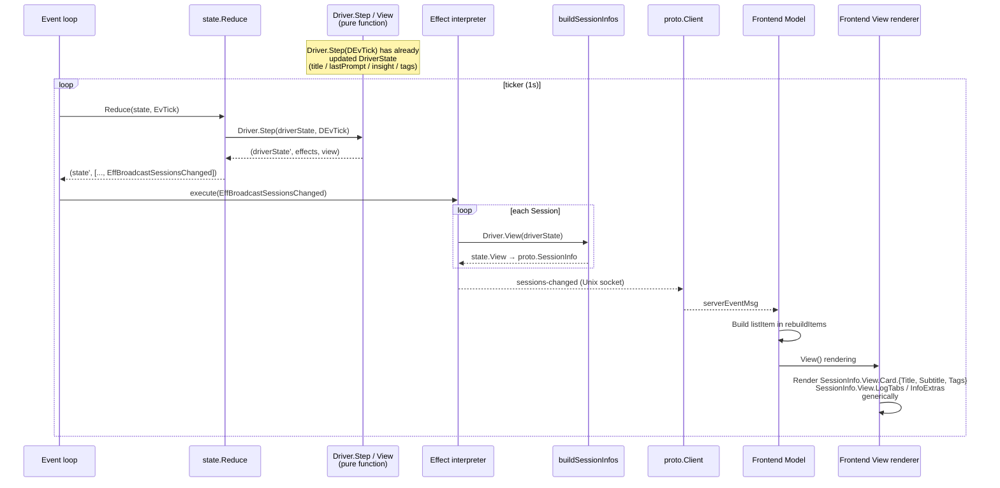

Key points:
- Runtime's `buildSessionInfos` packs `state.View` directly into `proto.SessionInfo.View` and transports it. The frontend renders `SessionInfo.View.*` fields generically.
- StatusLine travels on the same `proto.SessionInfo.View` payload: the active session's `Driver.View().StatusLine` is what the frontend displays in the session header.

## Process Model

The `server` binary has one long-lived form (the merged backend) and a small set of short-lived one-shot subcommands. All agent hook registration is owned by the runtime itself (`client/lib/agenthook`), invoked from the daemon boot path on the host and from the devcontainer postCreate inside containers — there are no `scripts/setup-*.sh` shims left in the tree:

```
server -data-dir <dir>             → Backend daemon (Runtime event loop + IPC server)
                                     + co-resident HTTP/WS gateway (cmd/server)
                                     also: register host hooks for every supported
                                           agent at boot (Claude / Gemini today)
server event <eventType>           → Hook event receiver (short-lived process invoked by an agent hook)
server host-exec <bin> [args ...]  → Host-exec broker shim (run inside a sandboxed container)
server mcp-exec <alias>            → MCP-proxy shim (run inside a sandboxed container)

bridge claude-setup-hooks   → Claude hook registration inside the devcontainer
bridge gemini-setup-hooks   → Gemini hook registration inside the devcontainer
                                      (both called from the devcontainer postCreate by coordinator.go;
                                       Codex has no hooks — it is integrated via the app-server protocol)
```

There is exactly **one** long-lived backend process — `server`. It owns both the daemon coordinator (event loop, IPC sockets, persistence) and a co-resident HTTP/WebSocket gateway goroutine that exposes the browser surface. The separate `web` binary serves the React/xterm.js bundle and reverse-proxies REST/WS to that gateway.

### Daemon (Runtime)

The daemon is the single long-running process that owns all session state. Concretely it runs:

- the Runtime event loop (`select` over eventCh / ticker / workers / fsnotify),
- the IPC server (host endpoint plus per-container endpoint),
- the worker pool that executes Effects against drivers and backends,
- `tapManager`, which holds one reader goroutine per frame fanning the per-frame pty stream out to subscribers (the browser frontend's xterm.js terminal connects through this fanout via `server/api`).

```
runDaemon()
├── Register drivers (driver.RegisterDefaults)
├── Build worker pool (worker.NewPool + RegisterDefaults)
├── Build Runtime (runtime.New) with PtyBackend over platform/termvt.Manager
├── LoadSnapshot — restore each session's frame stack from sessions.json
├── Cold-start bootstrap
│   └── RecreateAll — for each session, walk frames root-to-tail and
│                     Driver.PrepareLaunch(LaunchModeColdStart, …) using
│                     the persisted LaunchOptions; emitted EffSpawnFrame
│                     drives termvt.Manager to allocate a fresh pty session
│                     keyed by string(FrameID)
├── rt.Run(ctx) — start event loop goroutine
│                 tapManager starts a reader goroutine per frame on EffRegisterFrame;
│                 each reader feeds the raw pty stream into a VT emulator and
│                 emits EvFrameOsc / EvFramePrompt into eventCh. tapManager.stopAll()
│                 is called on ctx cancel.
│                 defer stack tears down in reverse: deactivateBeforeExit → EventLog.CloseAll
│                 → shutdownIPC → workers.Stop (bounded 500ms; pool ctx cancels runner
│                 subprocesses via SIGKILL) → close(done)
├── rt.StartIPC() — start Unix socket server
├── FileRelay startup — push monitoring for log/transcript files
└── Block on ctx until SIGINT/SIGTERM or explicit shutdown
```

**Cold start is the only startup mode** because `PtyBackend` is backed by an in-process `platform/termvt.Manager` whose session table is empty at every daemon boot — no pty survives the daemon process. The bootstrap therefore always walks the restored frame stack and calls `Driver.PrepareLaunch(LaunchModeColdStart, …)` for each frame, using the normalized `LaunchOptions` persisted alongside the frame's `driver_state`. `sessions.json` is the source of truth for what to restore.

The `RespawnFrame` interface still exists on `FrameLifecycle` and `PtyBackend` implements it as a teardown + recreate via the termvt.Manager, but the cold-start bootstrap path does not use it — fresh launches go through `EffSpawnFrame`.

For Codex, the daemon starts **one `codex app-server` per session managed by the client** (keyed by `stream:session:<sessionID>`). All frames within the same Session (root + peers) share one app-server; different Sessions get separate processes. The app-server is launched via `agentlaunch.Dispatcher.Wrap` + `agentlaunch.Spawn` (argv-direct, no host shell); the listen argv is built by `libcodex.AppServerListenArgs`, binding a per-session UDS `codex-<sessionID>.sock`. The path the app-server binds comes from `Factory.ResolveSockPath` (container-absolute under the run dir in container mode); the host-side path the daemon dials is derived from that path plus the launch's bind mounts (`resolveDialSock` → `WrappedLaunch.HostPath`). The stream daemon uses a dedicated non-TTY `DevcontainerLauncher` (`docker exec -i`) that shares the same `sandbox.Manager` as the per-frame interactive launcher. The daemon connects via **WebSocket-over-UDS** (HTTP Upgrade — the transport codex app-server speaks). Structured RPC events are converted to `DEvSubsystem` and dispatched to the owning frame. Each frame runs in the same sandbox as the app-server and attaches to that UDS directly with `codex --remote unix://<sock>` (fresh cold start — the codex CLI issues its own `thread/start`, backend adopts via `handleThreadStarted`) or `codex resume <id> --remote unix://<sock>` (cold-start recovery — the CLI resumes a persisted thread from its local rollout file); these remote-attach strings are built by `libcodex.RemoteAttachArgs`. There is no TCP routing bridge. Codex state is not driven by hooks. When a session's last frame is released, `Factory.Remove` stops the corresponding app-server process (reap on exit). Frame binding is deterministic despite the shared broadcast channel: `stream.Backend.initSem` serialises pending fresh frames so any incoming thread has a single unambiguous owner ([ADR-0081](../adr/adr-20260624-0081-codex-frame-init-serialize.md)).

### Codex process topology

The paragraph above compresses two spawn paths, two daemon-internal backends, and a host/container boundary into one line. Concretely, a Codex client-Session runs **1 + N processes**: one `codex app-server` shared across the session's frames, and one `codex --remote` TUI per frame. `stream.Backend` and `PtyBackend` own the two spawn paths independently — `stream.Backend` is *not* layered on top of `PtyBackend`.

| Component | Scope | Layer | Spawns | pty? |
|---|---|---|---|---|
| `stream.Backend` (`client/runtime/subsystem/stream/`) | session (`SubsystemID` keyed on session) | `Subsystem` interface | `codex app-server --listen unix://...` via `agentlaunch.Spawn` (argv-direct) | no — plain stdio pipes, `procgroup` |
| `PtyBackend` (`client/runtime/pty_backend.go`) | frame (1 per FrameID) | `FrameBackend` interface | rewritten `Plan.Command` = `codex --remote unix://...` via `termvt.Manager` | yes — `/dev/ptmx` master owned by daemon |

Every Codex frame flows through **both**: `stream.Backend.BindFrame` registers a per-frame binding (empty threadID for fresh cold-start, pre-bound for recovery), rewrites `Plan.Command` to `codex --remote` / `codex resume <id> --remote`, then `PtyBackend.SpawnFrame` runs that command in a pty. Backend itself never issues `thread/start` or `thread/resume` — the codex CLI owns the thread lifecycle, and backend adopts the resulting broadcast via `handleThreadStarted` under the `initSem` serialisation invariant ([ADR-0081](../adr/adr-20260624-0081-codex-frame-init-serialize.md)).

#### Host mode

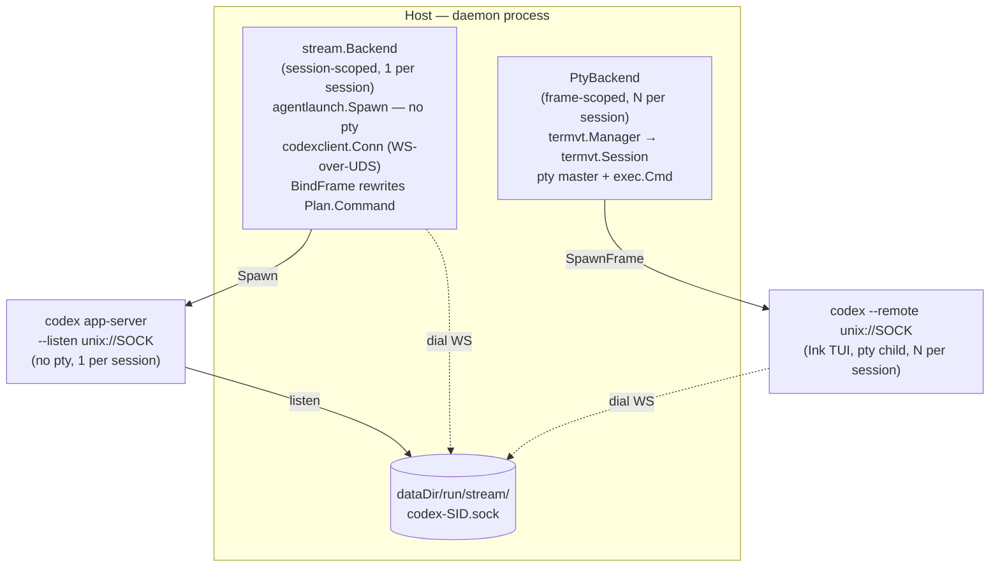

#### Devcontainer mode

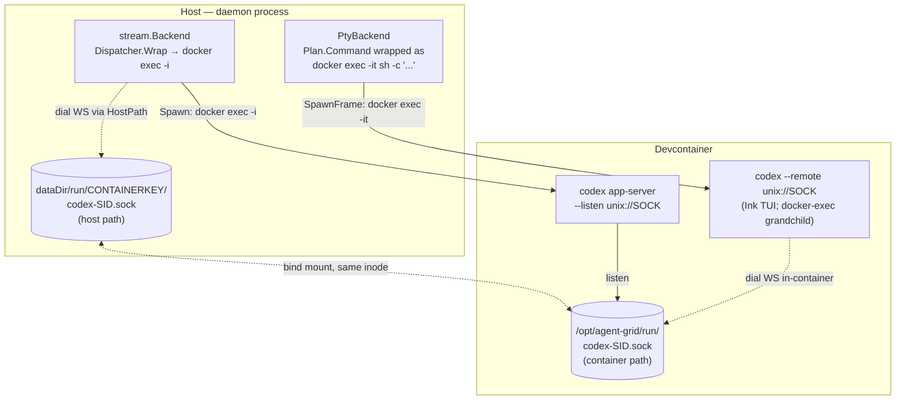

Reading notes:

- **The pty master always lives on the host** — it is created by `termvt.NewSession` (`platform/termvt/session.go:79`, `pty.StartWithSize`) inside the daemon process. In devcontainer mode the pty's immediate child is the `docker exec` CLI on the host; the actual `codex --remote` TUI runs in the container as its grandchild.
- **The dial socket and the listen socket are the same file.** In devcontainer mode the listen path is container-absolute and the dial path is its host-side alias via bind mount; `resolveDialSock` → `WrappedLaunch.HostPath` (`stream/backend.go:182`) is the translator. In host mode the two paths are identical.
- **Client disconnect / reconnect does not touch either process.** `reduceConnClosed` only tears down `Subscribers` / `SurfaceSubs` and emits `EffSurfaceSubscribeStop`; it never emits `EffKillFrame` or stops the subsystem. Both the app-server and the per-frame TUI survive until the frame is explicitly killed (or, for the app-server, until `reapSubsystemIfLast` runs after the session's last frame is released).
- **Thread lifecycle is owned by the codex CLI, not the daemon.** For fresh cold-start the CLI issues its own `thread/start` on its connection; `stream.Backend` receives the resulting `thread/started` via broadcast and adopts it into the frame currently reserving the `initSem` slot (serialisation guarantees exactly one adopt candidate — see [ADR-0081](../adr/adr-20260624-0081-codex-frame-init-serialize.md)). For cold-start recovery the daemon passes the persisted threadID to the CLI via `codex resume <id> --remote`; the CLI resumes from its local rollout file and the pre-registered mapping in `Backend.threads[id]` routes the resulting broadcast deterministically (no initSem consumed).
- **This two-process topology is Codex-specific.** Claude / Gemini drivers do not set `Plan.Subsystem`, so `ensureSubsystemOnce` falls back to `LaunchSubsystemCLI` (`interpret_spawn.go:272-274`) and only the per-frame CLI process is spawned — no app-server counterpart.

### Shutdown semantics

| Trigger | sessions.json | Sandboxes | Next boot |
|---|---|---|---|
| Explicit `shutdown` command | Saved | Destroyed via `EffReleaseFrameSandboxes` | Cold start creates fresh containers |
| SIGINT / SIGTERM (ctx cancel) | Saved | **Preserved** (no `EffReleaseFrameSandboxes`) — containers survive | Cold start adopts surviving containers where it can; `BeginColdStart` discards any container the matching cold-start path cannot reuse |
| SIGKILL / panic (cleanup defers do not run) | Last persisted snapshot remains | Orphaned containers from missing projects are reaped by `PruneOrphans` at next startup | Cold start as above |

`sessions.json` is **always preserved** — it is the restoration source for cold start. See [Sandbox Backends — Cold-start fresh provisioning](../component/component-20260624-platform-sandbox.md#design-decisions) for the container-side handshake.

### Frame Model

Each frame owns exactly one pty session allocated by `platform/termvt.Manager`. The `termvt.Manager` session key is `string(FrameID)` — there is no separate physical-handle namespace at the backend. The runtime's `EffSpawnFrame` asks the backend to create the pty session; success comes back as `EvFrameSpawned` (failure as `EvSpawnFailed`) and registration is recorded via `EffRegisterFrame`. The browser frontend subscribes to per-frame output via the `server/api` WebSocket gateway, which connects to `tapManager`'s fanout for the corresponding frame id. Key input from the frontend travels back through `FrameIO.SendKeys` / `SendKey` / `SendEnter`.

### Failure Behavior

- **Frame command exits**: termvt reports the session ended; `reduceTick` emits `EffReconcileWindows`, runtime compares the live backend frame table against state.Sessions and emits `EvFrameVanished` / `EvFrameCommandExited` for the missing frames. The reducer truncates the owning session at the dead frame's index — if it was the root frame, the whole session is deleted; otherwise the remaining lower frames stay and the new tail becomes the active frame. State is updated, the snapshot is rewritten, and `sessions-changed` is broadcast.
- **Active frame death**: the runtime probes each live frame's backend session every tick; an error that wraps `ErrFrameMissing` is treated as dead and the runtime emits `EvFrameVanished{OwnerFrameID:<active>}`, and the reducer applies the same truncate rule above.
- **Container death**: handled symmetrically — the next frame command exit reconciliation reaps the frame; sandbox cleanup runs through the normal `EffReleaseFrameSandboxes` path on explicit shutdown.
- **Daemon crash (SIGKILL)**: cleanup defers do not run, so any containers from the previous boot survive; the next daemon boot cold-starts and either adopts them or discards them via the `BeginColdStart` handshake.
- **Startup consistency**: `sessions.json` is the single source of truth at boot. Because every boot is a cold start, there is no warm-rebind step that can desynchronise with a live backend frame table — the bootstrap allocates a fresh pty session for every restored frame.
- **IPC errors**: when an IPC command returns an error on the frontend side, the gateway logs it and does not change UI state. No timeout is configured (local Unix-socket communication). If the daemon deadlocks, the client risks blocking indefinitely; recovery means killing the daemon process.

````

## Legacy Source: component-20260624-client-state-monitoring

````markdown
---
id: component-20260624-client-state-monitoring
kind: component
title: State monitoring
status: active
created: '2026-06-24'
updated: '2026-07-04'
tags:
- technical
- client
- legacy-import
owners: []
relations:
- {type: referencedBy, target: component-20260624-client-ipc}
- {type: referencedBy, target: component-20260624-client-overview}
- {type: references, target: component-20260624-client-interfaces}
- {type: references, target: component-20260624-client-ipc}
- {type: referencedBy, target: note-20260624-technical-overview}
source_paths:
- src/platform/termvt/
- src/client/state/
- src/client/runtime/
provides:
- state-monitoring
summary: For the interactive operation processing flow (client → IPC → Reduce → Effect),
  see ipc.md. The following describes the background status update pipeline and state
  monitoring by Drivers.
---

<!-- migrated_from: docs/technical/client/state-monitoring.md -->

# State monitoring

For the interactive operation processing flow (client → IPC → Reduce → Effect), see [ipc.md](../component/component-20260624-client-ipc.md). The following describes the background status update pipeline and state monitoring by Drivers.

## Background pipeline

Four parallel event sources feed Driver.Step:

- **Periodic tick (1s)**: `reduceTick` steps the active frame of each running session via `Driver.Step(frame.Driver, DEvTick{...})`. Frame reconciliation and per-frame health checks are performed on the same tick. For the detailed sequence, see [ipc.md](../component/component-20260624-client-ipc.md#tick-processing-sequence).
- **FrameTap OSC events**: When the `tapManager` reader goroutine receives bytes from the per-frame pty (via `PtyFrameTap` over `platform/termvt`), it feeds them into a per-frame `driver/vt.Terminal` (a thin wrapper over `charmbracelet/x/vt`). The emulator fires synchronous callbacks for OSC 0/2 (window titles), OSC 9/99/777 (notifications), and OSC 133 (semantic prompt phases). The reader translates these into `EvFrameOsc` and `EvFramePrompt` events.
- **Driver hooks (`EvDriverEvent`)**: hook subprocesses send events through the IPC bridge; `reduceDriverHook` dispatches them to the owning frame's driver as `DEvHook`.
- **Subsystem events (`EvSubsystem`)**: structured backends send typed execution events through the IPC bridge; `reduceSubsystem` dispatches them to the owning frame's driver as `DEvSubsystem`.

Driver.Step returns `[]Effect` — `EffStartJob` for slow I/O (transcript parse, haiku summary, git branch detect), `EffEventLogAppend` for operator-visible event log writes, and so on. Worker results are fed back via `EvJobResult` → `Driver.Step(DEvJobResult)` and reflected in DriverState.

## State monitoring

The Driver plugin's `Step` method is responsible for status updates. For the Driver interface definition, see [interfaces.md](../component/component-20260624-client-interfaces.md#interfaces).

### Lifecycle:

| Method | Caller | Purpose |
|---------|-----------|------|
| `NewState(now)` | `reduceCreateSession`, `reducePushDriver` | Generates a fresh DriverState value for a new frame. Initial values are Idle / now |
| `Restore(bag, now)` | `runtime.Bootstrap` | Reconstructs each frame's DriverState from the previously saved opaque map on warm/cold restart |
| `PrepareLaunch(s, mode, project, cmd, options)` | `reduceCreateSession`, `reducePushDriver`, cold-start bootstrap | Pure function that resolves the frame's launch plan (command / start_dir / normalized `LaunchOptions`). Called synchronously inside `state.Reduce` and on cold-start restoration; the resolved plan is baked into `EffSpawnFrame` so the runtime never calls drivers |
| `PrepareCreate(s, sessID, project, cmd, options)` | `reduceCreateSession` (planner-gated drivers only) | Optional extension returning a `CreatePlan` with a `SetupJob` for async pre-launch work (e.g., creating a managed worktree) |
| `CompleteCreate(s, cmd, options, result, err)` | `handlePendingCreate` (planner-gated drivers only) | Runs after the SetupJob completes; returns the final `CreateLaunch` and the normalized `LaunchOptions` to persist on the frame |
| `Step(prev, DEvTick)` | `reduceTick` | Periodic tick on the active frame of each running session. Claude gates on `DEvTick.Active`, emitting transcript parse jobs only when active. Generic transitions Running → Waiting after `IdleThreshold` elapses without OSC activity |
| `Step(prev, DEvFrameOsc)` | `reduceFrameOsc` | Routes OSC 0/2 (window title) sequences to the driver. Claude/Codex/Gemini interpret the title to update status (e.g. Braille spinner = Running, "✳" = Waiting) |
| `Step(prev, DEvFramePrompt)` | `reduceFramePrompt` | Routes OSC 133 semantic-prompt events. Shell driver sets `SawPromptEvent` on first observation and updates `LastExitCode` on `PromptPhaseComplete` |
| `Step(prev, DEvHook)` | `reduceDriverHook` | Receives hook events targeted at a specific frame and updates that frame's DriverState. Used by hook-driven agents such as Claude and Gemini |
| `Step(prev, DEvSubsystem)` | `reduceSubsystem` | Receives structured subsystem events targeted at a specific frame and updates that frame's DriverState. Used by Codex App Server |
| `Step(prev, DEvJobResult)` | `reduceJobResult` | Reflects results from the worker pool into the owning frame's DriverState. Transcript parse results such as title / lastPrompt |
| `Step(prev, DEvFileChanged)` | `reduceFileChanged` | File change notification from fsnotify. Emits transcript parse job |
| `View(driverState)` | runtime's `broadcastSessionsChanged` / `activeStatusLine` | Pure getter that returns display payloads consumed by the browser frontend over IPC (Card / LogTabs / InfoExtras / StatusLine) |
| `Persist(driverState)` | runtime's `snapshotSessions` | Serializes DriverState to an opaque map. Written to sessions.json alongside the frame's command and normalized `LaunchOptions` |

### Active/Inactive and DEvTick.Active (push model)

"Session is active" means the connected client (the browser through the `server` gateway, or any future native client) is currently attached to that session. The single source of truth is `state.State.ActiveSession` (SessionID), and `reduceTick` evaluates `sessID == state.ActiveSession` when constructing `DEvTick` to set the `DEvTick.Active` flag. Step is called on the active frame of every running session on every tick, passing `DEvTick{Active: false}` to inactive sessions. Activation is detected on the next tick (within 1 second).

### Claude driver (event-driven + active-gated transcript sync)

`claudeDriver`'s status is **fully event-driven**: the status in DriverState is updated only at the moment `Step(prev, DEvHook{Event: "state-change"})` receives a state-change event. If no new event arrives, the status does not change (= the previously restored status continues to be displayed).

Transcript metadata (title / lastPrompt, etc.) is incrementally parsed by `transcript.Tracker` inside the worker pool's `TranscriptParse` runner:

- `Step(prev, DEvTick{Active: true})`: Emits transcript parse job only when active. Returns immediately when inactive
- `Step(prev, DEvHook)`: Always updates DriverState regardless of active/inactive. Also emits transcript parse job
- `Step(prev, DEvJobResult{TranscriptParseResult})`: Reflects parse results (title / lastPrompt / statusLine) into DriverState
- `Step(prev, DEvFileChanged)`: File change notification from fsnotify. Emits transcript parse job

`lastPrompt` is obtained by `transcript.Tracker` walking the parentUuid chain backwards from the tail and returning the text of the first non-synthetic `KindUser` entry.

Hook event → driver.Status mapping:

| Hook event | Status |
|--------------|--------|
| UserPromptSubmit, PreToolUse, PostToolUse, SubagentStart | Running |
| Stop, Notification(idle_prompt) | Waiting |
| StopFailure, SessionEnd | Stopped |
| Notification(permission_prompt) | Pending |
| SessionStart | Idle |
| SessionEnd | Stopped |

The `server event <eventType>` subcommand repackages the Claude hook payload into `proto.CmdEvent` and sends it via IPC. The runtime's IPC reader converts it into an `EvDriverEvent` and feeds it into the event loop. `reduceDriverHook` locates the owning frame across all sessions using the frame id it received as `SenderID`, and calls `Driver.Step(frame.Driver, DEvHook{...})`. Neither the state layer nor the runtime layer holds any Claude-specific state logic.

### Codex driver (App Server stream + display-only transcript)

`CodexDriver` is driven by structured subsystem events from `codex app-server`, not by hooks.

- `Step(prev, DEvSubsystem{Kind: session_ready | turn_started | turn_completed})`: updates running/waiting lifecycle and stores the logical thread identity
- `Step(prev, DEvSubsystem{Kind: tool_started | tool_completed | approval_requested | approval_resolved})`: updates current tool and pending approval state
- `Step(prev, DEvSubsystem{Kind: plan_updated | diff_updated | message_updated})`: updates plan summary, diff summary, assistant message, and recent turns
- `Step(prev, DEvFileChanged)` / `Step(prev, DEvJobResult)`: transcript parsing still runs, but only to populate display tabs and supplemental fields

For Codex, transcript files are display-only. The source of truth for status, approval, tool execution, plan, and diff is the App Server event stream.

### Hook event routing and race-free identification

A mechanism for the hook subprocess to identify its owning client frame in a race-free manner.

**Problem**: A hook may fire before the daemon could write any frame-scoped marker visible to the process inside the frame's pty. Any post-spawn marker write would race with the hook.

**Solution**: Inject a frame-scoped env var into the frame's pty environment at spawn time (passed through to `platform/termvt` together with the command and argv). The env var is set at the kernel exec level simultaneously with the pty allocation, so no race occurs. The hook bridge reads the frame id directly from its own process environment. The reducer then scans the frame stacks to locate the owning frame and routes the hook to that frame's driver. Hooks whose target frame has already been truncated off the stack are silently dropped — this is the intended behavior when a frame's pty has just died and the reducer is still processing the eviction.

### OSC pipeline (pty → VT emulator → driver)

Frame status detection is OSC-driven. `PtyFrameTap` subscribes to each frame's pty via `platform/termvt` and streams the raw byte sequence into a per-frame `driver/vt.Terminal`; the emulator parses the byte stream and fires synchronous callbacks for the OSC sequences agents and shells emit:

| OSC | Source | Routing |
|-----|--------|---------|
| 0 / 2 | Window title (Claude/Codex/Gemini emit "✳ Working", "✋ Action Required", etc.) | `EvFrameOsc` → `EffEventLogAppend` (EVENTS log) + `DEvFrameOsc` to driver for status interpretation |
| 9 / 99 / 777 | Desktop notification protocols (Growl / Kitty / urxvt) | `EvFrameOsc` → `EffRecordNotification` (writes EVENTS log + dispatches optional desktop toast) |
| 133 | FinalTerm semantic prompt phases (`A`=start, `B`=input, `C`=command, `D`=complete with exit code) | `EvFramePrompt` → `EffEventLogAppend` + `DEvFramePrompt` to driver |

### Generic driver

`genericDriver` runs in a Waiting state by default. OSC events received via `DEvFrameOsc` may transition it to Running (e.g. when the frame reports a working spinner). Without OSC activity, the driver falls back to `IdleThreshold`-based decay: Running → Waiting after the configured duration elapses.

### Shell driver

`shellDriver` consumes OSC 133 prompt events:

- First observation of any phase sets `SawPromptEvent = true`, indicating the shell uses semantic prompt markers.
- `PromptPhaseComplete` updates `LastExitCode` from `\x1b]133;D;<exit-code>\x1b\\`.

### State persistence and restoration

`Driver.Persist(driverState)` returns an opaque `map[string]string` interpreted by the driver, and `EffPersistSnapshot` writes it to `sessions.json`. The backend uses `string(FrameID)` directly as its `termvt.Manager` session key — there is no separate physical-handle namespace that could leak into the snapshot file.

`sessions.json` is organized as a list of sessions, where each session contains a **frame stack** `frames[]`. Each frame in the stack carries its own `command`, normalized `launch_options`, and the driver-interpreted `driver_state` bag. The active frame is not persisted — it is always the tail of the stack at load time. `LaunchOptions` is stored in its canonical (normalized) form that drivers returned from `PrepareLaunch`; on cold start the bootstrap re-feeds those persisted options back into `PrepareLaunch` so each frame respawns with the same launch flavor (worktree vs in-place, etc.).

#### Writing (runtime)

When a driver's Step updates its frame's DriverState on each tick / hook event, the reducer emits `EffPersistSnapshot`, and the runtime's Effect interpreter writes it to `sessions.json`:

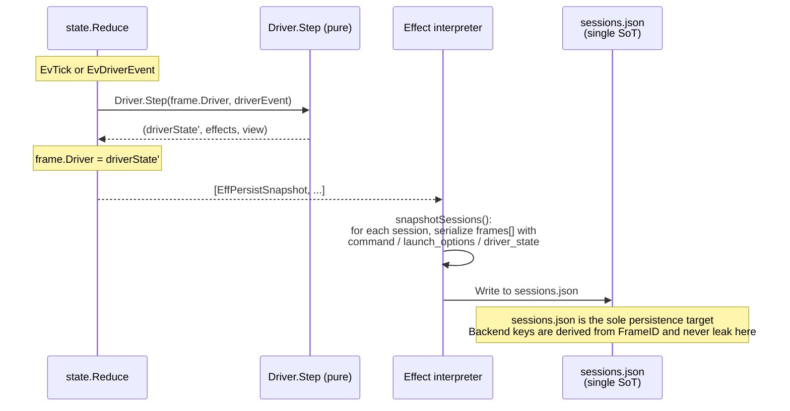

#### Restoration (warm restart / cold boot)

Restoration is always a **cold start** with `PtyBackend`: each fresh daemon boot brings up a new `termvt.Manager` with an empty session table, so there is no warm-restart "live backend frame" case at the backend level. The bootstrap walks each restored session's frame stack in root-to-tail order and respawns a pty session per frame via `Driver.PrepareLaunch(LaunchModeColdStart, …)`, re-feeding the persisted `LaunchOptions` so the launch flavor is preserved across restarts:

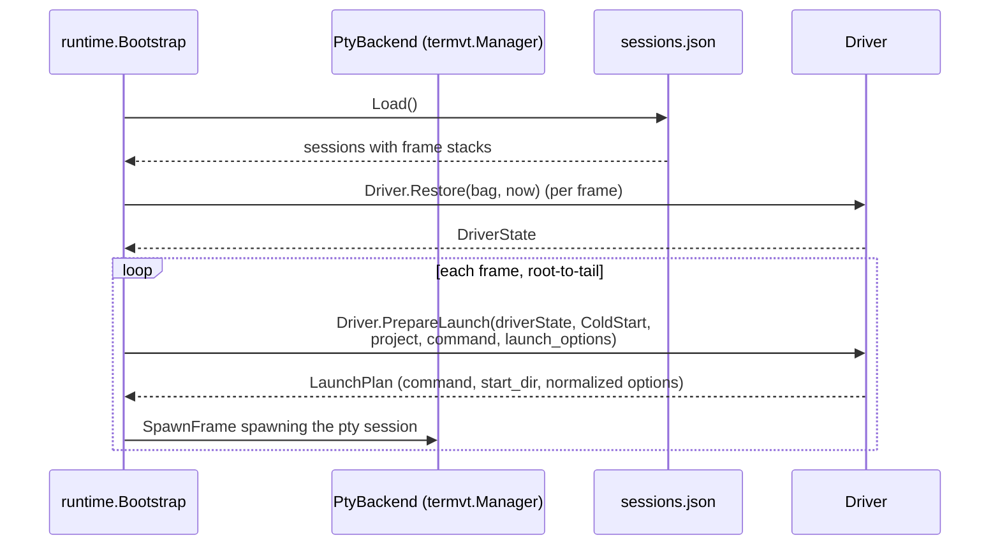

#### PersistedState schema per Driver

`claudeDriver.PersistedState()`:
```
{
  "roost_session_id":     "abc-123",
  "claude_session_id":    "def-456",
  "working_dir":          "/path/to/workdir",
  "transcript_path":      "/path/to/transcript.jsonl",
  "status":               "running",
  "status_changed_at":    "2026-04-09T12:34:56Z",
  "branch_tag":           "feature/foo",
  "branch_bg":            "#334455",
  "branch_fg":            "#ffffff",
  "branch_target":        "/path/to/repo",
  "branch_at":            "2026-04-09T12:00:00Z",
  "branch_is_worktree":   "1",
  "branch_parent_branch": "main",
  "summary":              "haiku summary text",
  "title":                "conversation title",
  "last_prompt":          "most recent user prompt"
}
```

`codexDriver.PersistedState()`:
```
{
  "thread_id":            "abc-123",
  "requested_thread_id":  "abc-123",
  "observed_thread_id":   "abc-123",
  "resume_phase":         "attached",
  "managed_working_dir":  "/path/to/worktree",
  "status":               "running",
  "status_changed_at":    "2026-04-09T12:34:56Z",
  "summary":              "haiku summary text",
  "title":                "conversation title",
  "last_prompt":          "most recent user prompt"
}
```

`genericDriver.PersistedState()`:
```
{
  "status":             "running",
  "status_changed_at":  "2026-04-09T12:34:56Z"
}
```

| Scenario | Behavior |
|---------|------|
| **New session creation** | `reduceCreateSession` generates the initial DriverState via `Driver.NewState`, calls `Driver.PrepareLaunch` synchronously to resolve the frame's command / start_dir / normalized `LaunchOptions`, stores a root frame carrying the normalized options on the session, and emits `EffSpawnFrame` pre-baked with the resolved plan. The runtime spawns the pty session and reports back via `EvFrameSpawned` |
| **Push driver on top of a session** | `reducePushDriver` appends a new frame on top of the active frame, running the same `PrepareLaunch` / spawn pipeline as new session creation. The appended frame becomes the new active frame |
| **Daemon restart** | `runtime.Bootstrap` loads the frame stacks from sessions.json, restores each frame's DriverState via `Driver.Restore`, then walks each session's frames in root-to-tail order and calls `Driver.PrepareLaunch(LaunchModeColdStart, …)` with the persisted `LaunchOptions` to reconstruct the launch plan. A pty session is spawned per frame from the resolved plan |
| **Session stop** | `reduceStopSession` emits terminate / unwatch / unregister effects for every frame in the session. The session is removed from State only once the pty session actually exits and an `EvFrameVanished` arrives |
| **Dead frame reap** | Frame reconciliation and `EvFrameVanished` locate the owning frame and truncate the session from that frame onward. If the root frame is the one that died, the entire session is deleted; otherwise the remaining lower frames stay and the new tail becomes the active frame |

### Cost extraction

Tool names, subagent counts, error counts, and other metrics from Claude sessions are extracted from the transcript JSONL by `transcript.Tracker` (`lib/claude/transcript`). `Tracker` is held within the worker pool's `TranscriptParse` runner, and results are returned to Driver.Step as `TranscriptParseResult`.

````

## Legacy Source: component-20260624-client-stream-backend-e2e

````markdown
---
id: component-20260624-client-stream-backend-e2e
kind: component
title: 'Stream backend: real app-server e2e (fidelity backstop)'
status: active
created: '2026-06-24'
updated: '2026-07-04'
tags:
- technical
- client
- legacy-import
owners: []
relations:
- {type: referencedBy, target: adr-20260624-0001-multiplexed-backends-shared-routing-contract}
- {type: referencedBy, target: adr-20260624-0002-optin-appserver-e2e-validates-fakes}
- {type: references, target: adr-20260624-0002-optin-appserver-e2e-validates-fakes}
- {type: references, target: component-20260624-client-stream-backend-testing}
- {type: referencedBy, target: component-20260624-client-stream-backend-testing}
- {type: referencedBy, target: component-20260624-platform-termvt-multiplexer-testing}
- {type: referencedBy, target: note-20260624-agent-testing}
source_paths:
- src/client/runtime/subsystem/stream/
provides:
- stream-backend-real-app-server-e2e-fidelity-backstop
summary: The routing-isolation harness (stream-backend-testing.md) runs against an
  in-process fake app-server. This e2e runs the *same* routing isolation invariant
  against a real app-server, so the fake is proven faithful to the
---

<!-- migrated_from: docs/technical/client/stream-backend-e2e.md -->

# Stream backend: real app-server e2e (fidelity backstop)

The routing-isolation harness ([stream-backend-testing.md](../component/component-20260624-client-stream-backend-testing.md))
runs against an **in-process fake app-server**. This e2e runs the *same* routing
isolation invariant against a **real** app-server, so the fake is proven faithful
to the wire behaviour it imitates. Rationale:
[ADR 0002](../adr/adr-20260624-0002-optin-appserver-e2e-validates-fakes.md).

It is **not codex-specific**. The stream backend fronts the codex app-server
*protocol* (WebSocket-over-UDS JSON-RPC); any binary that serves that protocol —
launched as `<bin> [args] app-server --listen unix://<sock>` (the same interface
`Backend.Start` dials) — is a valid target. codex is the reference
implementation, but the harness validates the fake against the *protocol*, not a
single product.

## What it checks

Two frames are launched in distinct working dirs, each prompted to echo a unique
marker. The test asserts each marker is delivered **only** to its own frame —
the same `assertMarkerFrames` invariant the in-process contract uses. If a real
server routes per-frame the way the fake does, the fake is faithful.

## Configuration

The test discovers backends from the environment and runs one subtest per
configured server. With none set, it skips.

| Env var | Meaning |
|---|---|
| `AG_E2E_CODEX_BIN` | Path to a codex binary (convenience alias; subtest `codex`). |
| `AG_E2E_APPSERVER_BIN` | Path to any other conforming app-server. |
| `AG_E2E_APPSERVER_NAME` | Subtest label for the generic server (default `appserver`). |
| `AG_E2E_APPSERVER_ARGS` | Extra argv for the generic server, space-split. |

Build tag: `e2e` (this file is excluded from default builds).

Prerequisites: the binary must serve the codex app-server protocol over
WebSocket-over-UDS via `--listen unix://…`, and — because the test drives real
turns — have whatever model credentials it needs to answer a prompt.

## Running

```sh
# codex
mkdir -p .gocache-e2e
GOCACHE=$(pwd)/.gocache-e2e AG_E2E_CODEX_BIN=$(which codex) make test-e2e

# any other conforming app-server
GOCACHE=$(pwd)/.gocache-e2e AG_E2E_APPSERVER_BIN=/path/to/server \
AG_E2E_APPSERVER_NAME=myserver \
AG_E2E_APPSERVER_ARGS="--flag value" \
  go test -tags e2e -run TestStreamRoutingE2E ./client/runtime/subsystem/stream/ -v

# both at once → one subtest each
GOCACHE=$(pwd)/.gocache-e2e AG_E2E_CODEX_BIN=$(which codex) AG_E2E_APPSERVER_BIN=/path/to/server \
  go test -tags e2e -run TestStreamRoutingE2E ./client/runtime/subsystem/stream/ -v
```

real-Codex E2E は current workspace 配下に isolated `HOME` と unix socket
を作る。`/tmp` は現行 Codex binary が helper bootstrap や socket bind を
拒否しうるので、手動実行でも writable な `GOCACHE` だけ明示しておく。

## CI posture

Never gated. The e2e needs a real binary and model access and is too slow/flaky
to block merges; CI relies on the fast in-process fake, and this backstop is run
manually/locally to keep the fake honest. This mirrors the env-gated
`TestSPEC_17_8` real-tracker integration tests.

````

## Legacy Source: component-20260624-client-stream-backend-testing

````markdown
---
id: component-20260624-client-stream-backend-testing
kind: component
title: 'Stream backend: routing-isolation test harness'
status: active
created: '2026-06-24'
updated: '2026-07-04'
tags:
- technical
- client
- legacy-import
owners: []
relations:
- {type: referencedBy, target: component-20260624-client-stream-backend-e2e}
- {type: references, target: adr-20260624-0001-multiplexed-backends-shared-routing-contract}
- {type: references, target: adr-20260624-0002-optin-appserver-e2e-validates-fakes}
- {type: references, target: adr-20260624-0081-codex-frame-init-serialize}
- {type: references, target: component-20260624-client-stream-backend-e2e}
- {type: referencedBy, target: component-20260624-platform-termvt-multiplexer-testing}
- {type: referencedBy, target: note-20260624-agent-testing}
- {type: referencedBy, target: note-20260624-technical-code-enforcement}
source_paths:
- src/client/runtime/subsystem/stream/
provides:
- stream-backend-routing-isolation-test-harness
summary: 'The stream subsystem backend multiplexes many frames (agents) over a single
  codex app-server connection. Its one safety-critical property is routing isolation:
  an event from a thread must reach only the frame that owns'
---

<!-- migrated_from: docs/technical/client/stream-backend-testing.md -->

# Stream backend: routing-isolation test harness

The stream subsystem backend multiplexes many frames (agents) over a single
codex app-server connection. Its one safety-critical property is **routing
isolation**: an event from a thread must reach only the frame that owns that
thread. A leak is *cross-talk* — one agent's output (including tool results)
surfacing in another agent's session. This page documents the harness that pins
that property. Rationale lives in
[ADR 0001](../adr/adr-20260624-0001-multiplexed-backends-shared-routing-contract.md) and
[ADR 0002](../adr/adr-20260624-0002-optin-appserver-e2e-validates-fakes.md). Setup for the
real-server backstop: [stream-backend-e2e.md](../component/component-20260624-client-stream-backend-e2e.md).

## The invariant

> Every `state.EvSubsystem` emitted from a thread T carries `FrameID == owner(T)`,
> where `owner(T)` is the frame whose `BindFrame` started/resumed T.

Corollary: thread→frame binding derives from the **initiating request**, never
from ambient state such as the active frame (a "fabricated fallback").

## How the fix makes cross-talk impossible

`Backend.BindFrame` reserves a per-frame slot in `initState` — a
mutex-guarded `*pendingSlot` with a per-generation wait channel (see
`initsem.go`) — for fresh cold-start, and pre-registers the persisted
thread id for cold-start recovery. Backend itself never issues
`thread/start` — the codex CLI owns the thread lifecycle. When the CLI's
`thread/started` notification arrives, `handleThreadStarted` calls
`initState.takeAny()` to atomically consume the reservation and binds the
incoming thread id into the pending frame's binding; if the thread id was
pre-registered (recovery), the existing map entry routes the notification
directly. Two same-cwd frames therefore get distinct thread ids because
the CLI mints fresh ids per invocation, and the "at-most-one pending"
invariant means adopt has an unambiguous target — no cwd/heuristic guess
is ever needed. See [ADR-0081](../adr/adr-20260624-0081-codex-frame-init-serialize.md)
for the full contract, and [ADR-0001](../adr/adr-20260624-0001-multiplexed-backends-shared-routing-contract.md) Update — passive adopt for the empirical
evidence that motivated the switch away from backend-owned `thread/start`.

## Files

| File | Role |
|---|---|
| `routing_contract_test.go` | `recordingRuntime`, `assertMarkerFrames`, the direct-drive `inProc` harness, and `TestStreamRoutingContract` (the case table). |
| `routing_wired_test.go` | the `wired` harness driving the real `codexclient.Conn` against a `fake.AppServer` (WebSocket-over-UDS); tests the async adopt path under `-race`. |
| `routing_fuzz_test.go` | `FuzzStreamRouting` (stdlib `testing.F`) over random message/release interleavings. |
| `routing_e2e_test.go` | `//go:build e2e` real **app-server** fidelity backstop (any conforming server, not just codex); skips when no backend env is set. See [stream-backend-e2e.md](../component/component-20260624-client-stream-backend-e2e.md). |
| `routing_backstop_test.go` | Always-on fake-based version of the isolation invariant. Same `runIsolationScenario` shape as the e2e above but drives `fake.AppServer` directly, so the invariant is re-verified on every default `go test` run. |
| `init_serialize_test.go` | Pins the `initState` invariants (serialization, timeout, ReleaseFrame drain, reaper cleanup, silent-drop-on-no-pending). Regression net for ADR-0081. |
| `interactive_flow_test.go` | End-to-end integration: `fake.AppServer` + pty-spawned `fake.FakeCLI` + real `Backend`. Verifies the CLI-owned thread flows all the way to a driver `Status = StatusWaiting` transition after a prompt round trip. |
| `fake/` package | High-fidelity fake of codex-app-server + fake CLI (pty-attached, argv-compatible with `codex --remote`). Reused by wired, backstop, and interactive_flow tests. |

`recordingRuntime` is the shared observation point: it records each emitted
`EvSubsystem`'s `FrameID`, and markers travel in `Payload.LastAssistantMessage`,
so `framesWithMarker` answers "which frames received this thread's output".

## How a case is built

The direct-drive contract binds frames the way `bindThread` leaves them (each to
a distinct thread id), then feeds server events into the handlers:

```go
h := newInProc(t)
h.bind("A", "tA", "/work") // distinct thread id, even with a shared cwd
h.bind("B", "tB", "/work")
h.message("tA", "MARK_A")
h.message("tB", "MARK_B")
h.wantMarkerFrames("MARK_A", "A") // isolation: only A
h.wantMarkerFrames("MARK_B", "B")
```

The wired harness exercises the real path end-to-end: a cold `BindFrame` issues
`thread/start`, binds the returned id, and `TestStreamRoutingWiredIsolation`
asserts two same-cwd frames get distinct ids and never cross-talk — under
`-race`.

## Running

```sh
# regression guards + structural fuzz seeds (the ci job's test step;
# a separate `fuzz` CI job also actively fuzzes — see .github/workflows/ci.yml)
cd src && TMPDIR=/tmp go test ./client/runtime/subsystem/stream/

# concurrency check
cd src && go test -race ./client/runtime/subsystem/stream/

# active fuzzing
cd src && go test -run x -fuzz 'FuzzStreamRouting$' -fuzztime=30s \
  ./client/runtime/subsystem/stream/

# fidelity backstop against a real app-server (opt-in; see stream-backend-e2e.md)
AG_E2E_CODEX_BIN=$(which codex) \
  go test -tags e2e -run TestStreamRoutingE2E ./client/runtime/subsystem/stream/
```

## Invariant ↔ pinning tests

| Behaviour | Pinned by |
|---|---|
| Same-cwd frames (distinct ids) never cross-talk | `TestStreamRoutingContract/two_frames_same_cwd_distinct_threads`, `TestStreamRoutingWiredIsolation` |
| Completion routes by exact thread id | `.../completion_reverse_order` |
| `thread.started` confirms an already-bound thread | `.../thread_started_confirms_bound` |
| Unknown `thread.started` is dropped (no cwd/active adoption) | `.../thread_started_for_unknown_thread_drops`, `TestHandleThreadStartedUnknownThreadDrops` |
| Released frame drops stray events | `.../release_drops_stray_events` |
| Random interleavings preserve by-id isolation | `FuzzStreamRouting` |
| No duplication / garbage-frame / panic | `FuzzStreamRouting` (structural checks) |
| Fake matches real app-server wire behaviour | `TestStreamRoutingE2EIsolation` (opt-in, per backend) |

````

## Legacy Source: component-20260705-client-web-browser-harness

````markdown
---
id: component-20260705-client-web-browser-harness
kind: component
title: web UI (clients/ui) browser harness
status: active
created: '2026-07-05'
updated: '2026-07-14'
tags:
- testing
- web
- client
owners: []
provides:
- client-web-browser-harness
source_paths:
- clients/ui/playwright.config.ts
- clients/ui/e2e/
- clients/ui/package.json
- .github/workflows/ci.yml
relations:
- {type: references, target: component-20260624-client-overview}
- {type: references, target: spec-20260705-test-harness}
- {type: referencedBy, target: note-20260624-agent-testing}
summary: Playwright browser smoke と fake backend で Web UI の session hydrate / command
  palette / new-session submit を常時検証する harness
---

## Overview

`uihost` の browser harness は、happy-dom では証明し切れないブラウザ配線を常時検証する
Playwright smoke 層である。責務は UI の見た目を比較することではなく、実ブラウザ上で
「アプリが起動し、session 一覧と command 導線が正しくつながっている」ことを短時間で pin する点にある。

現在の常時シナリオは次の 3 つで固定する。

- session hydrate: 初期 `hello` / `view-update` を受けて既存 session が一覧へ反映される
- command palette: keyboard shortcut から palette を開ける
- new-session submit: session 作成フォーム送信で API 呼び出しと新規 session 描画が成立する

この harness は `clients/ui/e2e/support/fake-backend.ts` の deterministic fake backend に依存する。
REST は `page.route()` で `/api/ws-ticket` / `/api/session-config` / `/api/sessions` を fake 化し、
WebSocket は `page.addInitScript()` で差し替えて初期 event 列を制御する。これにより flaky な外部依存を
持ち込まず、`npm run test:web` を PR CI の必須 gate にできる。

ブラウザ smoke が保証するのは wiring までであり、次は意図的に対象外とする。

- 実 soft keyboard / 実 VoiceOver / 実 long-press のような OS 実機依存挙動
- visual regression や screenshot diff
- 本物の backend / websocket daemon を使う fidelity 検証

実機依存の観察は `docs/specs/web-terminal-mobile-ux/` の手動検証チェックリストが正本で、backend 側の
server→view 貫通は `src/server/api` の gateway scenario e2e が担当する。

## Parts

主要な構成要素:

- `playwright.config.ts`: dev server 起動と Chromium smoke project の定義
- `e2e/support/fake-backend.ts`: deterministic fake backend と fake WebSocket
- `e2e/app.smoke.spec.ts`: hydrate / palette / new-session の常時シナリオ
- `package.json` の `test:e2e` / `test:web`: unit・build・browser smoke を分離した入口
- `.github/workflows/ci.yml`: Chromium install を含む CI gate

## Running locally

Run commands: [AGENTS.md](../../AGENTS.md) (Build & Test → E2E → Web Playwright smoke). Below is harness-specific detail for troubleshooting.

PR CI (`.github/workflows/ci.yml`) と同じ browser gate を手元で再現する。

### 1. 依存関係のインストール

```sh
cd clients/ui
npm ci
```

`~/.npm` への書き込み権限がない環境では cache を `/tmp` に逃がす。

```sh
NPM_CONFIG_CACHE=/tmp/npm-cache-agent-grid npm ci
```

### 2. Playwright ブラウザのインストール (初回 or `@playwright/test` 更新後)

```sh
npx playwright install chromium
```

CI は `npx playwright install --with-deps chromium` を使う。ローカルで system deps が足りないときは同じフラグを付ける。

`~/.cache/ms-playwright` へ書けない・ダウンロードできない場合は、ブラウザ保存先を明示する。

```sh
PLAYWRIGHT_BROWSERS_PATH=/tmp/ms-playwright npx playwright install chromium
```

その後の実行でも同じ `PLAYWRIGHT_BROWSERS_PATH` を渡す。

ダウンロードが難しい場合の escape hatch: `playwright.config.ts` が読む `PW_USE_SYSTEM_CHROME=1` でインストール済み Chrome を使う。

```sh
PW_USE_SYSTEM_CHROME=1 npm run test:e2e
```

### 3. 実行コマンド

| 目的 | コマンド |
|------|----------|
| browser smoke のみ | `npm run test:e2e` |
| lint + unit + browser smoke (CI と同じ web gate) | `npm run test:web` |
| unit のみ | `npm run test:unit` |

`test:e2e` は内部で `npm run build` (tsc + vite build) を走らせてから `playwright test` する。`playwright.config.ts` が `vite preview` を `127.0.0.1:4174` で起動し、`e2e/app.smoke.spec.ts` が fake backend 経由で hydrate / palette / new-session を検証する。

ブラウザ保存先を `/tmp` にした例:

```sh
PLAYWRIGHT_BROWSERS_PATH=/tmp/ms-playwright npm run test:e2e
```

### 4. よくある失敗

| 症状 | 対処 |
|------|------|
| `Executable doesn't exist at .../ms-playwright/...` | 手順 2 を実行。`PLAYWRIGHT_BROWSERS_PATH` を install と test で揃える |
| `biome: command not found` | `npm ci` 未実行。手順 1 からやり直す |
| TypeScript build が落ちる | `npm run build` を単体で実行し、`tsc` エラーを先に直す |

````
