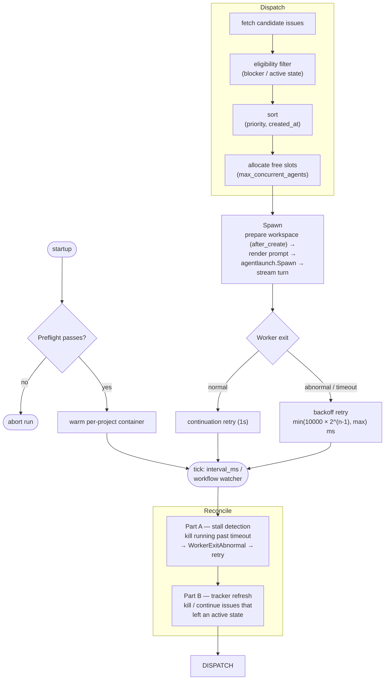
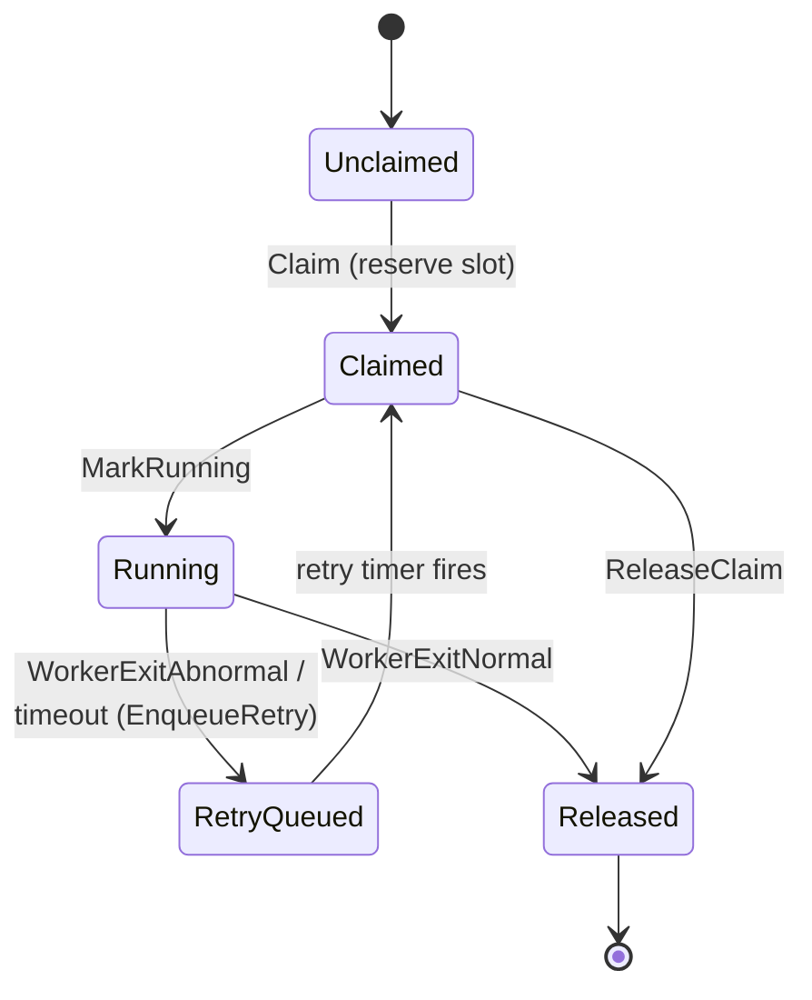
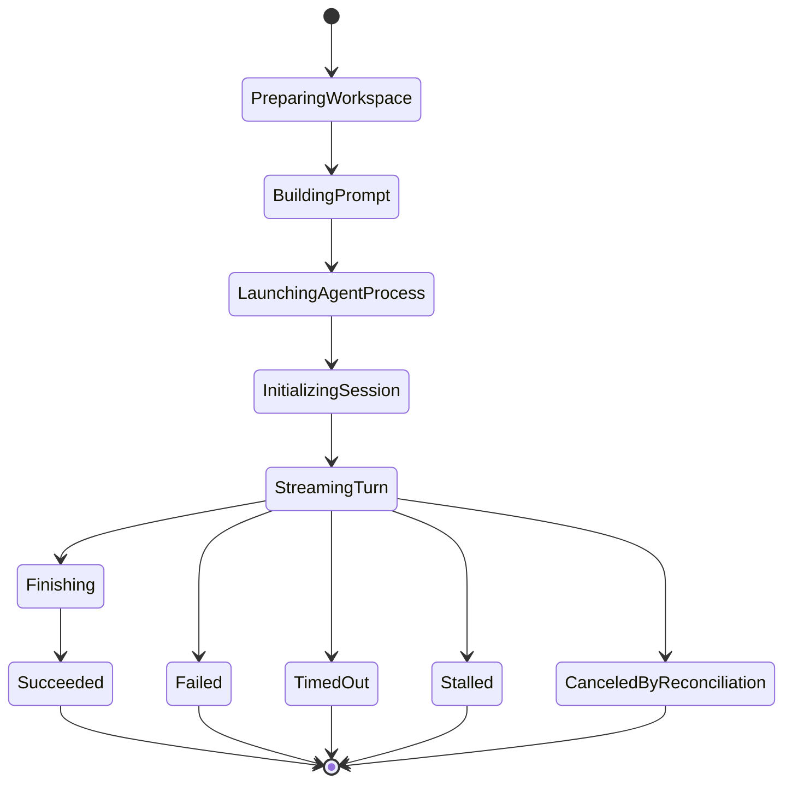

# Orchestrator architecture

The orchestrator is a headless decision-loop service. Its reducer owns eligibility, capacity, retry, stall, and reconciliation decisions; an imperative shell executes tracker calls, process launch, timers, and filesystem work and returns explicit events. Tracker state remains external truth and one scheduler authority owns an issue at a time.

The complete legacy sources remain below as migration history. The governing contract above is the maintained design surface.

## Legacy Source: component-20260624-orchestrator-overview

````markdown
---
id: component-20260624-orchestrator-overview
kind: component
title: orchestrator/ — Symphony SPEC Implementation
status: active
created: '2026-06-24'
updated: '2026-07-04'
tags:
- technical
- orchestrator
- legacy-import
owners: []
relations:
- {type: referencedBy, target: component-20260624-client-overview}
- {type: references, target: component-20260624-orchestrator-symphony-conformance}
- {type: references, target: component-20260624-platform-agent-protocol}
- {type: references, target: component-20260624-platform-sandbox}
- {type: references, target: component-20260624-platform-spawn-and-launch}
- {type: references, target: note-20260624-agent-workflow-authoring}
- {type: references, target: note-20260624-technical-guardrails}
- {type: references, target: note-20260624-user-orchestrator}
- {type: referencedBy, target: component-20260624-platform-agent-protocol}
- {type: referencedBy, target: note-20260624-agent-overview}
- {type: referencedBy, target: note-20260624-agent-workflow-authoring}
- {type: referencedBy, target: note-20260624-docs-overview}
- {type: referencedBy, target: note-20260624-technical-code-enforcement}
- {type: referencedBy, target: note-20260624-technical-guardrails}
- {type: referencedBy, target: note-20260624-technical-overview}
- {type: referencedBy, target: note-20260624-user-orchestrator}
source_paths:
- WORKFLOW.md
- src/orchestrator/workflowfile/
- src/orchestrator/wfconfig/
- src/orchestrator/scheduler/
- src/orchestrator/tracker/
- src/platform/tracker/linear/
- src/orchestrator/workspace/
- src/orchestrator/agent/
provides:
- orchestrator-symphony-spec-implementation
summary: The orchestrator is a headless, single-authority background service that
  implements the Symphony SPEC. It polls a Linear tracker, dispatches coding agents
  to per-issue workspaces, reconciles running/stalled sessions,
---

<!-- migrated_from: docs/technical/orchestrator/README.md -->

# orchestrator/ — Symphony SPEC Implementation

The orchestrator is a **headless**, **single-authority** background service that implements the [Symphony SPEC](https://github.com/openai/symphony/blob/main/SPEC.md). It polls a Linear tracker, dispatches coding agents to per-issue workspaces, reconciles running/stalled sessions, and exposes a read-only observability HTTP server (§13.7 — mandatory in our implementation).

It lives entirely inside `orchestrator/`, does **not** import `client/`, and shares `platform/` (logger, metrics, tracker/linear, agent/codexclient, agentlaunch, lib/codex, sandbox) with the client. The boundary is enforced by the `depguard` rule `client-no-orchestrator` and its converse.

User-facing operation (running it, the `WORKFLOW.md` config, agent selection) is in the [orchestrator user guide](../note/note-20260624-user-orchestrator.md). Authoring the driving prompt is in [WORKFLOW.md authoring](../note/note-20260624-agent-workflow-authoring.md).

## Design principles (orchestrator realization)

The orchestrator is a **decision-loop layer**, so — like the `client/` layer — it realizes the cross-layer [core principles](../../../ARCHITECTURE.md#core-principles-all-layers) as **strict Functional Core / Imperative Shell**: a pure reducer over an immutable, mutex-free `State`, interpreted by a single event-loop shell that owns all I/O and live handles.

- **Pure functional core** — `scheduler.Reduce(state, event, cfg, now) → (state', []Effect)` (`scheduler/reduce.go` and the `reduce_*.go` files) is the entire decision surface: eligibility, slot allocation, stall detection, reconcile transitions, retry/backoff. It performs no I/O, holds no mutex, spawns no goroutine, and reads no wall clock (time enters as `now`). `State` (`scheduler/state.go`) is an immutable value folded copy-on-write by the pure transition helpers in `scheduler/transitions.go`. The no-mutex rule is enforced by `forbidigo`.
- **Single-writer event loop** — `scheduler.Run` (`scheduler/scheduler.go`) is one `for { select {} }`. The agent runner, retry timers, and the fsnotify watcher only *emit* on channels (`workerDone`, `codexActivity`, `retryFire`, `reloadCh`); they never touch state. Each event is folded by `Reduce`; the loop is the only writer.
- **Decisions separated from I/O via Effects** — `Reduce` returns `[]Effect` descriptors (`scheduler/effect.go`: `EffSpawn`, `EffKillWorker`, `EffRefreshTracker`, `EffArmRetryTimer`, …). The shell (`scheduler/effects_exec.go`) interprets them against injected dependencies (`Deps{ Tracker, Spawn, Clock, … }`), performs the real I/O, and feeds results back as events (`scheduler/event.go`: `EvSpawned`, `EvTrackerRefreshed`, …). Live handles (the agent `Worker`, retry `Timer`) live in the shell's id→handle maps, never in `State`. Fakes replace `Deps` in tests; the whole pipeline is exercised by feeding events and asserting state.
- **Single-authority** — at most one claim/run per issue; `ErrDuplicateDispatch` (`scheduler/transitions.go`) enforces SPEC §7.4.
- **Agent-agnostic** — codex `app-server` and `claude-app-server` emit one uniform event sequence, so the scheduler never branches on agent identity.
- **Reconcile = truth reconciliation** — agents transition issue state autonomously; reconcile re-reads the tracker and detects the change. Issue truth is never fabricated locally.
- **Lock-free observability** — after each reduce the loop publishes the immutable `State` into an `atomic.Pointer[State]`; the HTTP server reads it lock-free (`scheduler/snapshot.go`). There is no lock to contend, so a snapshot read cannot block or time out.

## Packages

| Package | SPEC | Responsibility |
|---|---|---|
| `orchestrator/workflowfile/` | §5 | `WORKFLOW.md` YAML front matter + body loader |
| `orchestrator/wfconfig/` | §6 | Config resolution, defaults, `$VAR` expansion |
| `orchestrator/scheduler/` | §7 §8 §16 | Poll loop, dispatch, retry/backoff, reconcile |
| `orchestrator/tracker/` | §3.1.3 | Tracker adapter wrapper (→ `platform/tracker/linear/`) |
| `orchestrator/workspace/` | §9 | Per-issue workspace directory + lifecycle hooks |
| `orchestrator/agent/` | §10 | Agent runner + event handler |
| `orchestrator/prompt/` | §12 | Liquid-compatible prompt template renderer |
| `orchestrator/httpserver/` | §13.7 | Observability HTTP — `/api/v1/state`, `/api/v1/refresh` |
| `orchestrator/lineargql/` | §10.5 | `linear_graphql` client-side tool handler (advertised via `thread/start` `dynamicTools`) |

Full SPEC component ↔ package correspondence and the documented deviation posture: [symphony-conformance.md](../component/component-20260624-orchestrator-symphony-conformance.md).

## The poll / dispatch / reconcile pipeline

On startup `cmd/orchestrator` loads the workflow, resolves config, runs a **preflight** check (`scheduler.Preflight` — invalid config gates the whole run; see [guardrails → pre-run validation](../note/note-20260624-technical-guardrails.md#6-behavioral-steering--pre-run-validation)), warms the per-project container, then enters the loop. Each tick (`polling.interval_ms`, or a filesystem watcher on the workflow):



1. **Reconcile (Part A — stall detection):** running attempts that exceeded their stall/turn timeout are killed → `WorkerExitAbnormal` → retry enqueued.
2. **Reconcile (Part B — tracker refresh):** re-fetch tracker state; issues that left an active state are killed or continued accordingly.
3. **Dispatch:** fetch candidate issues → filter by eligibility (blockers, active state) → sort (priority, creation time) → allocate free slots (`agent.max_concurrent_agents`) → spawn.
4. **Spawn:** prepare the per-issue workspace (running `after_create` hooks), render the prompt, launch the agent via `agentlaunch.Spawn` (argv-direct, no host shell; `codex.command` is tokenized by `SplitArgs` then wrapped by `Dispatcher` — see [spawn-and-launch](../component/component-20260624-platform-spawn-and-launch.md)), and stream the turn.
5. **Worker exit:** normal exit enqueues a *continuation* retry (fixed 1s); abnormal exit / timeout enqueues a *backoff* retry (`min(10000 × 2^(n-1), max)` ms).

The observability HTTP server (when enabled) reads the same scheduler snapshot.

## Scheduler state machine

Each issue moves through a **claim state** (`scheduler/state.go`, SPEC §7.1):



| ClaimState | Meaning |
|---|---|
| `Unclaimed` | Initial — no slot reserved |
| `Claimed` | Reserved but not yet running |
| `Running` | Worker active |
| `RetryQueued` | Waiting for the retry timer |
| `Released` | Removed from all tracking (terminal) |

A single run attempt has an 11-phase **run phase** lifecycle (SPEC §7.2):



Pure transition functions live in `scheduler/transitions.go` (`claim`, `markRunning`, `workerExitNormal`, `workerExitAbnormal`, `enqueueRetry`, `releaseClaim`) — each takes a `State` value and returns a new one, never mutating in place. They are composed by the per-event reducers in `scheduler/reduce*.go`; retry/backoff in `retry.go`; eligibility rules in `eligibility.go`; slot allocation in `slots.go`.

## Agent protocol

The `agent.command` (Codex `app-server` or `claude-app-server`) is driven over the Codex app-server stdio protocol. The runner tokenizes the command string via `agentlaunch.SplitArgs`, wraps via `Dispatcher.Wrap`, and spawns via `agentlaunch.Spawn` (argv stdio; no host-side shell). Both emit the same event sequence — `thread/started → turn/started → item/* → thread/tokenUsage/updated → turn/completed` — so the scheduler is agent-agnostic. The `claude-app-server` shim wraps a Claude agent as a drop-in app-server; approval/sandbox policy hints are logged but not enforced (isolation is provided by the devcontainer, see [sandbox.md](../component/component-20260624-platform-sandbox.md)).

The protocol layer itself — `codexclient` framing, the `codexschema` v1/v2 type split, the full turn sequence diagram, and how the `claude-app-server` shim translates Claude CLI stream-json into Codex notifications — is documented in [agent-protocol.md](../component/component-20260624-platform-agent-protocol.md). The launch primitives (`SplitArgs`/`Dispatcher`/`Spawn`/`procgroup`) are in [spawn-and-launch.md](../component/component-20260624-platform-spawn-and-launch.md).

## Conformance

[symphony-conformance.md](../component/component-20260624-orchestrator-symphony-conformance.md) is the source of truth for the SPEC §17 ↔ test correspondence table, the strictly-honored items, and the documented deviations/extensions (e.g. mandatory HTTP server, multi-agent via `codex.command`, the `linear_graphql` advertise block).

````

## Legacy Source: component-20260624-orchestrator-symphony-conformance

````markdown
---
id: component-20260624-orchestrator-symphony-conformance
kind: component
title: Symphony SPEC Conformance
status: active
created: '2026-06-24'
updated: '2026-07-04'
tags:
- technical
- orchestrator
- legacy-import
owners: []
relations:
- {type: referencedBy, target: component-20260624-orchestrator-overview}
- {type: referencedBy, target: note-20260624-agent-contributing}
- {type: referencedBy, target: note-20260624-agent-workflow-authoring}
- {type: referencedBy, target: note-20260624-technical-harness-engineering-assessment}
- {type: referencedBy, target: note-20260624-technical-overview}
source_paths:
- src/cmd/orchestrator/
- WORKFLOW.md
- src/orchestrator/tracker/
- src/platform/tracker/linear/
- src/cmd/claude-app-server/
- src/platform/metrics/
- src/orchestrator/httpserver/
- src/orchestrator/workflowfile/
provides:
- symphony-spec-conformance
summary: Authoritative conformance document against Symphony SPEC v1 Draft. plans/.archive/symphony-orchestrator/05-conformance.md
  is the working doc; this file serves as the M4 snapshot.
---

<!-- migrated_from: docs/technical/orchestrator/symphony-conformance.md -->

# Symphony SPEC Conformance

Authoritative conformance document against Symphony SPEC v1 Draft.
`plans/.archive/symphony-orchestrator/05-conformance.md` is the working doc; this file serves as the M4 snapshot.

---

## SPEC §17 ↔ Test Mapping

Each §17.x check item is mapped to a canonical `TestSPEC_*` marker or a per-phase test.
Naming convention: `TestSPEC_<section>_<short_name>` (see `plans/.archive/symphony-orchestrator/05-conformance.md#conformance-test-の整備-p9`).

### §17.1 Workflow and Config Parsing

| Check | Test |
|---|---|
| Workflow file path precedence (explicit > cwd default) | `TestSPEC_17_1_WorkflowFilePathPrecedence` (`cmd/orchestrator`) |
| Workflow file changes trigger re-read without restart | `TestWatchWorkflowSignalsOnWrite`, `TestWatchWorkflowSignalsOnWrite_Coalesces` (`scheduler`) |
| Invalid reload keeps last-known-good config, emits operator-visible error | `TestSPEC_17_1_LastKnownGoodOnInvalidReload` (`scheduler`) / `TestDispatchGatingOnBadReload` / `TestDegradedWarnEmittedOnce` |
| Missing WORKFLOW.md returns typed error | `TestRunMissingWorkflow` (`cmd/orchestrator`) / `TestLoad_MissingFile` (`workflowfile`) |
| Invalid YAML front matter returns typed error | `TestLoad_InvalidYAML` (`workflowfile`) |
| Front matter non-map returns typed error | `TestLoad_FrontMatterNotMap` (`workflowfile`) |
| Config defaults apply for OPTIONAL values | `TestResolve_AppliesAllDefaults` (`wfconfig`) |
| `tracker.kind` validation enforces supported kind | `TestNew_UnsupportedKind` (`orchestrator/tracker`) / `TestPreflightValid` (`scheduler`) |
| `tracker.api_key` works including `$VAR` indirection | `TestResolve_VarExpansion_APIKey` (`wfconfig`) |
| `$VAR` resolution for tracker API key and path values | `TestResolve_VarExpansion_*` (`wfconfig`) |
| `~` path expansion | `TestResolve_TildeExpansion_WorkspaceRoot` (`wfconfig`) |
| `codex.command` preserved as shell command string | `TestResolve_CodexCommandPreserved` (`wfconfig`) |
| Per-state concurrency override map normalizes state names | `TestResolve_PerStateConcurrencyNormalized` (`wfconfig`) |
| Prompt template renders `issue` and `attempt` | `TestRender_interpolatesIssue`, `TestRender_interpolatesAttempt` (`prompt`) |
| Prompt rendering fails on unknown variables (strict mode) | `TestSPEC_17_1_StrictTemplateUnknownVarErrors` (`prompt`) / `TestRender_unknownVariableErrors` |

### §17.2 Workspace Manager and Safety

| Check | Test |
|---|---|
| Deterministic workspace path per issue identifier | `TestPath_Deterministic` (`workspace`) |
| Missing workspace directory is created | `TestEnsure_CreatesDirectory` (`workspace`) |
| Existing workspace directory is reused | `TestEnsure_ReusesExistingDirectory` (`workspace`) |
| Existing non-directory path handled safely | `TestEnsure_NonDirectoryFails` (`workspace`) |
| `after_create` hook runs only on new workspace creation | `TestEnsure_AfterCreate_NewOnly` (`workspace`) |
| `before_run` hook runs before each attempt; failure aborts | `TestBeforeRun_FailureReturnsError`, `TestBeforeRun_Timeout` (`workspace`) |
| `after_run` hook runs after each attempt; failure ignored | `TestAfterRun_FailureIgnored`, `TestAfterRun_TimeoutIgnored` (`workspace`) |
| `before_remove` hook runs on cleanup; failure ignored | `TestRemove_BeforeRemoveFailureIgnored` (`workspace`) |
| Workspace path sanitization and root containment enforced before agent launch | `TestSPEC_17_2_WorkspaceKeySanitized` (`workspace`) / `TestPath_Sanitize_*` |
| Agent launch uses per-issue workspace cwd; out-of-root rejected | `TestSPEC_17_2_CwdEqualsWorkspaceRoot` (`workspace`) / `TestVerifyCWD_*` |

### §17.3 Issue Tracker Client

| Check | Test |
|---|---|
| Candidate issue fetch uses active states and project slugs | `TestSPEC_17_3_CandidateFetchUsesActiveStates` (`platform/tracker/linear`) |
| Linear query uses slugId project filter field (`in` over the slug array) | `TestSPEC_17_3_LinearProjectFilterUsesSlugId` |
| Issue project name/content normalized for per-project config | `TestLinearProjectFieldNormalized` |
| Empty `fetch_issues_by_states([])` returns empty without API call | `TestSPEC_17_3_FetchIssuesByStates_EmptyStates_NoAPICall` |
| Pagination preserves order across multiple pages | `TestSPEC_17_3_PaginationPreservesOrder` |
| Blockers normalized from inverse relations of type `blocks` | `TestSPEC_17_3_BlockedByFromBlocksInverseRelation` |
| Labels normalized to lowercase | `TestSPEC_17_3_LabelsLowercase` |
| Issue state refresh by ID returns minimal normalized issues | `TestSPEC_17_3_FetchIssueStatesByIDsUsesIDType` |
| Error mapping for request errors, non-200, GraphQL errors, malformed payloads | `TestErrorMapping_*` (`platform/tracker/linear`) |

### §17.4 Orchestrator Dispatch, Reconciliation, and Retry

| Check | Test |
|---|---|
| Dispatch sort order: priority then oldest creation time | `TestSortCandidates` (`scheduler`) |
| `Todo` issue with non-terminal blockers is not eligible | `TestEligible_RequiredFields`, `TestEligible_BlockerRule` (`scheduler`) |
| `Todo` issue with terminal blockers is eligible | `TestEligible_BlockerRule` (`scheduler`) |
| Active-state issue refresh updates running entry state | `TestReconcileRefresh_ActiveUpdatesSnapshot` (`scheduler`) |
| Non-active state stops running agent without workspace cleanup | `TestReconcileRefresh_IntermediateKillsNoWorkspaceRemove` (`scheduler`) |
| Terminal state stops running agent and cleans workspace | `TestReconcileRefresh_TerminalKillsAndCleansWorkspace` (`scheduler`) |
| Normal worker exit schedules short continuation retry (attempt 1) | `TestHandleWorkerExit_Normal_ReleasesSlotAndSchedulesContinuation` (`scheduler`) |
| Abnormal worker exit increments retries with exponential backoff | `TestHandleWorkerExit_Abnormal_EnqueuesBackoffRetry` (`scheduler`) |
| Retry backoff capped by `agent.max_retry_backoff_ms` | `TestSPEC_17_4_RetryBackoffCapHonored` (`scheduler`) / `TestBackoffDelay` |
| Per-state concurrency cap applied independently from global | `TestSPEC_17_4_PerStateConcurrency` (`scheduler`) / `TestAvailablePerStateSlots` |
| Continuation uses fixed 1s delay | `TestSPEC_17_4_ContinuationFixed1s` (`scheduler`) / `TestContinuationDelay` |
| Stall detection kills stalled sessions and schedules retry | `TestReconcileStall_KillsAndEnqueuesRetry` (`scheduler`) |

### §17.5 Coding-Agent App-Server Client

| Check | Test |
|---|---|
| Launch command uses workspace cwd; `codex.command` is tokenized via `SplitArgs` and spawned argv-direct through `agentlaunch.Spawn` (no host shell); container mode wraps the argv in `docker exec` | `TestSpawn_sessionStartedAndTurnCompleted` (`agent`) |
| Thread/turn identities extracted and used to emit `session_started` | `TestSPEC_17_5_SessionIDFormat` (`agent`) / `TestShim_SessionID` (`cmd/claude-app-server`) |
| Request/response read timeout enforced | `TestSpawn_turnTimeoutKillsAndFails` (`agent`) |
| Unsupported dynamic tool calls rejected without stalling | `TestHandleToolCall_unknownTool_replyError` (`agent`) |
| Usage and rate-limit telemetry extracted | `TestTurnHandler_UsageUsesTotalIgnoresLastPayload`, `TestTurnHandler_RateLimitReported` (`agent`) |
| Token absolute totals used; same absolute value not double-counted | `TestSPEC_17_5_AbsoluteTokenNoDoubleCount` (`platform/metrics`) / `TestAccumulator_SingleThread_NoDoubleCount` |
| Agent-switch event parity: shim emits §10.4 protocol method names | `TestSPEC_17_5_AgentSwitchEventParity` (`cmd/claude-app-server`) / `TestShim_ConformanceEventOrder` |
| `thread/start` sends `approvalPolicy`, `sandbox`, `serviceName` per §10.2 | `TestSPEC_17_5_ThreadStartSendsApprovalPolicy`, `TestSPEC_17_5_ThreadStartSendsSandboxMode`, `TestSPEC_17_5_ThreadStartSendsServiceName` (`agent`) |
| `turn/start` sends `approvalPolicy`, `sandboxPolicy` per §10.2 | `TestSPEC_17_5_TurnStartSendsApprovalPolicy`, `TestSPEC_17_5_TurnStartSendsSandboxPolicy` (`agent`) |
| Empty policy config omits optional fields from wire | `TestSPEC_17_5_EmptyPolicyFieldsOmitted` (`agent`) |

### §17.6 Observability

| Check | Test |
|---|---|
| `/api/v1/state` response contains required top-level fields | `TestSPEC_17_6_StateShape` (`orchestrator/httpserver`) / `TestStateEndpoint_EmptySnapshot` |
| 405 Method Not Allowed uses standard error envelope | `TestSPEC_17_6_MethodNotAllowedEnvelope` (`orchestrator/httpserver`) / `TestMethodNotAllowed_405` |
| Snapshot timeout 503 / `snapshot_timeout` (§13.3 RECOMMENDED) | **N/A — not applicable.** The scheduler publishes immutable state into an `atomic.Pointer[State]`; the HTTP read is lock-free (`scheduler/snapshot.go`), so a snapshot read cannot block or time out. The RECOMMENDED timeout path exists to bound a lock wait that no longer exists. |
| Orchestrator unavailable returns 503 with `orchestrator_unavailable` code (§13.3 RECOMMENDED) | `TestSPEC_17_6_OrchestratorUnavailable` (`orchestrator/httpserver`) / `TestScheduler_SnapshotCtx_Unavailable` (`scheduler`) |
| Logging sink failures do not crash orchestration | `TestRunContinuesAfterTickPreflightFailure` (`cmd/orchestrator`) |

### §17.7 CLI and Host Lifecycle

| Check | Test |
|---|---|
| CLI accepts positional `--workflow` argument | `TestSPEC_17_1_WorkflowFilePathPrecedence` (`cmd/orchestrator`) |
| CLI uses `./WORKFLOW.md` when no workflow path provided | `TestSPEC_17_1_WorkflowFilePathPrecedence` (cwd sub-test) |
| CLI errors on nonexistent explicit workflow path | `TestRunMissingWorkflow` (`cmd/orchestrator`) |
| CLI exits 0 on normal shutdown | `TestSPEC_17_7_GracefulShutdownExitsZero` (`cmd/orchestrator`) / `TestRunGracefulShutdown` |
| CLI exits nonzero on startup failure | `TestRunPreflightFailure`, `TestRunConfigResolveFailure` (`cmd/orchestrator`) |
| Secret (`tracker.api_key`) never appears in logs or stderr | `TestSPEC_17_7_SecretNeverLogged` (`cmd/orchestrator`) |
| Root prefix containment invariant enforced before agent launch | `TestSPEC_17_7_RootPrefixCheck` (`workspace`) / `TestPath_EscapeRoot_*` |

### §17.8 Real Integration Profile

| Check | Test |
|---|---|
| `FetchCandidateIssues` with real API key succeeds | `TestSPEC_17_8_RealLinearFetchCandidates` (`platform/tracker/linear`) — env-gated |
| `FetchIssuesByStates` with real API succeeds | Same (within 3-op chain) |
| `FetchIssueStatesByIDs` with real API succeeds | Same (within 3-op chain) |
| Skipped when credentials absent; not silently passed | `t.Skip` when env unset → reported as `--- SKIP` |

**How to run** (§17.8):
```sh
LINEAR_API_KEY=<key> LINEAR_PROJECT_SLUG=<slug> \
  go test -run TestSPEC_17_8 -v ./platform/tracker/linear/
```

Optional env: `LINEAR_TRACKER_ENDPOINT` (default: `https://api.linear.app/graphql`), `LINEAR_ACTIVE_STATES` (comma-separated, default: `Todo,In Progress`).

---

## SPEC §3.1 Component ↔ Go Package Mapping

The authoritative source is [`plans/.archive/symphony-orchestrator/05-conformance.md#SPEC-用語と実装名の対応`](../../../plans/.archive/symphony-orchestrator/05-conformance.md). The following is a summary.

| SPEC §3.1 Component | Go package |
|---|---|
| Workflow Loader (§3.1.1) | `orchestrator/workflowfile/` |
| Config Layer (§3.1.2) | `orchestrator/wfconfig/` |
| Issue Tracker Client (§3.1.3) | `orchestrator/tracker/` (→ `platform/tracker/linear/`) |
| Orchestrator (§3.1.4) — equivalent to SPEC's scheduler | `orchestrator/scheduler/` |
| Workspace Manager (§3.1.5) | `orchestrator/workspace/` |
| Agent Runner (§3.1.6) | `orchestrator/agent/` (→ `platform/agent/codexclient/`) |
| Status Surface (§3.1.7) | `orchestrator/httpserver/` |
| Logging (§3.1.8) | `platform/logger/` |

**Note**: The SPEC §3.1.4 component name "Orchestrator" conflicts with the overall service name, so the implementation renames it to `orchestrator/scheduler/`. See `plans/.archive/symphony-orchestrator/02-layout.md#naming`.

---

## Mandatory Items (Excerpt)

The complete list is in `plans/.archive/symphony-orchestrator/05-conformance.md`. Representative mandatory items:

- **§4.2**: session_id = `<thread_id>-<turn_id>`; workspace key sanitize regex `[A-Za-z0-9._-]`
- **§8.4**: continuation retry is fixed 1s; failure retry is `min(10000×2^(n-1), max)` ms
- **§11.2**: Linear slugId filter (`in` over `tracker.project_slugs`), ID type `[ID!]`, pagination 50/page, timeout 30s
- **§11.3**: labels lowercase; blockers from inverse of `blocks`; priority int-only; ISO-8601
- **§13.5**: absolute thread totals preferred; delta fallback prohibited
- **§15.3**: secrets such as `tracker.api_key` must never appear in logs (existence check only)

---

## Deviations / Extensions

The complete list is in `plans/.archive/symphony-orchestrator/05-conformance.md`. Major deviations:

| SPEC § | SPEC | Our Choice |
|---|---|---|
| §10 | Codex app-server only | stdio shim via `codex.command` supports multiple agents (`claude-app-server`) |
| §10.5 `linear_graphql` | OPTIONAL extension | implemented in `orchestrator/lineargql/` via codex native `item/tool/call`; advertised through `thread/start` `dynamicTools` (`orchestrator/agent/dynamictools.go`) when the Linear client is configured (historical tracker: issue 024-p8b-linear-graphql-tool, see git history) |
| §13.7 | HTTP server is OPTIONAL | **implemented as mandatory** — orchestrator has no built-in interactive UI |
| §3.3 | sandbox is impl-defined | devcontainer mode recommended as default |
| §9.3 | workspace population is impl-defined | `after_create` hook strongly recommended to run `git worktree add` |
| §15.5 | harness hardening is documentation-only | devcontainer + credproxy + mcpproxy are default |
| §18.2 | persistence / tracker write / pluggable tracker | not implemented (maintaining SPEC §14.3 in-memory design) |
| §11.2 | single project slugId (`eq`) | `tracker.project_slugs` is an array; filter uses `slugId: { in: [...] }` to span multiple projects |
| §5.3.1 / §11.2 | tracker config is the only per-run config | per-project config read from each Linear project's `content` (front matter `branch` + additional prompt body), exposed as `{{ project.* }}` and `AG_PROJECT_BRANCH` |

---

## Documented Posture (SPEC §10.5 / §15.5)

### approval / sandbox policy (§10.5)

- When `codex.command: codex app-server`: Codex-side auto-approve policy is specified in WORKFLOW.md.
- When `codex.command: claude-app-server`: Claude has no approval concept, so the shim **executes immediately**. Received `approvalPolicy`/`sandboxPolicy` values are logged only via `slog.Warn` (deviation notification to operator). Actual security boundary is enforced by the container.

### user-input-required (§10.5)

Turns that require user input are treated as **failures** (autonomous operation assumed).

### harness hardening (§15.5)

Applied by default: devcontainer isolation, credproxy, mcpproxy whitelist, hostexec allow-list, secret non-logging, hook script output truncation.

````
