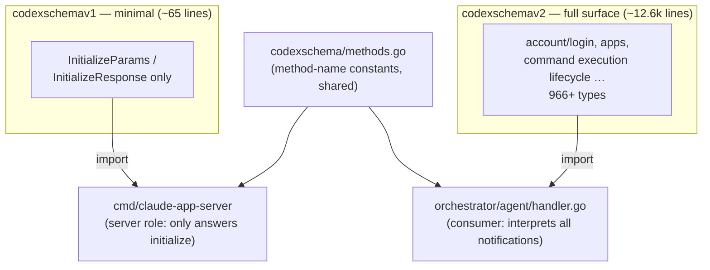
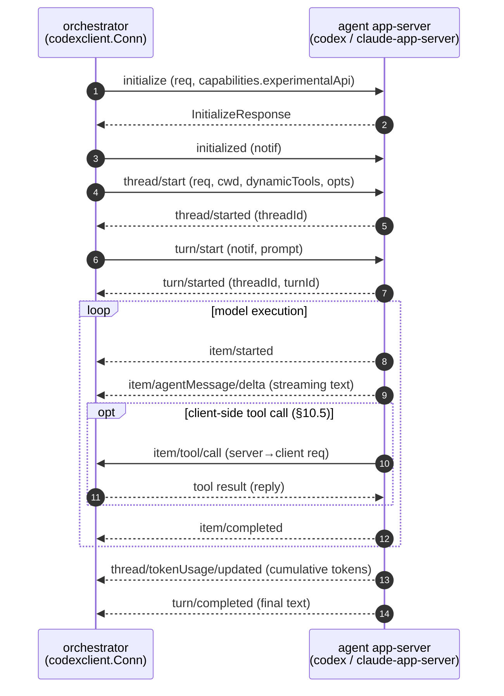
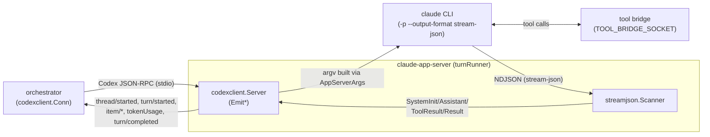
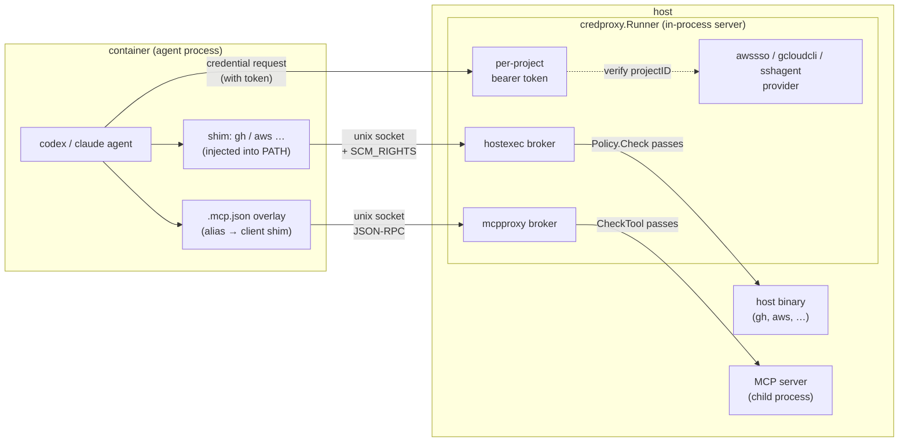
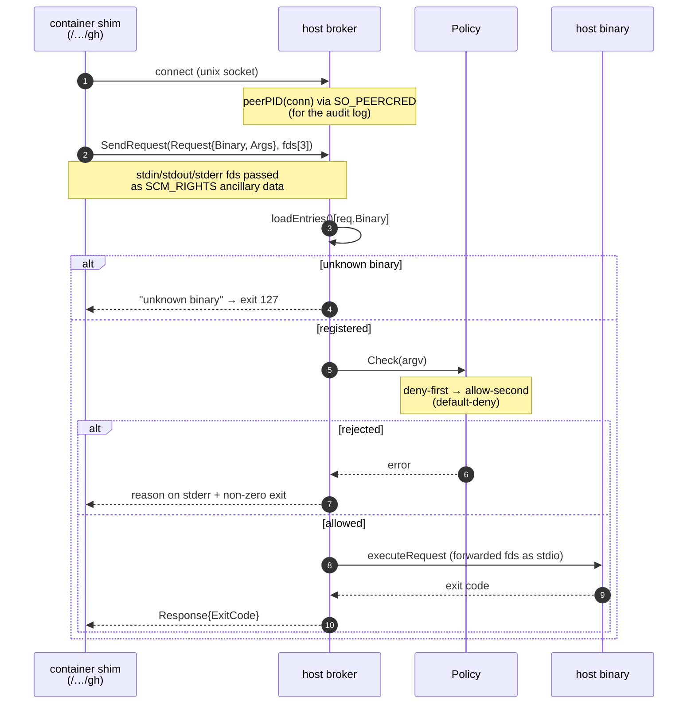
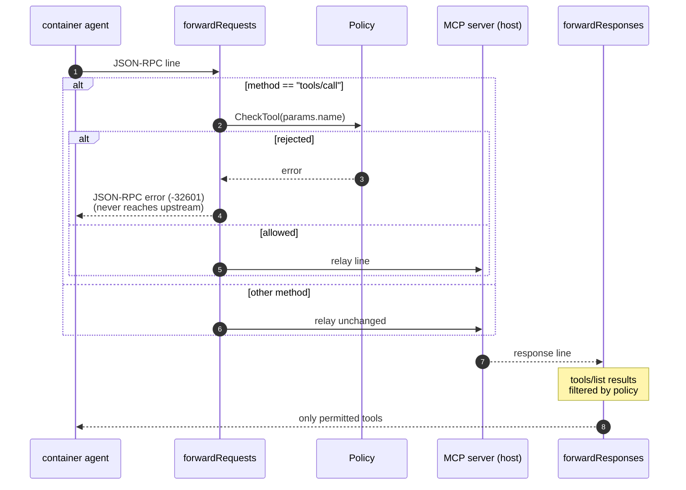
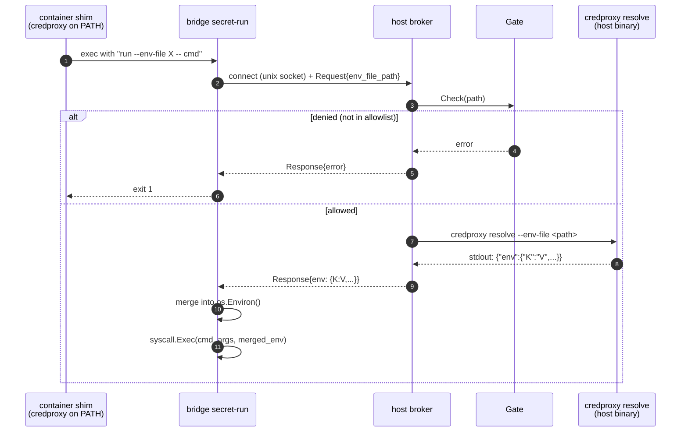
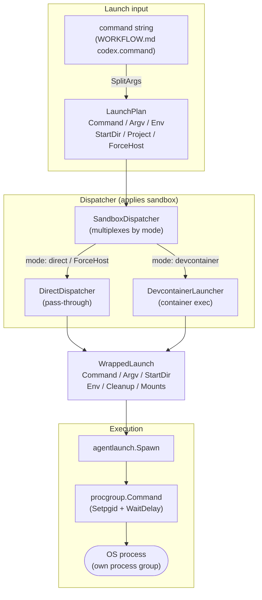
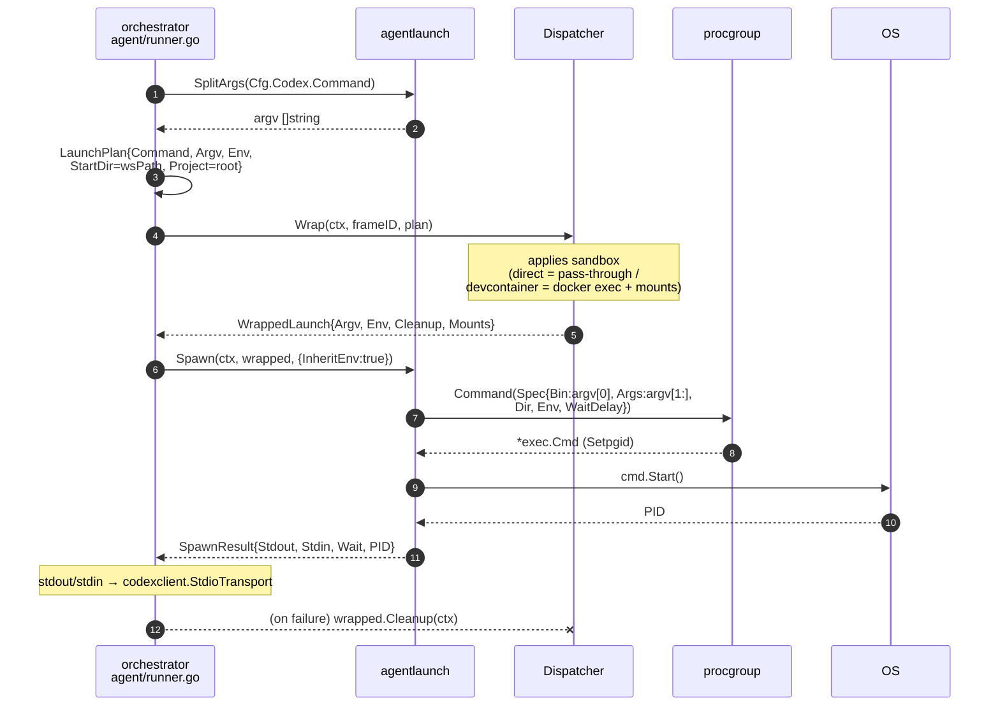
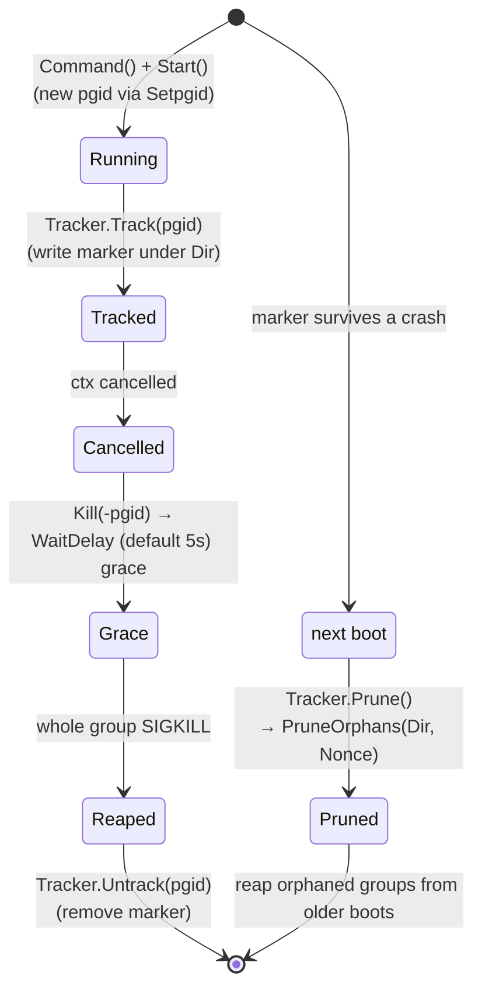

# Platform architecture

The platform area is the shared infrastructure boundary below product policy. It standardizes process launch, terminal fan-out, agent protocol, sandboxing, and constrained host mediation. Frame launch owns final PATH ordering after pre-exec evaluation; stable platform identities define authoritative shim locations, while providers materialize shims without independently mutating PATH.

The complete legacy sources remain below as migration history. The governing contract above is the maintained design surface.

## Legacy Source: component-20260624-platform-agent-protocol

````markdown
---
id: component-20260624-platform-agent-protocol
kind: component
title: Agent Protocol — The Codex app-server Protocol Layer
status: active
created: '2026-06-24'
updated: '2026-07-04'
tags:
- technical
- platform
- legacy-import
owners: []
relations:
- {type: referencedBy, target: component-20260624-orchestrator-overview}
- {type: references, target: component-20260624-orchestrator-overview}
- {type: references, target: component-20260624-platform-sandbox}
- {type: references, target: component-20260624-platform-spawn-and-launch}
- {type: referencedBy, target: component-20260624-platform-overview}
- {type: referencedBy, target: component-20260624-platform-spawn-and-launch}
- {type: referencedBy, target: note-20260624-technical-guardrails}
- {type: referencedBy, target: note-20260624-technical-overview}
source_paths:
- src/platform/agent/codexclient/
- src/platform/agent/codexschema/
- src/platform/lib/codex/
- src/platform/lib/claude/
- src/platform/agent/codexschema/README.md
- src/cmd/claude-app-server/
- src/orchestrator/agent/handler.go
- src/cmd/claude-app-server/main.go
provides:
- agent-protocol-the-codex-app-server-protocol-layer
summary: The shared stdio JSON-RPC protocol the orchestrator uses to drive an agent
  (Codex / Claude). This layer is what lets the scheduler stay agent-agnostic — Codex
  and Claude emit the same event sequence, so nothing above
---

<!-- migrated_from: docs/technical/platform/agent-protocol.md -->

# Agent Protocol — The Codex app-server Protocol Layer

The shared **stdio JSON-RPC protocol** the orchestrator uses to drive an agent (Codex / Claude). This layer is what lets the scheduler stay **agent-agnostic** — Codex and Claude emit the same event sequence, so nothing above has to branch on the agent.

| Package | Responsibility |
|---|---|
| `platform/agent/codexclient/` | Transport-agnostic JSON-RPC framing; helpers for both the client and server roles |
| `platform/agent/codexschema/` | Protocol method-name constants + generated types (v1/v2), pinned to a JSON Schema |
| `platform/lib/codex/` | argv builders for launching the codex process |
| `platform/lib/claude/` | Claude CLI integration (`cli/` argv builders, `streamjson/` output parser) |

The launch path (how it becomes a process) is in [spawn-and-launch.md](../component/component-20260624-platform-spawn-and-launch.md); the scheduler-side usage is in the [orchestrator README](../component/component-20260624-orchestrator-overview.md).

## codexclient — JSON-RPC framing

`Conn` (`codexclient/conn.go:33`) is the hub that routes JSON-RPC messages.

- `Request(method, params)` (`conn.go:83`) — a client→server request that awaits a response
- `Notify(method, params)` (`conn.go:111`) — a notification, no response expected
- `Run(ctx, Handler)` (`conn.go:56`) — the receive loop; dispatches to the `Handler`'s `OnNotification` / `OnServerRequest` (`conn.go:23-27`)

**Client-role** helpers (`client.go`): `Initialize` performs the `initialize` request + `initialized` notification handshake and sends `capabilities: {experimentalApi: true}` (`client.go:11`). `StartThread` (advertises the `§10.5` dynamicTools), `StartTurn`, and `ResumeThread` build their respective requests.

**Server-role** helpers (`server.go`): `Server` provides notification emitters — `EmitThreadStarted` / `EmitTurnStarted` / `EmitTurnCompleted` / `EmitAgentMessageDelta` / `EmitItemStarted` / `EmitItemCompleted` / `EmitTokenUsage` (`server.go:25-85`). The `claude-app-server` shim uses these to "speak" the Codex protocol.

There are two transports: stdio (`transport_stdio.go`) and websocket (`transport_ws.go`).

## codexschema — method constants and versioned types

`methods.go` (package `codexschema`) holds the protocol method names in four groups:

| Group | Examples |
|---|---|
| client→server requests | `initialize` / `thread/start` / `thread/resume` |
| client→server notifications | `initialized` / `turn/start` |
| server→client notifications | `thread/started` / `turn/started` / `item/started` / `item/agentMessage/delta` / `item/completed` / `thread/tokenUsage/updated` / `turn/completed` / `error` … |
| server→client requests | `item/commandExecution/requestApproval` / `item/fileChange/requestApproval` / `item/tool/call` (§10.5) / `item/tool/requestUserInput` (experimental) |

> Documented posture for `item/tool/requestUserInput`: automated orchestration treats it as a hard fail (`methods.go:47`).

Types are generated from JSON Schema by quicktype into `v1/types.gen.go` (package `codexschemav1`) and `v2/types.gen.go` (package `codexschemav2`). These are **pinned** to a specific codex-cli version and verified by a CI drift check (`make codex-schema-check`) that diffs the committed bundles against current codex output. A schema bump requires an explicit PR that updates the pin and regenerates types (details in `platform/agent/codexschema/README.md`). The generated files are auto-excluded from the lint file/function-length checks.

### v1 / v2 — selected at import time

The two differ only in type coverage; **there is no runtime negotiation**. `initialize` sends `experimentalApi: true`, but which type set is used is decided by the **consumer's import choice**.



- `claude-app-server` only returns `initializeResponse()`, so the minimal **v1** suffices (`cmd/claude-app-server/main.go:12`).
- The orchestrator's `turnHandler` interprets `thread/started`, `turn/completed`, `tokenUsage`, etc., so it imports **v2** plus the shared `codexschema` constants (`orchestrator/agent/handler.go:13-14`).

## The agent turn sequence

The orchestrator's `agent/runner.go:launchConn` opens a `Conn`, and the `turnHandler` (`handler.go`) receives notifications.



`turnHandler.OnNotification` (`handler.go:67`) signals `sessionReady` on `turn/started` and `turnDone` on `turn/completed`, measures the turn duration, and reports a `CodexActivity` to metrics. It auto-replies `acceptForSession` to `item/*/requestApproval` (`handler.go:170`).

## Presenting Claude as the Codex protocol — the claude-app-server shim

Claude has no native app-server, so `cmd/claude-app-server` acts as a **drop-in shim** that speaks the Codex protocol while internally launching the Claude CLI and translating its stream-json output.



- `cli/argv.go`'s `AppServerArgs(resumeSessionID, appendSystemPrompt, prompt)` (`:29`) builds argv like `-p --output-format stream-json --verbose --resume <id>`. `SandboxFlags` (`:15`) adds sandbox flags.
- `streamjson` (`streamjson.go`) parses the CLI's NDJSON into typed events (`SystemInit` / `AssistantMessage` / `ToolResult` / `ToolResults` / `Result` / `Unknown`). `Usage.Total()` returns the token total.
- `turnRunner.scanStream` (`turn.go:170`) translates events into Codex notifications: `SystemInit` → record sessionID, `AssistantMessage` → `EmitAgentMessageDelta`, `ToolResult` → `item/completed`, `Result` → `completeTurn` (which emits `EmitTokenUsage` + `turn/completed`).
- Claude's tool execution is forwarded to an in-band tool bridge over `TOOL_BRIDGE_SOCKET` (`turn.go:99`).

approval / sandbox policy hints are logged but not enforced by the shim — isolation is provided by the devcontainer (see [sandbox.md](../component/component-20260624-platform-sandbox.md)).

## lib/codex — argv builders for codex

`lib/codex/argv.go` builds the process-launch argv:

| Function | Purpose |
|---|---|
| `ParseCommand(argv []string)` (`:26`) | Parse `codex.command` into a `CommandConfig` |
| `AppServerListenArgs(serverBin, sock, extra, sandboxExternal)` (`:54`) | listen-socket mode |
| `AppServerStdioArgs(extra, sandboxExternal)` (`:64`) | stdio mode |
| `RemoteAttachArgs(sock, threadID, startDir)` (`:79`) | remote attach over the app-server UDS (`--remote unix://<sock>`) |
| `ShellJoinArgv(args)` (`:93`) | shell-join argv for a pty frame |

`ShellJoinArgv` is what populates the `Command` form (pty frame) in [spawn-and-launch.md](../component/component-20260624-platform-spawn-and-launch.md).

````

## Legacy Source: component-20260624-platform-brokers

````markdown
---
id: component-20260624-platform-brokers
kind: component
title: Brokers — Host Mediation and Policy Enforcement
status: active
created: '2026-06-24'
updated: '2026-07-04'
tags:
- technical
- platform
- legacy-import
owners: []
relations:
- {type: references, target: component-20260624-platform-sandbox}
- {type: references, target: component-20260624-platform-spawn-and-launch}
- {type: references, target: note-20260624-technical-guardrails}
- {type: referencedBy, target: component-20260624-platform-overview}
- {type: referencedBy, target: component-20260624-platform-spawn-and-launch}
- {type: referencedBy, target: note-20260624-technical-guardrails}
- {type: referencedBy, target: note-20260624-technical-overview}
source_paths:
- src/platform/credproxy/
- src/platform/hostexec/
- src/platform/mcpproxy/
- src/platform/secretenv/
- src/platform/secretenv/broker.go
- src/platform/secretenv/gate.go
provides:
- brokers-host-mediation-and-policy-enforcement
summary: Implementation deep dive of the three brokers that give an in-container agent
  limited access to host privileges, credentials, and MCP servers.
---

<!-- migrated_from: docs/technical/platform/brokers.md -->

# Brokers — Host Mediation and Policy Enforcement

Implementation deep dive of the three brokers that give an in-container agent **limited** access to host privileges, credentials, and MCP servers.

> This document covers the **"how"** (the implementation). The **"why"** — why this shape is a security boundary (long-lived secrets stay on the host; the container only ever sees short-lived tokens and brokered stdio) — is owned by [sandbox.md → Credential Proxy / Host-exec broker / MCP proxy](../component/component-20260624-platform-sandbox.md#credential-proxy). The two cross-link and avoid duplicating content.

| Package | Role | Enforcement |
|---|---|---|
| `platform/credproxy/` | In-process credential server. Bundles providers and issues a per-project bearer token | token ↔ projectID verification |
| `platform/hostexec/` | Runs allowlisted host binaries on behalf of the container (SCM_RIGHTS stdio forwarding) | deny-first allowlist (`Policy.Check`) |
| `platform/mcpproxy/` | Runs MCP servers on the host and relays JSON-RPC stdio | per-tool policy (`Policy.CheckTool`) |
| `platform/secretenv/` | Resolves secret references from an env-file on the host; injects into subprocess env | env-file path allowlist (`Gate.Check`, default-deny) |

## The big picture: credproxy bundles the providers

Both hostexec and mcpproxy implement the external `credproxy/container` `container.Provider` interface and register with the `credproxy.Runner` (`credproxy/credproxy.go:83`, `buildProviders`). This collapses credentials, host-exec, and MCP behind a single per-project Unix-socket server.



## credproxy — per-project tokens and provider fan-out

`Runner` (`credproxy.go:36`) holds a `credproxylib.Server` and the provider set. `Start` (`credproxy.go:72`) brings up the server and `buildProviders` registers the awssso / gcloudcli / sshagent providers plus the hostexec and mcpproxy `SpecBuilder`s. The server runs on a child context so `Shutdown` deterministically reaps provider-managed processes such as ssh-agent.

**Token scoping** (`ProjectToken`, `credproxy.go:53`):

- Each project gets a 32-byte (256-bit) token from `crypto/rand` (`generateToken`, `credproxy.go:231`).
- `srv.AddAuthToken(token, projectID)` registers it, where `projectID = container.ProjectRunHash(projectPath)`.
- Repeat requests for the same project reuse the cached token (`tokens map[string]string`).

Container-side requests present this token, and the server matches token → projectID. **This is the boundary that blocks credential leakage across projects.**

## hostexec — proxied execution over SCM_RIGHTS

A container-side shim asks over a Unix socket to "run this binary with this argv"; the broker executes it on the host and returns the exit code. stdio is passed as **the actual file descriptors** via SCM_RIGHTS.



**Policy** (`hostexec/policy.go`) evaluates deny → allow and rejects anything matching neither (default-deny, `Check` `policy.go:77`).

- Patterns are globs (`*` matches any string, including spaces). In `"gh pr *"` the space before `*` is **literal**, so it does not match `"gh preview"` (`CompilePolicy` `policy.go:49`).
- argv is reconstructed into a string by `shellJoin` before matching. This is **to align with Claude Code's Bash permission pattern semantics**; tokens that are not `isShellSafe` get single-quoted (`policy.go:95`).
- Leading `KEY=VALUE` env-assignment tokens are stripped by `trimEnvPrefix` before comparison, so `"ENV=x gh pr *"` and `"gh pr *"` are treated identically.

For audit, the caller PID is read via `SO_PEERCRED` (`peerPID`, `broker.go:81`) and logged together with `/proc/<pid>/comm` (`procComm`).

## mcpproxy — JSON-RPC relay and tool gating

MCP servers run as host-side child processes, with newline-delimited JSON-RPC 2.0 relayed bidirectionally between them and the container. `SpecBuilder` (`mcpproxy/provider.go:21`) is also a `container.Provider`.



- `forwardRequests` (`relay.go:54`) intercepts `tools/call` and gates it with `policy.CheckTool(name)` (`policy.go:43`, deny-first). A rejected call is answered directly to the container with an error and never forwarded upstream.
- `forwardResponses` (`relay.go:86`) filters `tools/list` results by policy so disallowed tools are never shown to the container.
- `ContainerSpec` (`provider.go:61`) takes the project's `.mcp.json` as a base and generates an overlay pointing each alias at the client shim (`writeMCPJSON`), then returns two bind mounts (broker socket + `.mcp.json` overlay) plus the `AG_MCP_SOCK` env. With no servers configured it returns an empty Spec.

## secretenv — secret reference resolver

`secretenv` resolves opaque references (e.g. `op://vault/item/field`) in an env-file and injects the real values into a single subprocess environment. Invoked ad-hoc within a running session — not at container startup.



**Container shim** (`secretenv-shims/credproxy`): a shell script that calls `bridge secret-run "$@"`. It is written to `<projRunDir>/secretenv-shims/` and prepended to container `PATH`, so existing scripts that call `credproxy run` work without modification.

**Broker** (`platform/secretenv/broker.go`): per-project Unix socket server (`<projRunDir>/secretenv.sock`, bind-mounted at `/opt/agent-grid/run/secretenv.sock`). Each connection is handled in its own goroutine. `gate`, `credproxyBin`, and `hostPathMountPrefix` are guarded by a `sync.RWMutex` so concurrent request handling during config reload is race-free.

Before the gate is checked, the broker applies path canonicalization in order:
1. Reject non-absolute paths — the container shim performs `filepath.Abs` (container CWD); a relative path arriving at the broker means a shim bug or a direct socket attempt.
2. `filepath.Clean` — collapse any `.`/`..` sequences.
3. `containerToHost` — strip `HostPathMountPrefix` (boundary-safe: `/mnt` does not strip `/mnternal`). When the prefix is empty (bare-host or no devcontainer) the path is unchanged.

After canonicalization, `gate.Check(hostPath)` runs against the resulting **host absolute path**, and the same `hostPath` is forwarded to `credproxy resolve --env-file`. This is the **gate ≡ open invariant**: the path checked by the gate is byte-identical to the path credproxy opens. The broker must never expand `~`/`$VAR` (that would use the host daemon's env, not the container's, and break the invariant with any post-gate expansion).

**Gate** (`platform/secretenv/gate.go`): `filepath.Match` allowlist, default-deny. `*` matches within a single path segment only — does not cross `/`. Patterns are matched against the **host absolute path** (after `HostPathMountPrefix` is stripped). `allow` values in `settings.toml` should use host paths.

**Resolution**: entirely credproxy's concern. Hook backend (op/mise/vault) and its configuration (`~/.config/credproxy/config.toml`) are never known to the client. the client's role is gate + socket plumbing only. The `credproxy resolve` output contains only env-file-declared secrets; host environment variables are never included.

**Bare-host path**: the real `credproxy run` binary resolves locally with no gate. The shim/broker path is only active inside a devcontainer.

## Related documentation

- The full security model and sandbox lifecycle: [sandbox.md](../component/component-20260624-platform-sandbox.md)
- Where brokers are injected into the container along the launch path: [spawn-and-launch.md](../component/component-20260624-platform-spawn-and-launch.md) (`DevcontainerLauncher`)
- Capability sandboxing as an agent-control guardrail: [guardrails.md → capability](../note/note-20260624-technical-guardrails.md#3-capability-sandboxing--what-a-running-agent-can-touch)

````

## Legacy Source: component-20260624-platform-overview

````markdown
---
id: component-20260624-platform-overview
kind: component
title: platform/ — Shared Infrastructure
status: active
created: '2026-06-24'
updated: '2026-07-04'
tags:
- technical
- platform
- legacy-import
owners: []
relations:
- {type: references, target: component-20260624-platform-agent-protocol}
- {type: references, target: component-20260624-platform-brokers}
- {type: references, target: component-20260624-platform-sandbox}
- {type: references, target: component-20260624-platform-spawn-and-launch}
- {type: references, target: note-20260624-technical-code-enforcement}
- {type: references, target: note-20260624-technical-guardrails}
- {type: references, target: note-20260624-user-sandbox}
- {type: referencedBy, target: note-20260624-agent-overview}
- {type: referencedBy, target: note-20260624-docs-overview}
- {type: referencedBy, target: note-20260624-technical-code-enforcement}
- {type: referencedBy, target: note-20260624-technical-overview}
source_paths:
- src/platform/sandbox/
- src/platform/hostexec/
- src/platform/mcpproxy/
- src/platform/pathmap/
- src/platform/logger/
- src/platform/lib/
- src/platform/tracker/
- src/platform/metrics/
provides:
- platform-shared-infrastructure
summary: platform/ is the base layer. Both the server backend (client/) and the orchestrator/
  depend on it; it depends on neither of them (enforced by the depguard rule platform-no-client-or-orchestrator).
  Wire-format and
---

<!-- migrated_from: docs/technical/platform/README.md -->

# platform/ — Shared Infrastructure

`platform/` is the base layer. Both the `server` backend (`client/`) and the `orchestrator/` depend on it; it depends on **neither** of them (enforced by the `depguard` rule `platform-no-client-or-orchestrator`). Wire-format and persistence types here stay stdlib-only.

Because it sits below both services, `platform/` is where tool-specific knowledge (paths, env var names, CLI invocations) is allowed to live — keeping it out of the generic layers above.

## Design principles (platform realization)

`platform/` is a **library layer, not a decision loop**, so the Functional Core / Imperative Shell form of the [core principles](../../../ARCHITECTURE.md#core-principles-all-layers) does not apply here. It still serves the same overriding goal — **testability** — but through **dependency-injection seams** rather than a pure reducer:

- **Testability via DI seams** — code that wraps an external dependency (`exec`, docker, the network, a filesystem path) puts that dependency behind an injectable interface or an env-var override, so tests substitute a fake. Examples: subprocess wrappers expose a `Runner` interface (`lib/github.Runner`) with a `DefaultRunner` for production and a fake for tests; external config paths accept overrides (`CODEX_CONFIG_DIR`). "We can't test it without the real binary" is a design defect — cover the parsing/command-assembly logic behind the seam.
- **Base layer, no upward imports** — `platform/` imports neither `client/` nor `orchestrator/` (enforced by `depguard` rule `platform-no-client-or-orchestrator`). It knows nothing about the services above it.
- **Tool-specific knowledge concentrated here** — paths, env-var names, and CLI invocations live in `lib/<tool>/` and `credproxy/` so the generic layers above stay tool-agnostic. This is the receiving side of client's Driver isolation.
- **Agent-agnostic launch primitive** — `agentlaunch` (`Spawn`/`SplitArgs`/`Dispatcher`) turns a command string into a running process without knowing which agent it launches; per-agent argv construction stays in `lib/<tool>`.
- **Wire-format / persistence is stdlib-only** — types that cross the wire or hit disk depend only on the standard library, for portability.

## Packages

| Package | Responsibility |
|---|---|
| `platform/sandbox/` | Project-level sandbox backends (generic `Manager[I]`). `devcontainer/` implements per-project container lifecycle via docker. See [sandbox.md](../component/component-20260624-platform-sandbox.md). |
| `platform/hostexec/` | Host-exec broker — a `container.Provider` that runs allowlisted host binaries on behalf of container processes via SCM_RIGHTS stdio forwarding. |
| `platform/mcpproxy/` | MCP proxy broker — runs MCP servers on the host with JSON-RPC stdio relayed into the container, with tool-level policy enforcement. Generates a `.mcp.json` overlay so Claude Code routes configured aliases through the broker. |
| `platform/pathmap/` | Container↔host path translation using `WrappedLaunch.Mounts`. |
| `platform/logger/` | `slog` initialization + log file management. |
| `platform/lib/` | External tool integration — `git`, `github`, `gemini`, `wsl`, `openurl`, `notify`, …  Per-agent argv builders: `lib/codex/argv.go` (`AppServerListenArgs`, `RemoteAttachArgs`, `ParseCommand([]string)`, `ShellJoinArgv`, driver constants) and `lib/claude/cli/argv.go` (`SandboxFlags`, `AppServerArgs`). |
| `platform/tracker/` | Issue tracker adapters (e.g. `linear/`). Shared by the orchestrator. |
| `platform/metrics/` | Token / runtime metrics accumulation. |
| `platform/agentlaunch/` | Agent launch primitives: `LaunchPlan`/`WrappedLaunch` (dual `Command` string for pty frame + `Argv []string` for `Spawn`), `Dispatcher.Wrap` interface, `Spawn` (argv-direct exec via `procgroup`, no host shell), `SplitArgs` POSIX tokenizer. Shared by client and orchestrator. |
| `platform/procgroup/` | Process-group spawn wrapper (`procgroup.Command`) with `WaitDelay`-bounded SIGKILL. `Tracker` records pgids so a future boot's `PruneOrphans` can reap orphaned processes. |
| `platform/agent/` | Shared agent launch interfaces (e.g. `codexclient/`). |
| `platform/credproxy/` | Credential providers (AWS SSO, gcloud CLI, ssh-agent) — the external `credproxy` library; the only place tool-specific credential env var names live. |

## Per-subsystem deep dives

- **[spawn-and-launch.md](../component/component-20260624-platform-spawn-and-launch.md)** — `agentlaunch` + `procgroup` + `pathmap`. The layer that turns a command string into a running process: `LaunchPlan`/`WrappedLaunch`/`Dispatcher`/`Spawn`, process-group lifecycle and orphan reaping, container↔host path translation.
- **[brokers.md](../component/component-20260624-platform-brokers.md)** — implementation of `hostexec` + `mcpproxy` + `credproxy`: SCM_RIGHTS proxied execution, JSON-RPC tool gating, per-project tokens. The security model is in [sandbox.md](../component/component-20260624-platform-sandbox.md).
- **[agent-protocol.md](../component/component-20260624-platform-agent-protocol.md)** — `agent/codexclient` + `codexschema` (v1/v2) + `lib/codex` + `lib/claude`. The Codex app-server stdio protocol, the turn sequence, and the claude-app-server shim's translation.
- **[sandbox.md](../component/component-20260624-platform-sandbox.md)** — `sandbox/` backends: per-project devcontainer isolation, image resolution, credential proxy.
- Agent-control guardrails (capability sandboxing, autonomy policy, concurrency, liveness) are in [guardrails.md](../note/note-20260624-technical-guardrails.md); code-level enforcement (import boundaries, length limits) is in [code-enforcement.md](../note/note-20260624-technical-code-enforcement.md).

## Sandbox isolation and credential brokering

The sandbox, host-exec, and MCP-proxy packages together provide the security model: long-lived secrets stay on the host, and the container only ever sees short-lived tokens or brokered stdio. The architecture and lifecycle are documented in [sandbox.md](../component/component-20260624-platform-sandbox.md); user-facing configuration is in the [sandbox setup guide](../note/note-20260624-user-sandbox.md).

````

## Legacy Source: component-20260624-platform-sandbox

````markdown
---
id: component-20260624-platform-sandbox
kind: component
title: Sandbox Backends
status: active
created: '2026-06-24'
updated: '2026-07-04'
tags:
- technical
- platform
- legacy-import
owners: []
relations:
- {type: referencedBy, target: component-20260624-client-ipc}
- {type: referencedBy, target: component-20260624-client-process-model}
- {type: referencedBy, target: component-20260624-orchestrator-overview}
- {type: referencedBy, target: component-20260624-platform-agent-protocol}
- {type: referencedBy, target: component-20260624-platform-brokers}
- {type: referencedBy, target: component-20260624-platform-overview}
- {type: references, target: note-20260624-user-sandbox}
- {type: referencedBy, target: note-20260624-technical-guardrails}
- {type: referencedBy, target: note-20260624-technical-overview}
- {type: referencedBy, target: note-20260624-user-sandbox}
source_paths:
- src/platform/sandbox/
- src/platform/sandbox/devcontainer/
provides:
- sandbox-backends
summary: User-facing setup (devcontainer.json, [sandbox.*] settings, credential proxy
  provider config) lives in the user guide docs/user/sandbox.md. This document covers
  the architecture, security model, and lifecycle.
---

<!-- migrated_from: docs/technical/platform/sandbox.md -->

# Sandbox Backends

User-facing setup (devcontainer.json, `[sandbox.*]` settings, credential proxy provider config) lives in the user guide [docs/user/sandbox.md](../note/note-20260624-user-sandbox.md). This document covers the architecture, security model, and lifecycle.

## Purpose

Sandbox backends isolate agent processes per project — each project directory runs inside its own container with scoped filesystem, network, and capability restrictions.

The state layer knows only `LaunchPlan.Project` (the project path); it has no awareness of which backend is active. Backend selection and command wrapping live in the runtime layer; container lifecycle lives in the `sandbox/` package.

Reactor does not build images. The image name is declared by the user in `devcontainer.json` (`image:` or `build.name`). Container lifecycle (create / start / exec / remove) uses docker directly.

## Layer Responsibilities

| Layer | Sandbox role |
|---|---|
| `state/` | Holds `LaunchPlan.Project`. Backend-agnostic |
| `runtime/` | `AgentLauncher` wraps `LaunchPlan` into `WrappedLaunch{Command, Argv, Env, Mounts, ContainerSockDir, Cleanup}`. `Wrap` populates both `Command` (shell-joined string for pty-frame launch) and `Argv` (structured argv for `agentlaunch.Spawn`). `SandboxDispatcher` resolves which launcher (direct / devcontainer) to use per project via `config.SandboxResolver` |
| `sandbox/` | `Manager[I any]` interface + backend implementations. Owns container lifecycle only; does not import driver / lib / runtime |
| `credproxy` library (`providers/<name>/`) | AWS SSO / gcloud / ssh-agent providers. Tool-specific env var names (`AWS_*`, `GOOGLE_*`, `SSH_AUTH_SOCK`) live exclusively here |
| `hostexec/` | Host-exec broker — runs allowlisted host binaries on behalf of container processes via SCM_RIGHTS stdio forwarding |

`sandbox/` is tool-agnostic. It does not contain knowledge of any specific tool (e.g. Claude). Tool-specific host paths are declared by the user in `devcontainer.json` or `~/.agent-grid/settings.toml`; they are never hardcoded in Go source.

## Design Decisions

| Decision | Choice | Rationale |
|---|---|---|
| Backend abstraction | `sandbox.Manager[I any]` + typed `Instance[I]` | Eliminates `any` and forced type-asserts. Backend-specific state (e.g. `*devcontainer.ContainerState`) is carried as the type parameter |
| Instance scope | Per-container, keyed by isolation mode | Project isolation: one container per project (key = projectPath). Shared isolation: a single `__shared__` container hosts every project's frames. `AcquireFrame` / `ReleaseFrame` manage the per-instance ref-count; `DestroyInstance` is called when the count reaches zero. The image is shared across projects at build time |
| Config resolution | User scope + project scope merged by `config.SandboxResolver` with mtime-based caching | Default direct mode; individual repos opt into devcontainer without daemon restart |
| Lifecycle and effect | client disconnect → containers survive; explicit shutdown → `EffReleaseFrameSandboxes` (`DestroyInstance` runs `docker rm` for both shared and project containers); SIGINT (ctx cancel) → same as client disconnect | Container lifetime decisions are expressed as state-layer effects, ordered in the event loop rather than a defer stack. The destroy step removes `docker rm`'s side effect on shared containers too: in-container daemons (per-session `codex app-server`) only exist on a freshly-`postCreate`-d container, so reusing a stale one breaks cold start |
| Cold-start fresh provisioning | `coordinator.coldStart` brackets `PrewarmContainers` / `RecreateAll` with `BeginColdStart` / `EndColdStart` on the `ColdStartAware` launcher. `Manager.EnsureInstance` then sees `opts.ColdStart=true` and `docker rm`s any surviving container before calling `createContainer` | Even when graceful shutdown is skipped (SIGKILL / crash), the next cold start guarantees `postCreate` runs on a fresh container |
| Crash recovery | `PruneOrphans` at daemon startup enumerates containers labelled `reactor-managed=1` and kills any whose project is not in sessions.json | Covers SIGKILL / panic paths where defer and effects never run. sessions.json is the ground truth |
| Image resolution | `LoadSpec` reads `image:` (top-level) then `build.name` from devcontainer.json | Reactor does not build images. The user builds externally and declares the image name in devcontainer.json |

## Frame Lifecycle Interaction

**New frame**
`AgentLauncher.WrapLaunch` → `EnsureInstance` (singleflight-serialized per project) → `AcquireFrame` → the resulting `WrappedLaunch` is embedded in `EffSpawnFrame`

**Warm start**
`AdoptFrame` reclaims the still-running container and increments the ref-count for each restored frame; `RecoverSandboxFrames` replays per-frame bearer tokens from `<dataDir>/warm/`

**Frame exit / shutdown**
`Cleanup` callback → `ReleaseFrame` → if count reaches zero → `DestroyInstance`

**Daemon startup**
`PruneOrphans` kills containers outside the known project set; `<dataDir>/warm/` is wiped at cold start

## Devcontainer Backend

### Image Resolution

At session start, `LoadSpec` reads the image name from `.devcontainer/devcontainer.json`:

1. If `image:` is set → use it.
2. Else if `build.name` is set → use it.
3. Neither found → error: `devcontainer.json: image or build.name is required`.

The image must already exist locally (or be pullable by docker on first `docker create`). the client never invokes a build.

### Container Identity

Frames join via `docker exec` rather than spawning a new container per frame. TTY allocation is consumer-dependent: interactive pty-frame launches (attached to the browser frontend through the gateway) use `-it`; the stream daemon (JSON-RPC over stdio pipe) uses `-i` only. Both consumers share the same `sandbox.Manager` instance but use separate `DevcontainerLauncher` instances configured for their respective TTY mode. The container scope is determined by the resolved isolation mode:

- **Project isolation** (default): one long-lived container per project. Container name `reactor-<sha256[:6] of project path>`; labels `reactor-managed=1`, `reactor-project=<abs-path>`
- **Shared isolation**: a single container named `reactor-shared` hosts every project's frames. All bind-mounts for every reactor-managed project are added at create time so any frame inside can reach its workspace. Per-frame state (workspace, env, credentials) is supplied via `docker exec -e` / `-w` at launch time, never frozen onto the spec

Multiple projects can share the same image name regardless of isolation mode.

### Workspace Mount

The project directory is bind-mounted into the container. By default the container-side path mirrors the host path exactly (e.g. host `/home/u/proj` → container `/home/u/proj`), so editor path resolution and CLI commands work without translation.

`workspaceMount` in devcontainer.json overrides the bind-mount entirely. `host_path_mount_prefix` (client setting) prepends a fixed prefix (e.g. `/mnt`) when devcontainer.json does not pin the workspace path. Working directory is set via `docker create -w` — no `WORKDIR` is needed in the Dockerfile.

### devcontainer.json Keys Honored by the client

| Key | Effect |
|---|---|
| `image` | Image name to use (standard devcontainer.json field) |
| `build.name` | Image name to use when `build:` is present (client extension; `--image-name` equivalent) |
| `mounts` | Extra bind-mounts passed as `--mount` / `-v` to `docker create` |
| `containerEnv` | Environment variables injected via `-e` |
| `containerUser` | User for `docker create -u` |
| `remoteUser` | User for `docker exec -u` (takes precedence over `containerUser`) |
| `workspaceFolder` | Container-side workspace path (default: mirror of host path) |
| `workspaceMount` | Replaces the default workspace bind-mount |
| `runArgs` | Extra args appended to `docker create` (resource limits, capabilities, etc.) |
| `postCreateCommand` | Command (string or array) run once after the container is created |
| `preExecCommand` | Shell string (client extension) run inside the container before each `docker exec` launch |

Variable substitution in string values: `${localWorkspaceFolder}`, `${localWorkspaceFolderBasename}`, `${containerWorkspaceFolder}`, `${localEnv:VAR}`. All other devcontainer.json keys (`features`, `customizations`, …) are ignored.

### Crash Recovery

`PruneOrphans` runs at daemon startup. It lists containers with label `reactor-managed=1` and removes any whose `reactor-project` label value is absent from sessions.json.

## Container IPC Endpoint

Each sandboxed project gets a dedicated Unix socket at `<dataDir>/run/<project-hash>/server.sock` on the host. It is bind-mounted read-write into the container at `/opt/agent-grid/run/server.sock` (via the per-project run dir mount that already exists for credential helper files). The container agent reads `AG_SOCKET` (set to `/opt/agent-grid/run/server.sock`) to locate it.

**API surface**: `hook-event` and `subsystem-event` are implemented. Commands such as `event`, `surface.send_text`, `peer.send`, `shutdown`, and all others are structurally absent — no handler is registered, so they receive a protocol error without touching state.

**Authentication**: at frame spawn time, a 32-byte `crypto/rand` token is generated and injected into the container via `AG_SOCKET_TOKEN`. Every `hook-event` and `subsystem-event` message carries the token; server-side Lookup resolves it to the owning frame ID. No client-supplied frame ID is trusted.

**Warm-start recovery**: tokens are persisted to `<dataDir>/warm/<frameID>.json` (atomic write, `0o600`). On daemon warm restart (containers survive, daemon replaces), `RecoverSandboxFrames` reads `warm/*.json` and re-registers each token for live frames so hook events continue to work immediately. The `warm/` directory is never bind-mounted into containers — a container process cannot read other frames' tokens.

**Cold start**: `warm/` is wiped before `LoadSnapshot` runs, ensuring stale tokens from a previous run do not survive a session-destroying restart.

## Container↔Host Path Translation

Sandboxed agents emit hook payloads and subsystem payloads containing container-absolute paths (e.g. `/workspaces/proj/.../session.jsonl`), but the daemon, drivers, and IPC consumers operate on host-absolute paths. `lib/pathmap` translates at the IPC boundary using the bind-mount table captured in `WrappedLaunch.Mounts`. State, runtime above the launcher, and proto never see container paths.

## Host Mounts

Bind-mounts are declared in devcontainer.json `mounts`. `sandbox/` does not have a global host-mounts config for arbitrary paths — tool-specific paths belong in project or user devcontainer.json, keeping the sandbox layer tool-agnostic.

## Credential Proxy

In devcontainer mode the client always runs an in-process HTTP server backed by the `credproxy` library. The server listens on `<dataDir>/run/credproxy.sock` on the host and is bind-mounted per project into each container at `/opt/agent-grid/run/credproxy.sock`. Its lifetime is tied to the client process — no external daemon is needed. Each provider self-gates on its own configuration and contributes nothing to the container when its settings are empty.

Providers come from two sources: the external `credproxy` library's `providers/<name>/` packages (AWS SSO, gcloud, ssh-agent) and local packages — `hostexec/` (host-exec broker), `mcpproxy/` (MCP proxy), `secretenv/` (secret env resolver) — all using the same `container.Provider` interface. Each provider contributes to the runtime by:

1. Building a `container.Spec` (env vars to inject, files to materialize under the per-project run dir, optional bind-mounts).
2. Optionally registering an HTTP route on the proxy server (AWS SSO uses this; others rely on bind-mounts only).

Generic layers (`runtime/`, `sandbox/`, `state/`, `proto/`) never reference tool-specific env var names (`AWS_*`, `GOOGLE_*`, `SSH_AUTH_SOCK`). Those names appear only inside the corresponding provider package.

### AWS SSO, gcloud CLI, SSH Agent

Behavior of each provider (credential fetch flow, security model, container env vars) is documented in the credproxy repository:

- [providers/awssso](https://github.com/takezoh/credproxy/tree/main/providers/awssso) — `credential_process` via proxy HTTP route; `~/.aws/sso/cache` never bind-mounted
- [providers/gcloudcli](https://github.com/takezoh/credproxy/tree/main/providers/gcloudcli) — GCE metadata server emulator + synthetic `CLOUDSDK_CONFIG`; tokens fetched on demand via `gcloud auth print-access-token`; `~/.config/gcloud` never bind-mounted
- [providers/sshagent](https://github.com/takezoh/credproxy/tree/main/providers/sshagent) — per-project ephemeral agent; container receives socket only

`SSH_AUTH_SOCK` is injected at both container-creation time (`docker create -e`) and at each frame launch (`docker exec -e`), so updating the key list takes effect on the next launch without recreating the container.

### Host-exec broker

The `hostexec` provider lets container processes invoke host binaries (e.g. `gh`, `aws`, `kubectl`) without receiving any credentials or tokens. The host executes the binary; the container only sees stdio.

**Mechanism:**

1. The host starts a per-project Unix socket broker (`<dataDir>/run/<project-hash>/hostexec.sock`) bind-mounted at `/opt/agent-grid/run/hostexec.sock` inside the container.
2. Shell shim scripts are written to `<dataDir>/run/<project-hash>/hostexec-shims/<name>`. Each shim calls `bridge host-exec <name> "$@"`. The shim directory is placed at the front of every framelaunched process's PATH by `framelaunch.Run()` (see [Runtime PATH ordering](#runtime-path-ordering-case-d)) — the provider itself does NOT contribute `Env["PATH"]` to the container spec.
3. If `overlay` paths are configured, additional shims are written to `<dataDir>/run/<project-hash>/hostexec-overlay/<name>` and bind-mounted read-only at each path. Each entry is a project-relative path (resolved against the container-side workspace folder, `..` allowed) or an absolute path. This lets existing scripts that invoke binaries via relative paths (`./bin/gh`) or scripts in parent directories mounted via `extra_create_args` route through the same broker.
4. The shim sends the request (binary name, args, cwd) plus the three stdio fds via SCM_RIGHTS over the socket.
5. The broker policy-checks the command, then exec's the host binary with the transferred fds as its stdin/stdout/stderr. The exit code is returned to the shim.

**Policy (deny-first, default-deny):**

Allow and deny patterns follow Claude Code's Bash permission semantics: argv is reconstructed into a shell string with single-quoting, and patterns use `*` as a wildcard matching any substring including spaces.

```
deny?  → reject
allow? → permit
else   → reject
```

Leading `KEY=VALUE` env assignments in patterns are stripped before matching, so `"GH_TOKEN=x gh pr *"` is equivalent to `"gh pr *"` for both matching and binary name extraction.

Binary names must match `[a-zA-Z0-9][a-zA-Z0-9._-]*`; patterns whose first non-env token fails this check are rejected at config load time.

User-scope and project-scope `allow`/`deny` lists are concatenated; project patterns cannot remove user-level deny rules. `overlay` lists are also concatenated, with duplicates removed. Relative entries from different scopes are resolved independently against each project's workspace folder at runtime.

### MCP proxy

The `mcpproxy` provider runs MCP server processes on the host and relays JSON-RPC stdio into the container via a per-project Unix socket broker (`<dataDir>/run/<project-hash>/mcp.sock`). Credentials (GCP ADC, AWS profiles, etc.) are never transmitted — the MCP process itself runs on the host where the credentials reside.

**Mechanism:**

1. The host starts a per-project Unix socket broker bind-mounted at `/opt/agent-grid/run/mcp.sock` inside the container.
2. At container launch, the client generates a `.mcp.json` in the project workspace (read-only bind-mount) that overrides any project-local `.mcp.json` for configured aliases, routing them through `server mcp-exec <alias>`.
3. `server mcp-exec <alias>` (the in-container shim) sends its three stdio fds via SCM_RIGHTS over the socket.
4. The broker starts the actual MCP server process on the host and relays JSON-RPC messages. `tools/call` requests are policy-checked before forwarding; `tools/list` responses are filtered to the allowed set.

**Policy (deny-first, default-deny):** patterns match the tool name directly with `*` as wildcard. User-scope and project-scope server definitions are merged; project entries override user entries on the same alias.

**Container env var:** `AG_MCP_SOCK=/opt/agent-grid/run/mcp.sock` (set when any server is configured).

### Secret env resolver

`secretenv` lets an in-session command (`credproxy run --env-file X -- cmd`) resolve opaque references in an env-file and inject the real values into a **single subprocess** environment. The design follows the `op run --env-file` model.

This is an **intentional exception** to the "long-lived secrets stay on host" invariant. The resolved value enters the subprocess env for its lifetime only and never persists in the container env, session env, or any file. The trade-off is explicit and scoped.

**Bare-host** (no devcontainer, trusted user): the real `credproxy` binary resolves locally via the configured hook. No gate.

**Container**: a shim script named `credproxy` (placed in `<projRunDir>/secretenv-shims/`, prepended to `PATH` by `framelaunch.Run()` — see [Runtime PATH ordering](#runtime-path-ordering-case-d); the provider itself does NOT contribute `Env["PATH"]`) impersonates `credproxy run`. The shim calls `bridge secret-run`, which connects to a per-project host broker socket. The broker:

1. Gates the request by checking the env-file path against a per-project `filepath.Match` allowlist (default-deny, host config, container cannot modify).
2. Delegates resolution to the host `credproxy resolve --env-file <path>` binary.
3. Returns the resolved `{name: value}` map over the Unix socket.
4. The shim merges resolved values into `os.Environ()` and `syscall.Exec`s the target command.

The container sends only the env-file path. Hook backend (op/mise/vault) and its configuration live entirely in credproxy (`~/.config/credproxy/config.toml`); the client has no knowledge of it. The `credproxy resolve` output contains only env-file-declared secrets — host environment variables are never included.

**Gate details:** `filepath.Match` glob patterns, single-level `*` only (does not cross `/`). Empty allowlist = default-deny. Patterns are evaluated against the raw path sent by the container — paths are not cleaned by the broker; callers should send canonical paths.

### Subscription credentials (interactive auth)

Some tools (Claude Code, etc.) authenticate via OAuth flows that store refresh tokens in user-config files. The credential proxy cannot synthesise these — they require a real interactive login. The user opts in by declaring a bind-mount in devcontainer.json for the credential file/directory. This exposes the OAuth refresh token to the container; the trade-off is the user's call.

**Container reuse**: `/opt/agent-grid/run` is bind-mounted at container-creation time. If an existing container lacks this mount (created with an older client version), remove it with `docker rm -f reactor-<hash>` and relaunch.

### Runtime PATH ordering (case D)

**Contract**: `platform/framelaunch.Run()` is the sole owner of the invariant "runtime-authoritative shim dirs first in PATH". After preExec evaluation (which may reorder PATH via `mise activate` / user dotfiles), Run() unconditionally prepends the entries of `appid.RuntimeAuthoritativePathList()` to the PATH inherited by PreCommands and MainCommand, deduplicated and order-preserving.

**SSOT**: `platform/appid` owns the shim subdirectory names as constants:

| appid const | value | provider |
|---|---|---|
| `HostExecShimsDir` | `hostexec-shims` | hostexec |
| `HostExecShimsPath` | `/opt/agent-grid/run/hostexec-shims` | (derived) |
| `SecretEnvShimsDir` | `secretenv-shims` | secretenv |
| `SecretEnvShimsPath` | `/opt/agent-grid/run/secretenv-shims` | (derived) |

`appid.RuntimeAuthoritativePathList()` returns `[HostExecShimsPath, SecretEnvShimsPath]` in that order, fresh slice per call.

**Provider contract**: `hostexec.SpecBuilder.ContainerSpec` and `secretenv.SpecBuilder.ContainerSpec` MUST NOT set `Env["PATH"]` on their returned `container.Spec` — the container-side runtime path ordering is owned by framelaunch, not by provider ContainerEnv contribution. The rationale is that PATH ordering the provider tries to establish is defeated by preExec's shell rc anyway (RCA); a defense-in-depth panic at `NewSpecBuilder` time fires when `cfg.ContainerRunDir != appid.ContainerRunDir` to guarantee shim locations match what framelaunch prepends.

**Trust boundary**: any binary placed under `appid.HostExecShimsPath` or `appid.SecretEnvShimsPath` on disk is exec'd in preference to `/usr/bin` counterparts of the same command name for every framelaunched process. Writers of those directories (only the hostexec / secretenv providers today) hold implicit exec priority. Overlay-registered shims (via `sandbox.proxy.host_exec.overlay`) share this priority via bind-mount rather than PATH ordering.

**Rollback toggle**: setting the env `AG_FRAMELAUNCH_DISABLE_PATH_REASSERT=1` (or `true`/`yes`, case-insensitive) skips the merge wiring while still emitting the `framelaunch.path_reassert` slog record with `skip_branch=toggle_disabled`. Provided per `adr-20260716-shim-priority-hardening-and-migration` as an emergency escape hatch. Reverts to pre-case-D behavior (preExec's PATH wins) for the affected frame.

**Migration note (observable PATH surface)**: with case D, `docker exec -it reactor-<hash> bash -c 'echo $PATH'` no longer shows `/opt/agent-grid/run/hostexec-shims` at the front — provider `Env["PATH"]` contribution is gone. This is not a behavior regression: interactive shells re-source shell rc anyway (which already displaced the shim from the front), so effective shim resolution in interactive shells was never guaranteed by the old provider ContainerEnv contribution. Agent-invoked processes (via `framelaunch.Run()`) do see the shim first as the case-D contract guarantees.

Related: `adr-20260716-framelaunch-runtime-path-owner`, `adr-20260716-provider-shim-root-appid-ssot`, `adr-20260716-shim-priority-hardening-and-migration`.

````

## Legacy Source: component-20260624-platform-spawn-and-launch

````markdown
---
id: component-20260624-platform-spawn-and-launch
kind: component
title: Spawn & Launch — Centralized Agent Process Launching
status: active
created: '2026-06-24'
updated: '2026-07-04'
tags:
- technical
- platform
- legacy-import
owners: []
relations:
- {type: referencedBy, target: component-20260624-orchestrator-overview}
- {type: referencedBy, target: component-20260624-platform-agent-protocol}
- {type: referencedBy, target: component-20260624-platform-brokers}
- {type: referencedBy, target: component-20260624-platform-overview}
- {type: references, target: component-20260624-platform-agent-protocol}
- {type: references, target: component-20260624-platform-brokers}
- {type: references, target: note-20260624-user-sandbox}
- {type: referencedBy, target: note-20260624-technical-guardrails}
- {type: referencedBy, target: note-20260624-technical-overview}
source_paths:
- src/platform/agentlaunch/
- src/platform/procgroup/
- src/platform/pathmap/
- WORKFLOW.md
- src/client/state/
provides:
- spawn-launch-centralized-agent-process-launching
summary: The platform/ layer owns the single answer to "how does a command string
  become a running process?". Centralized out of client/ and orchestrator/ by the
  recent "platform spawn/command centralization" work, three
---

<!-- migrated_from: docs/technical/platform/spawn-and-launch.md -->

# Spawn & Launch — Centralized Agent Process Launching

The `platform/` layer owns the single answer to **"how does a command string become a running process?"**. Centralized out of `client/` and `orchestrator/` by the recent "platform spawn/command centralization" work, three packages cooperate here.

| Package | Responsibility |
|---|---|
| `platform/agentlaunch/` | Launch specs (`LaunchPlan`/`WrappedLaunch`), sandbox application (`Dispatcher`), argv-direct exec (`Spawn`), POSIX tokenizer (`SplitArgs`) |
| `platform/procgroup/` | Process-group lifecycle (`Command`), orphan reaping (`Tracker`) |
| `platform/pathmap/` | container↔host path translation (`Mounts`) |

User-facing sandbox configuration is in the [sandbox setup guide](../note/note-20260624-user-sandbox.md); the in-container broker implementation is in [brokers.md](../component/component-20260624-platform-brokers.md); the agent protocol spoken over the spawned stdio is in [agent-protocol.md](../component/component-20260624-platform-agent-protocol.md).

## Core design: two launch forms and shell-less exec

A launch spec carries **two forms at once** (`agentlaunch/types.go`).

- `Command string` — a shell-joined string. Used by the **per-frame pty** launcher (the `server` backend, on top of `PtyBackend`).
- `Argv []string` — pre-tokenized argv. Used by **argv-direct exec** (orchestrator). Because **no `/bin/sh -c` is interposed on the host**, shell-metacharacter injection cannot occur by construction.

Per-agent lib builders (`lib/codex`, `lib/claude/cli` — see [agent-protocol.md](../component/component-20260624-platform-agent-protocol.md)) populate both; the caller chooses which to use.

## Types and relationships



### `LaunchPlan` → `WrappedLaunch`

`LaunchPlan` carries pure launch parameters (`types.go:11`). `ForceHost` replaces the client/state `SandboxOverride == SandboxOverrideHost` sentinel, forcing a bypass of the container.

`Dispatcher.Wrap` (`dispatcher.go:8`) applies sandbox logic and returns a `WrappedLaunch` (`types.go:32`), which includes the teardown hook `Cleanup func(context.Context) error` and the `Mounts []Mount` used for in-container path translation.

### The three Dispatcher implementations

| Implementation | Behaviour |
|---|---|
| `DirectDispatcher` (`direct.go`) | Pass-through. Strips `AG_SOCKET_TOKEN` (`stripContainerOnlyEnv`); injects `AG_SOCKET` when configured |
| `DevcontainerLauncher` (`devcontainer.go`) | Ensures a container via `sandbox.Manager`, rewrites to a `docker exec` command, builds mounts via pathmap, and injects the credproxy token |
| `SandboxDispatcher` (`dispatcher_mode.go`) | Resolves the per-project mode via `SandboxResolver` and delegates to Direct / Devcontainer. `ForceHost` always goes Direct |

`SandboxDispatcher.Wrap` (`dispatcher_mode.go:19`) branches:

- `plan.ForceHost == true` → `Direct.Wrap`
- `mode == "devcontainer"` → `Devcontainer.Wrap` (error if the backend is unavailable)
- `mode == "" | "direct"` → `Direct.Wrap`
- otherwise → error (an unknown mode is rejected at runtime)

## End-to-end launch sequence

The orchestrator's `agent/runner.go:launchConn` (`runner.go:305`) is the representative caller.



`Spawn` (`spawn.go:38`) errors immediately if `Argv` is empty. The environment is assembled by `buildEnv`: with `InheritEnv` true it merges onto `os.Environ()`, otherwise only the keys in `w.Env` (returning a non-nil empty slice even when empty, so os/exec does not inherit the parent environment). It wires stdout/stdin pipes and returns `SpawnResult` after `cmd.Start()`.

## procgroup: process-group lifecycle

Go's `exec.CommandContext` **only SIGKILLs the immediate child** on cancellation. Grandchildren the child spawned (an ssh-agent, a language server launched by an MCP shim, codex tool subprocesses…) get reparented to init and survive. `procgroup` places each command in its **own process group** (Linux: `Setpgid`) and kills the whole group on cancellation, reaping descendants together with the parent (`procgroup.go` package doc).



- `Command` (`procgroup.go:45`) — `WaitDelay` defaults to `DefaultWaitDelay = 5s` (`procgroup.go:28`). After `Cancel=Kill(-pgid)` it gives this grace window before os/exec force-closes I/O. Non-Linux degrades to `exec.CommandContext` defaults.
- `Tracker` (`procgroup.go:81`) — holds `Dir`/`Nonce` and records live pgids as marker files. `NewBootNonce` (`procgroup.go:69`) issues a per-boot token, so `Prune` (`procgroup.go:103`) only reaps orphans from **earlier** boots and never touches the current boot's groups. A nil Tracker / empty Dir is a no-op, so callers without crash-reaping configured need no branching.

## pathmap: container↔host translation

`Mounts` (`pathmap/pathmap.go`) is the list of bind mounts. `ToHost`/`ToContainer` use **longest-prefix matching** so nested mounts (e.g. `/workspaces/foo` and `/workspaces/foo/cache` from different hosts) resolve correctly. `DevcontainerLauncher` uses it to translate `StartDir` into a container-relative path. The same mechanism round-trips host/container paths at the IPC boundary (see [brokers.md](../component/component-20260624-platform-brokers.md)).

## Callers

| Layer | Launch form | Path |
|---|---|---|
| orchestrator | `Argv` (argv-direct) | `agent/runner.go:launchConn` → `SplitArgs` → `Wrap` → `Spawn` |
| client (`server` backend) | `Command` (per-frame pty) | via `PtyBackend.SpawnFrame`; does not use `Spawn`, hands the command string to the per-frame pty session (ADR 0004) |
| claude-app-server | `Argv` | same lineage as the orchestrator's stdio shim (see [agent-protocol.md](../component/component-20260624-platform-agent-protocol.md)) |

````

## Legacy Source: component-20260624-platform-termvt-multiplexer-testing

````markdown
---
id: component-20260624-platform-termvt-multiplexer-testing
kind: component
title: 'termvt multiplexer: fan-out isolation test harness'
status: active
created: '2026-06-24'
updated: '2026-07-04'
tags:
- technical
- platform
- legacy-import
owners: []
relations:
- {type: referencedBy, target: adr-20260624-0003-termvt-fanout-isolation}
- {type: referencedBy, target: adr-20260624-0028-termvt-session-actor-model}
- {type: references, target: adr-20260624-0002-optin-appserver-e2e-validates-fakes}
- {type: references, target: adr-20260624-0003-termvt-fanout-isolation}
- {type: references, target: adr-20260624-0028-termvt-session-actor-model}
- {type: references, target: component-20260624-client-stream-backend-e2e}
- {type: references, target: component-20260624-client-stream-backend-testing}
- {type: referencedBy, target: note-20260624-agent-testing}
- {type: referencedBy, target: note-20260624-technical-code-enforcement}
source_paths:
- src/platform/termvt/
- src/server/api/
provides:
- termvt-multiplexer-fan-out-isolation-test-harness
summary: 'platform/termvt is the PTY multiplexer primitive: it runs a command in a
  pty, parses the output through a server-side VT emulator (OSC handling + reattach
  snapshots), and fans typed Events out to any number of'
---

<!-- migrated_from: docs/technical/platform/termvt-multiplexer-testing.md -->

# termvt multiplexer: fan-out isolation test harness

`platform/termvt` is the PTY multiplexer primitive: it runs a command in a
pty, parses the output through a server-side VT emulator (OSC handling + reattach
snapshots), and fans typed `Event`s out to any number of subscribers. Its one
safety-critical property is **fan-out isolation** — the termvt analogue of the
stream subsystem's [routing isolation](../component/component-20260624-client-stream-backend-testing.md).
Rationale: [ADR 0003](../adr/adr-20260624-0003-termvt-fanout-isolation.md).

## The invariant

> Every `Event` a `Session` produces reaches **exactly** the live subscribers of
> that session — all of them, in order, control-before-output within a chunk —
> and **no** subscriber of any other session. A subscriber that cannot keep up is
> **severed** (its channel closed), never silently dropped and never allowed to
> block or corrupt the others.

Two cross-talk shapes this rules out:

- **Manager cross-talk** — one session's bytes surfacing in another session's
  terminal. Prevented structurally: each `Session` owns its own subscriber set;
  the `Manager` only routes by exact id.
- **Back-pressure cross-talk** — a slow client wedging or corrupting a healthy
  one. Prevented by single-writer fan-out: `fanout` runs inside the Session's
  sole-owner `mainLoop` and does a non-blocking send per subscriber, closing
  any whose buffer is full, so one slow consumer can neither stall the read
  loop nor steal another's stream.

The single-writer discipline is structural rather than mutex-based: `Session`
is an actor (one `mainLoop` goroutine owns the emulator, subscriber map,
pending control buffer, and dimensions; public methods reach them via `cmdCh`
RPC, all routed through a single `call[R]` helper that pins the shutdown
branch). `ExitCode` is the one exception — it reads `atomic.Bool` +
`atomic.Int32` directly so the runtime's per-tick poll cannot freeze the IPC
under a slow chunk parse. See [ADR 0028](../adr/adr-20260624-0028-termvt-session-actor-model.md)
for the rationale and the deadlock that drove the refactor.

## Why there is no in-process fake (and no opt-in e2e tier)

The stream subsystem multiplexes over a codex **app-server**, so its harness
needs an in-process fake plus an [opt-in real-server backstop](../component/component-20260624-client-stream-backend-e2e.md)
([ADR 0002](../adr/adr-20260624-0002-optin-appserver-e2e-validates-fakes.md)) to prove the
fake is faithful. termvt has no such fake: its only backend is a **real pty**,
which is always available in CI. The contract therefore drives a real pty
directly — the wired and fidelity layers coalesce, so there is nothing to gate
behind a build tag.

## Files

| File | Role |
|---|---|
| `session.go` | actor public API: `Session` struct, `NewSession` (real pty) + `NewSessionWithDeps` (fake-injection seam), `Subscribe`/`Unsubscribe`/`Resize`/`Snapshot`/`Size`/`ExitCode`/`Close`, plus the generic `call[R]` RPC helper. |
| `session_actor.go` | actor internals: `mainLoop`, `readerLoop`, `responseLoop`, command types (`subscribeCmd` etc.), `fanout`, `registerOSC`, `handleExit`, `processChunk`. |
| `session_deps.go` | `Emulator` and `PTY` interfaces + the production wrappers (`realEmulator`, `realPTY`). The interfaces are the test seam. |
| `fanout_contract_test.go` | the isolation contract: multi-subscriber delivery, `Manager` cross-talk, slow-subscriber containment, control-before-output ordering. |
| `session_test.go` | wired single-session behaviour against a real pty: input echo, OSC 9/133/title capture, reattach-snapshot-first, resize, exit-on-close, default size, slow-subscriber sever, and the CSI-Report-Mode deadlock regression (`TestSessionExitCodeNeverBlocksDuringCSIReportMode`). |
| `session_actor_test.go` | actor-shape tests against a fake emulator + fake pty: chunk-vs-RPC ordering, post-shutdown Subscribe contract, lock-free ExitCode latency, unique non-zero subscriber ids. |
| `manager_test.go` | wired multi-session lifecycle: create/get/list, duplicate-id rejection, remove closing subscribers. |

`waitFor` / `assertNoOutput` are the shared observation helpers;
markers travel as ordinary pty output (`cat` echoes a written marker), so
"which subscriber received it" is read straight off the event channel.

## Running

```sh
# regression guards + fuzz seed corpus (the ci job's test step)
cd src && TMPDIR=/tmp go test ./platform/termvt/

# concurrency check — guards the single-writer fan-out under concurrent
# subscribe/drain. Use the project-level target so the audited subtree stays
# in one place; see docs/agent/testing.md.
make test-race
```

The untrusted client→server decode for the web gateway is fuzzed separately in
`server/api` (`FuzzApplyInboundProto`): arbitrary client frames must never panic the reader
and must never drive the pty to a non-positive size. See
[.github/workflows/ci.yml](../../../.github/workflows/ci.yml)'s `fuzz` job.

## Invariant ↔ pinning tests

| Behaviour | Pinned by |
|---|---|
| Every live subscriber of a session receives its output | `TestFanoutDeliversToEverySubscriber` |
| Sessions never cross-talk (A's bytes never reach B's subscriber) | `TestManagerSessionsDoNotCrossTalk` |
| A slow subscriber is severed without starving a fast one | `TestSlowSubscriberDoesNotStarveFast`, `TestSessionDisconnectsSlowSubscriber` |
| Control events precede the raw output of the same chunk | `TestControlPrecedesOutputInChunk` |
| Reattach delivers a snapshot first, atomically with live writes | `TestSessionReattachSnapshotFirst` |
| OSC 9 / 133 / title captured as Control, not raw bytes | `TestSessionCapturesOSC9`, `…OSC133Prompt`, `…Title` |
| Process exit fans out EventExit then closes channels | `TestSessionEmitsExitOnClose`, `TestManagerRemove` |
| Resize dimensions are floored/capped (no uint16 overflow or OOM grid) | `TestNormalizeSizeClamp` |
| Malformed or out-of-range client frames can't panic or mis-resize | `server/api` `TestApplyInboundProto_IgnoresMalformedAndNonPositiveResize`, `FuzzApplyInboundProto` |
| CSI Report Mode (DECRQM) reply cannot deadlock `ExitCode` | `TestSessionExitCodeNeverBlocksDuringCSIReportMode` |
| `Subscribe`/`Resize`/`Snapshot`/`Size` complete in deterministic order vs chunks | `TestActor_SubscribeReceivesSnapshotThenChunk` |
| `ExitCode` stays lock-free even while `mainLoop` is parked in a slow chunk | `TestActor_ExitCodeNeverGoesThroughMainLoop` |
| Subscriber ids never collide with the post-shutdown sentinel | `TestActor_SubscribeIDsAreUniqueAndNonZero` |
| Post-shutdown `Subscribe` returns a closed channel, no goroutine leak | `TestActor_SubscribeAfterShutdownReturnsClosedChannel` |

````

## Legacy Source: component-20260704-platform-claude-fakeclaude

````markdown
---
id: component-20260704-platform-claude-fakeclaude
kind: component
title: fakeclaude — Claude CLI wire fake
status: active
created: '2026-07-04'
tags:
- fake
- claude
- stream-json
- hook
owners: []
provides: []
source_paths:
- src/platform/lib/claude/fakeclaude
relations:
- {type: implements, target: adr-20260704-cli-fake-validated-by-real-cli-e2e}
summary: 'Reusable in-memory fake for the two wire surfaces the Claude CLI exposes:
  the -p --output-format stream-json output stream, and the JSON payload Claude writes
  to hook stdin. Made public as part of the decision in'
---

## Overview

Reusable in-memory fake for the two wire surfaces the Claude CLI exposes:
the `-p --output-format stream-json` output stream, and the JSON payload
Claude writes to hook stdin. Made public as part of the decision in
[adr-20260704-cli-fake-validated-by-real-cli-e2e](../adr/adr-20260704-cli-fake-validated-by-real-cli-e2e.md).

## Public API

### Launcher — stream-json driver

```go
type LauncherFunc func(
    ctx context.Context,
    cwd, resumeSessionID, appendSystemPrompt, prompt string,
    extraEnv []string,
) (io.ReadCloser, func() error, error)

func NewLauncher(sequences ...[]string) (LauncherFunc, *CallLog)
func NewProgrammableLauncher(fn func(LaunchArgs) LaunchResponse) (LauncherFunc, *CallLog)

type CallLog struct { /* ... */ }
func (l *CallLog) Calls() []LaunchCall
func (l *CallLog) Last() LaunchCall
func (l *CallLog) Len() int
```

`LauncherFunc` is byte-for-byte identical to the private `claudeLauncher` type
declared in `cmd/claude-app-server/launch.go`; a `LauncherFunc` value is
directly assignable to that private type.

`NewLauncher` returns each provided sequence in turn; the last sequence sticks.
This covers every shim scenario historically served by the private
`fakeLauncherSequence`.

`NewProgrammableLauncher` computes the response from the actual call args —
used when a test needs to inspect `extraEnv` (e.g. TOOL_BRIDGE_SOCKET) or block
until context cancellation.

### Line builders — stream-json event fixtures

Six top-level constants match what the shim historically hard-coded:

- `LineSystemInit` (`{"type":"system","subtype":"init","session_id":"claude-sess-1"}`)
- `LineAssistant`
- `LineToolUse`, `LineToolResult`
- `LineResultOK`, `LineResultFail`

Plus parameterised builders:

- `SystemInit(sessionID string) string`
- `AssistantText(text string) string`
- `ToolUse(id, name string, input any) string`
- `ToolResult(toolUseID, content string, isError bool) string`
- `ResultOK(text string, usage streamjson.Usage) string`
- `ResultFail(errText string, usage streamjson.Usage) string`

Every builder's output round-trips through
`platform/lib/claude/streamjson.Parse` back to the expected typed `Event`
(pinned by `TestLines_RoundTrip`).

### HookPayload — hook stdin JSON

```go
type HookPayload struct {
    SessionID        string
    HookEventName    string
    Prompt           string
    TranscriptPath   string
    NotificationType string
    ToolName         string
    ToolInput        map[string]any
    Source           string
    ToolUseID        string
    PermissionMode   string
    Error            string
    IsInterrupt      bool
}
func Marshal(p HookPayload) []byte
```

The 15 hook event names are fixed by `agenthook.Claude.Events`. Tests build
`HookPayload{HookEventName: "SessionStart", ...}` literals directly — there
are no per-event constructors because every event's required field set is
different and driven by the test scenario.

```


Fields mirror `client/driver/claude_event.go:hookPayload`. The duplication is
deliberate — the driver's private struct cannot be re-exported without
crossing the platform → client depguard rule.

## Coverage matrix

| Wire | Real Claude emits | fakeclaude covers | e2e pin |
|---|---|---|---|
| stream-json `system.init` | ✓ | `LineSystemInit`, `SystemInit(id)` | `TestE2E_StreamJSONLexicon`, `TestE2E_FakeVsRealShape` |
| stream-json `assistant.text` | ✓ | `LineAssistant`, `AssistantText(s)` | `TestE2E_FakeVsRealShape` |
| stream-json `assistant.tool_use` | ✓ | `LineToolUse`, `ToolUse(id,name,input)` | `TestE2E_ToolUseLexicon` |
| stream-json `user.tool_result` | ✓ | `LineToolResult`, `ToolResult(...)` | `TestE2E_ToolUseLexicon` |
| stream-json `result` (success / error) | ✓ | `LineResultOK`, `LineResultFail`, `ResultOK/Fail(...)` | `TestE2E_StreamJSONLexicon` |
| hook `SessionStart` / `UserPromptSubmit` / `Stop` / `SessionEnd` | ✓ | `HookPayload{HookEventName: "…", …}` literal | `TestE2E_HookPayloadSchema` |
| hook `PreToolUse` / `PostToolUse` | ✓ | `HookPayload` literal with `ToolUseID`/`ToolName`/`ToolInput` | `TestE2E_HookPayloadKeySubset` |
| hook 15 events (full `agenthook.Claude.Events`) | ✓ | `HookPayload` struct fields | `TestE2E_HookPayloadKeySubset` |

The 15-event breadth is checked at the schema level rather than one test per
event — Claude does not deterministically fire every event on a short prompt.

## Consumer sites

- `src/cmd/claude-app-server/shim_test.go` — the `fakeLauncherSequence`
  helper is a thin wrapper delegating to `fakeclaude.NewLauncher`; the six
  `line*` const are aliases of `fakeclaude.Line*`
- `src/cmd/claude-app-server/conformance_test.go`
- `src/cmd/claude-app-server/toolbridge_test.go`
- `src/cmd/claude-app-server/main_test.go`
- `src/client/lib/agenthook/hook_e2e_test.go` (build tag `e2e`)

Do not clone fixtures into new tests — import them.

## Import rules

- `fakeclaude` imports **only** `platform/lib/claude/streamjson` and
  `platform/lib/claude/cli`. `client/*` and `orchestrator/*` are forbidden by
  depguard `platform-no-client-or-orchestrator`.
- Consumers may live in any layer.
- The e2e tests under this package are `//go:build e2e`; skipped when
  `AG_E2E_CLAUDE_BIN` is unset. Hook e2e lives under
  `client/lib/agenthook/` because it imports `agenthook`.

## Recording refresh

When the real Claude CLI wire contract changes, refresh the committed
recordings before updating `lines.go`:

```sh
cd src
AG_E2E_CLAUDE_BIN=claude go test -tags e2e ./platform/lib/claude/fakeclaude -run 'Recorded.*Fixture' -record
go test ./platform/lib/claude/fakeclaude
```

The `-record` run rewrites `testdata/recordings/*.jsonl` with normalized
values (`session_id`, paths, timestamps, tokens). The non-e2e package tests
then compare the committed recordings against the builder contracts in
`lines.go`.

## Parts

````

## Legacy Source: component-20260704-platform-fakecodex

````markdown
---
id: component-20260704-platform-fakecodex
kind: component
title: fakecodex — Codex app-server wire fake (stdio)
status: active
created: '2026-07-04'
tags:
- fake
- codex
- app-server
- stdio
owners: []
provides: []
source_paths:
- src/platform/agent/fakecodex
relations:
- {type: implements, target: adr-20260704-cli-fake-validated-by-real-cli-e2e}
- {type: references, target: adr-20260624-0002-optin-appserver-e2e-validates-fakes}
summary: Reusable in-memory fake of the Codex app-server (stdio JSON-RPC v2). Made
  public as part of the decision in adr-20260704-cli-fake-validated-by-real-cli-e2e.
---

## Overview

Reusable in-memory fake of the Codex app-server (stdio JSON-RPC v2).
Made public as part of the decision in
[adr-20260704-cli-fake-validated-by-real-cli-e2e](../adr/adr-20260704-cli-fake-validated-by-real-cli-e2e.md).

Complements `client/runtime/subsystem/stream/fake` (WebSocket transport,
validated by [ADR 0002](../adr/adr-20260624-0002-optin-appserver-e2e-validates-fakes.md)):
this package models the same protocol over the stdio transport
`orchestrator/agent` uses directly.

## Public API

```go
type Server struct { /* ... */ }
func New(cfg Config) *Server
func (s *Server) Serve(ctx context.Context, transport codexclient.Transport) error
func (s *Server) Attach(ctx context.Context, r io.Reader, w io.WriteCloser) (stop func())

// Observation.
func (s *Server) LastThreadParams() json.RawMessage
func (s *Server) LastTurnParams() json.RawMessage
func (s *Server) LastResumeParams() json.RawMessage
func (s *Server) LastCWD() string
func (s *Server) LastMessage() string
func (s *Server) ToolReplies() []json.RawMessage
```

Config:

```go
type Config struct {
    ThreadID   string          // default DefaultThreadID
    TurnID     string          // default DefaultTurnID
    FailInit   bool            // reject initialize with a JSON-RPC error
    HangTurn   bool            // start the session but never resolve the turn
    Handler    TurnHandler     // custom per-turn logic; nil ⇒ DefaultTurnHandler
    TokenUsage TokenUsageSpec
}

type TurnRequest struct { ThreadID, CWD, Message string; Raw json.RawMessage }
type TurnEmitter interface {
    AgentDelta(delta string) error
    ItemStarted(item map[string]any) error
    ItemCompleted(item map[string]any) error
    ToolCallRequest(tool string, arguments any, callID string) (json.RawMessage, error)
}
type TurnHandler func(ctx context.Context, req TurnRequest, e TurnEmitter) (text string, err error)
```

Presets in `presets.go`:

- `DefaultTurnHandler` — immediate `turn/completed` with text `"done"`.
- `FailingTurnHandler(msg)` — emit `error` instead of `turn/completed`.
- `TextTurnHandler(delta, completedText)` — one `item/agentMessage/delta` then complete.
- `ToolCallHandler(toolName, arguments, completedText)` — issue one `item/tool/call`
  request; capture the reply into `ToolReplies()`.
- `ItemPairHandler(started, completed, completedText)` — emit `item/started` +
  `item/completed`, mirrors the shim's tool-use / tool-result pair.

## Method coverage

Every notification method the fake can emit corresponds to a real codex
app-server method. Union set:

| Method | Direction | Fake emits | Notes |
|---|---|---|---|
| `initialize` | client → fake | reply `{}` or JSON-RPC error | `FailInit` gates the error |
| `initialized` | client → fake | (no-op) | client notif |
| `thread/start` | client → fake | reply `{thread:{id:...}}` | `LastThreadParams()` records params |
| `thread/resume` | client → fake | reply `{thread:{id:...}}` | `LastResumeParams()` records params |
| `turn/start` | client → fake | (drives the sequence below) | `LastTurnParams()` / `LastCWD()` / `LastMessage()` record |
| `thread/started` | fake → client | ✓ | on every turn/start |
| `turn/started` | fake → client | ✓ | on every turn/start |
| `item/agentMessage/delta` | fake → client | via `TurnEmitter.AgentDelta` |  |
| `item/started` | fake → client | via `TurnEmitter.ItemStarted` |  |
| `item/completed` | fake → client | via `TurnEmitter.ItemCompleted` |  |
| `item/tool/call` | fake → client | via `TurnEmitter.ToolCallRequest` | request/response round-trip |
| `thread/tokenUsage/updated` | fake → client | ✓ | on turn completion; `TokenUsageSpec` controls last/total/modelContextWindow |
| `turn/completed` | fake → client | ✓ | on turn success |
| `error` | fake → client | on turn failure |  |

## Role split with `stream/fake`

| Concern | `client/runtime/subsystem/stream/fake` | `platform/agent/fakecodex` |
|---|---|---|
| Transport | WebSocket-over-UDS | stdio |
| ADR | [0002](../adr/adr-20260624-0002-optin-appserver-e2e-validates-fakes.md) | [this](../adr/adr-20260704-cli-fake-validated-by-real-cli-e2e.md) |
| Primary consumer | `client/runtime/subsystem/stream` routing tests | `orchestrator/agent` runner tests |
| Fidelity backstop | `routing_e2e_test.go` (WS backend) | `codex_appserver_e2e_test.go` (stdio backend) |
| Multi-thread | broadcast, rollout files, active/idle status | single-thread, per-turn |

The two fakes intentionally cover different scopes. Do not merge them: routing
fidelity needs multi-frame broadcast, while orchestrator's stdio needs the
whole turn lifecycle over one pipe.

## Consumer sites

- `src/orchestrator/agent/runner_test.go` — the `fakeServer` struct is a thin
  adapter wrapping `fakecodex.Server`.
- `src/orchestrator/agent/handler_test.go`
- `src/orchestrator/agent/runner_events_test.go`
- `src/orchestrator/agent/runner_loop_test.go`
- `src/orchestrator/agent/worker_test.go`
- `src/platform/agent/fakecodex/codex_appserver_e2e_test.go` (build tag `e2e`)

## Import rules

- `fakecodex` imports **only** `platform/agent/codexclient` and
  `platform/agent/codexschema`. `client/*` / `orchestrator/*` are forbidden by
  depguard.
- Consumers live in any layer.
- The e2e test is `//go:build e2e`; skipped when `AG_E2E_CODEX_BIN` is
  unset.

## Recording refresh

When a Codex app-server upgrade changes notification shape or ordering, refresh
the committed recordings first and then adjust `presets.go` if needed:

```sh
cd src
mkdir -p ../.gocache-e2e
GOCACHE=$(pwd)/../.gocache-e2e \
  AG_E2E_CODEX_BIN=$(which codex) \
  go test -tags e2e ./platform/agent/fakecodex -run 'Recorded.*Fixture' -record
GOCACHE=$(pwd)/../.gocache-e2e \
  go test ./platform/agent/fakecodex ./client/driver -run 'Recorded|Replay'
```

`AG_E2E_CODEX_BIN` だけでなく writable な `GOCACHE` も必要。real-Codex
E2E は isolated `HOME` と unix socket を workspace 配下に作るため、
`/tmp` 前提の追加設定は不要。

The `-record` run rewrites `testdata/recordings/*.jsonl` with normalized
thread ids, rollout paths, timestamps, and secrets. The committed fixture now
stores the normalized **raw params** from real Codex rather than a projection
struct, so "field omitted" and "field present with zero value" remain
distinguishable in the recording. The always-on package tests then project that
raw fixture into the smaller fake contract they compare against, which keeps
upstream metadata growth from forcing unrelated fake updates while still
catching key-presence drift.

## Parts

````
