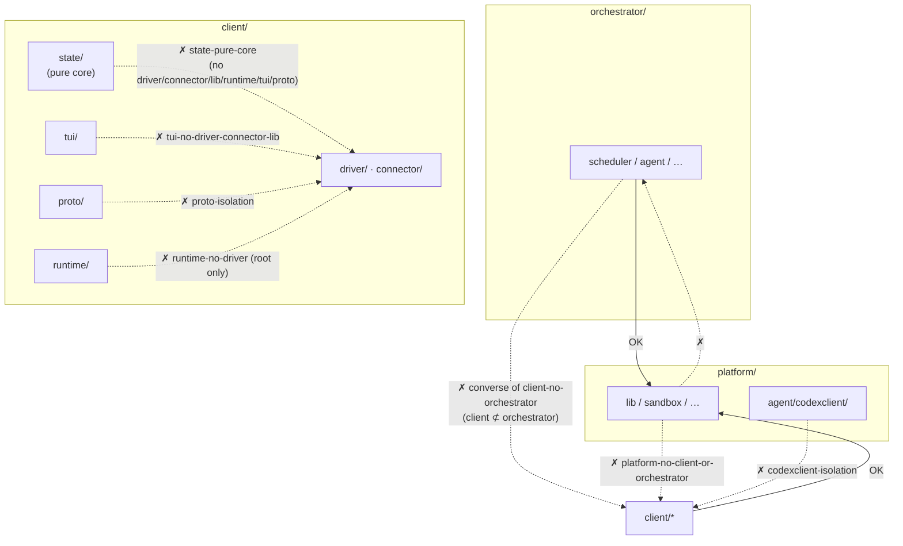

# Code & Architecture Enforcement

The mechanisms that keep the **codebase** true to its intended architecture. Unlike review-dependent conventions, most are rejected mechanically at **lint or compile time**. For each: what it prevents, where it is defined, how it is enforced, and how a developer declares an exception.

The design principles themselves are owned by [ARCHITECTURE.md](../../ARCHITECTURE.md); this document covers their enforcement. (Runtime controls over the autonomous *agents* are a separate concern — see [guardrails.md](guardrails.md).)

## 1. Import boundaries (depguard)

The dependency direction across the three layers (platform / client / orchestrator), and intra-layer subsystem isolation, are enforced by `depguard`. Definitions are in `depguard.rules` of `src/.golangci.yml`; violations are rejected by `make lint`.

| Rule | Scope | Deny (summary) |
|---|---|---|
| `platform-no-client-or-orchestrator` | `platform/**` | `client/`, `orchestrator/` |
| `client-no-orchestrator` | `client/**` | `orchestrator/` |
| `state-pure-core` | `client/state/**` | `driver/`, `connector/`, `platform/lib`, `runtime/`, `tui/`, `proto/` |
| `tui-no-driver-connector-lib` | `client/tui/**` | `driver/`, `connector/`, `platform/lib` |
| `worker-no-driver-connector-lib` | `client/runtime/worker/**` | `driver/`, `connector/`, `platform/lib` |
| `sandbox-tool-agnostic` | `platform/sandbox/**` | `driver/`, `connector/`, `platform/lib`, `runtime/` |
| `proto-isolation` | `client/proto/**` | `driver/`, `connector/`, `platform/lib`, `runtime/`, `tui/` |
| `runtime-no-driver` | `client/runtime/*.go` (root only) | `driver/` |
| `subsystem-isolation` | `client/runtime/subsystem/**` | `tui/`, `connector/` |
| `codexclient-isolation` | `platform/agent/codexclient/**` | `client/`, `orchestrator/` |

Key intents:

- **Layer direction**: platform is the base and knows nothing above it; client does not know orchestrator (the converse is guaranteed by `platform-no-...`).
- **`state/` purity**: the state machine has no I/O and no side effects — a pure functional core. It cannot import driver/runtime/tui at all.
- **`runtime-no-driver`**: only the runtime **root** is forbidden from importing driver. Tool-specific backends move to `runtime/subsystem/<kind>/`. Exception: `client/driver/vt` is explicitly allowed in `exclusions.rules`.
- **`codexclient` reusability**: a shared protocol transport, so it knows nothing of agent-roost internals.

## 2. Pure-core purity (forbidigo + ruleguard)

The decision-loop functional cores — `client/state` and `orchestrator/scheduler` — must hold no mutex, spawn no goroutine, read no wall clock, and perform no I/O (the only permitted synchronous I/O is bounded read-only `os.Stat`). State is folded as an immutable value; concurrency, timers, and I/O live in the event-loop shell. Observability reads an immutable published snapshot lock-free (`atomic.Pointer[State]`), so neither core needs a mutex.

| Invariant | Enforced by | Notes |
|---|---|---|
| No mutex | `forbidigo` (`sync.Mutex` / `sync.RWMutex`, pkg-scoped) | message: "… is a pure functional core — no mutexes allowed" |
| No goroutine | `gocritic` ruleguard (`gorules/purecore.go`) | `go` is a `GoStmt`, invisible to forbidigo's CallExpr matching |
| No wall clock | `gocritic` ruleguard | `time.Now` / `time.Since` — time enters `Reduce` as a value |
| No direct I/O | `gocritic` ruleguard | `os.Open`/`WriteFile`/…, `net.Dial`/`Listen`, `exec.Command`; `os.Stat` allowed |

`client/state` is wholly pure, so the ruleguard rules apply to every non-test file in it. In `orchestrator/scheduler` the pure reducer and the imperative shell share one package, so the rules skip the shell files (`scheduler.go`, `effects_exec.go`, `clock.go`, `watch.go`) — these legitimately own the loop, timers, and I/O. Test files are exempt.

## 3. Length limits

| Limit | Value | Enforced by |
|---|---|---|
| Function length | 80 lines (`funlen`, `ignore-comments: true`) | lint (`.golangci.yml`) |
| File length | 500 lines (`revive` `file-length-limit`, skipping comments/blanks) | lint (`.golangci.yml`) |

Length exceptions (in `exclusions.rules`):

- `_test.go` — tests relax both function and file length (table-driven tests grow large by nature) as well as errcheck.
- `client/state/reduce_*.go` — state-machine dispatch tables stay cohesive as one unit (function-length exempt).

Exceptions are declared **by path pattern in `.golangci.yml`, not by an in-code annotation** — anything matching `reduce_*.go` is exempt automatically. Generated code (`codexschema/v*/types.gen.go`, etc.) is auto-excluded from length checks too.

## 4. Feature flags

`platform/features/features.go` has **two mechanisms that share no key space** — pick one based on whether the experimental code should physically exist in the binary. The C analogue: runtime flag is `if () {}`, compile-time flag is `#if / #endif`.

| Kind | Mechanism | Toggle | Stays in the binary? | Use when |
|---|---|---|---|---|
| runtime | `Flag` constant + injected `Set` | `~/.roost/settings.toml` `[features.enabled]` | both branches compiled | the user should opt in without rebuilding |
| compile-time | top-level `const` bool guarded by a build tag | `go build -tags <tag>` (e.g. `make build-experimental`) | off-side removed by dead-code elimination | the code is unfinished / unsafe or must not enter release binaries |

**Runtime — add:** declare a `Flag` constant and list it in `All()`; read it as `st.Features.On(features.Peers)` (`features.go:36`). Gating is allowed in `state/`, `runtime/`, `tui/` — **not** in `driver/` or `connector/`, where driver-specific gating uses `config.Drivers[name]` instead. Users opt in under `[features.enabled]`. `FromConfig` **silently ignores unknown keys** (`features.go:46`), so when a flag stabilises you delete the constant and inline the enabled branch with no config migration.

**Compile-time — add:** create a `//go:build <tag>` / `//go:build !<tag>` file pair exporting the same `const` bool, then gate code with `if features.MyFeat { ... }` — the off-side is removed because `MyFeat` is a `const`. For larger code, put the implementation behind the tag and provide a no-op stub on the `!tag` side so callers need no guarding. Add a Makefile target for first-class variants; CI builds both.

## 5. Wire format is stdlib-only (depguard)

Wire-format / persistence types are written with **stdlib only (`encoding/json`)** (AGENTS.md / ARCHITECTURE.md) — a portability constraint. The `depguard` rule `proto-wire-stdlib-only` (scope `client/proto/**`) denies codec libraries (protobuf, msgpack, cbor) from the wire layer; `client/proto/codec.go` uses only `encoding/json`. The rule is a deny-list of the realistic offenders rather than a stdlib allow-list, matching the intent: do not bring a new codec library into the wire layer.

## Related

- Canonical design principles: [ARCHITECTURE.md](../../ARCHITECTURE.md)
- Per-layer deep dives: [platform](platform/README.md) · [client](client/README.md) · [orchestrator](orchestrator/README.md)
- Agent-control guardrails (admission, concurrency, capability, autonomy, liveness): [guardrails.md](guardrails.md)
